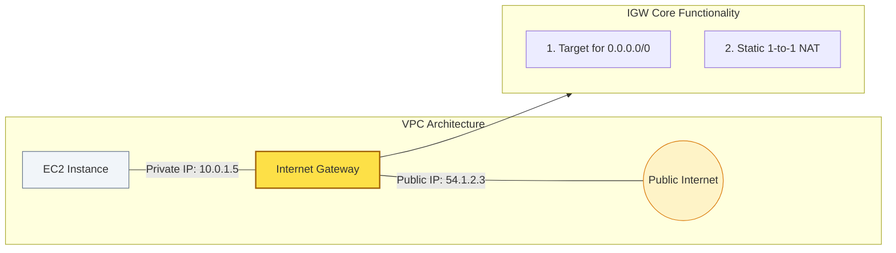

# 🌐 Module 03.01: Internet Gateway Fundamentals

> **"An Internet Gateway is more than a bridge; it is the boundary between the private cloud and the open web. It is the scale-less, infinite door that makes the cloud reachable."**

## 📚 Overview

An **Internet Gateway (IGW)** is a logical, horizontally scaled, and highly available VPC component that serves as the edge between your private network and the global internet. Unlike a traditional physical router, an IGW is a software-defined service managed by AWS that handles millions of packets without requiring manual scaling or maintenance.

## 🎓 Learning Objectives

By the end of this module, you will:

- ✅ Define the **Dual Role** of an IGW (Routing and NAT).
- ✅ Understand the **1-to-1 Mapping** between Public and Private IPs.
- ✅ Identify the **Attachment Constraints** (1 IGW per VPC).
- ✅ Explain why IGWs are considered **Inherently Highly Available**.
- ✅ Configure **Internet Routing** in a standard Route Table.

---

## 🏗️ The 1-to-1 NAT Magic

The IGW's most critical "invisible" job is performing static Network Address Translation. 

1. **Traffic Out**: When an instance with a Public IP sends a packet, the IGW intercepts it, strips the **Private IP** source, and replaces it with the **Public IP**.
2. **Traffic In**: When a response comes back from the internet to the Public IP, the IGW "remembers" the mapping and swaps the Public IP for the instance's **Private IP** before delivering the packet inside the VPC.

**Note**: The EC2 instance itself is *unaware* of its own Public IP. It only sees its Private address.

---

## 🚀 Professional Pattern: The "Clean Detach"

Senior DevOps engineers know that removing an IGW in an emergency isn't as simple as clicking "Delete."

**The Pro Standard**:
1. **Remove the Routes First**: You cannot detach an IGW if it is still a target in any active Route Table.
2. **Handle Public IPs**: Even if the routes are gone, instances with active Public IPs can occasionally "block" the detachment process in some edge cases.
3. **Automate with IaC**: Never manually detach an IGW in a production environment. Use **Terraform** or **CDK** variables to manage the lifecycle, ensuring that and all dependent resources are updated in the correct dependency order.

---

## 🏆 Real-World DevOps Story: The "Forgotten Route" Crisis

**The Scenario**: A company launched a new website and assigned its web servers Elastic IPs. Everything looked perfect in the console.
**The Crisis**: No one could reach the website. The developers could SSH into the servers from their internal network, but the outside world saw "Request Timed Out."
**The Discovery**: While the IGW was *attached* to the VPC, the **Subnet Route Table** was still using the default settings. It had no entry for `0.0.0.0/0`, meaning the servers didn't know the IGW was the path to the internet.
**The Fix**: A single route update: `Destination: 0.0.0.0/0, Target: igw-xxxxxxxx` resolved the issue in 2 seconds.
**The Lesson**: **Attachment is not Association.** Attaching the gate to the VPC doesn't matter if you haven't built the road leading to the gate.

---

## ❓ Interview Preparation (IGW Fundamentals)

1. **Q: How much bandwidth can an Internet Gateway handle?**
    *A: Theoretically, there is no limit. Since it is a horizontally scaled, managed service, AWS scales the underlying infrastructure automatically to handle as much traffic as your VPC instances can generate (up to 100Gbps+ per instance).*

2. **Q: Is an Internet Gateway a single point of failure?**
    *A: No. Although you only attach *one* IGW resource to a VPC, that resource represents a highly available, regional service spread across multiple Availability Zones under the hood by AWS.*

3. **Q: Can you attach an Internet Gateway to multiple VPCs?**
    *A: No. An IGW has a strict 1:1 relationship with a VPC. To move an IGW, you must detach it from the original VPC first.*

4. **Q: What is the cost of an Internet Gateway?**
    *A: The IGW resource itself is **free**. You only pay standard AWS Data Transfer fees for the traffic that passes through it.*

5. **Q: If an instance doesn't have a Public IP, can it talk to the internet through the IGW?**
    *A: **No.** The IGW only performs 1-to-1 NAT for public IPs. For private instances to reach the internet, they must route their traffic through a **NAT Gateway** instead.*

---

## 📝 Knowledge Check

1. **How many Internet Gateways can be attached to a single VPC at once?**
    - [x] a) 1
    - [ ] b) 2
    - [ ] c) 5
    - [ ] d) Unlimited

2. **Which IP translation does an IGW perform for a public instance?**
    - [ ] a) Many-to-1 (PAT)
    - [x] b) 1-to-1 Static NAT
    - [ ] c) Cross-AZ Translation
    - [ ] d) Encrypted Tunneling

3. **In the Route Table, what is the 'Destination' CIDR used to represent all internet traffic?**
    - [x] a) 0.0.0.0/0
    - [ ] b) 10.0.0.0/8
    - [ ] c) 169.254.169.254
    - [ ] d) 255.255.255.255

4. **True or False: If you delete an IGW, you will also lose your Elastic IPs.**
    - [ ] True
    - [x] False (Elastic IPs are independent resources)

5. **What is the primary reason for placing a Load Balancer in a public subnet with an IGW route?**
    - [ ] a) To save money
    - [x] b) To allow external clients to initiate connections to the application
    - [ ] c) To encrypt data at rest
    - [ ] d) To increase internal database speed

---

## 🔗 Next Steps

The front door is open. Now let's explore how to let your private servers "talk out" without letting the "world in."

Proceed to: **[02. NAT Gateway Deep Dive](../../../../../README.md)** →