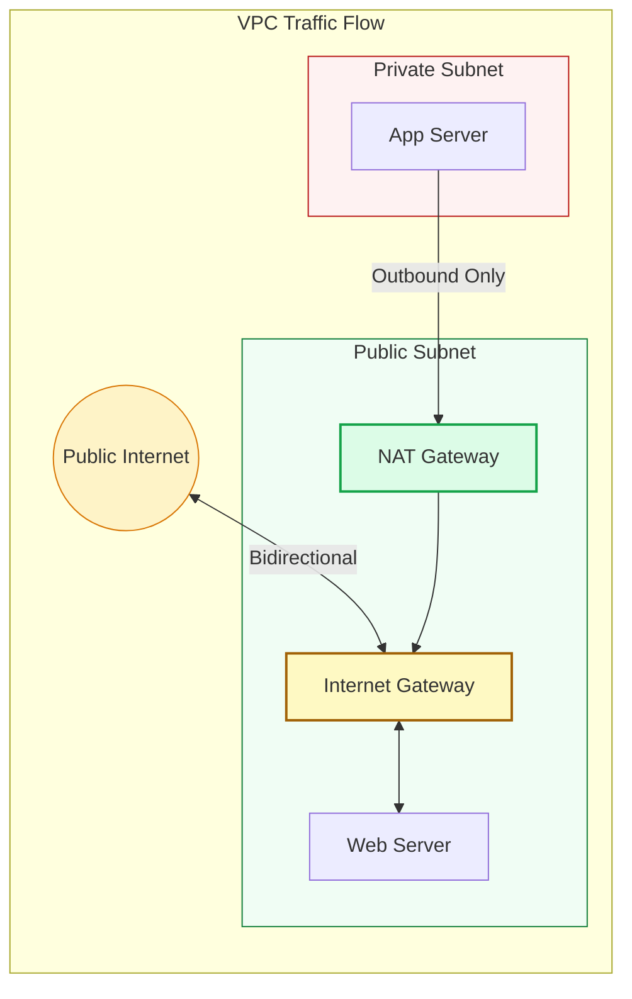

# 🚪 Module 03: Internet & NAT Gateways

> **"Gateways are the doors that allow traffic to enter and exit your Virtual Private Cloud. Proper gateway design ensures that your VPC is not an isolated island while maintaining the security of your private resources."**

## 📚 Overview

Gateways are the critical intersections where your private network meets the global internet. This module explores the mechanics of **Internet Gateways (IGW)**—the highly available doors for your public resources—and **NAT Gateways**—the one-way exits for your private servers. Mapping these components correctly is the difference between a secure environment and a total security breach.

## 🎓 Learning Path

| # | Topic | Focus | Key Deliverable |
| :--- | :--- | :--- | :--- |
| **01** | [**IGW Fundamentals**](./01-Internet-Gateway-Fundamentals/README.md) | Bidirectional entry | Configure the 1-to-1 NAT boundary |
| **02** | [**NAT Gateway Deep Drive**](./02-NAT-Gateway-Deep-Dive/README.md) | Private egress | Master PAT (Port Address Translation) |
| **03** | [**IPv6 & Egress-Only**](./03-IPv6-and-Egress-Only-Gateways/README.md) | Modern networking | Secure unidirectional IPv6 traffic |
| **04** | [**HA & Optimization**](./04-High-Availability-and-Optimization/README.md) | Enterprise scale | Design multi-AZ redundant gateways |

---

## 🚀 Professional Pattern: The HA NAT Rule

A common mistake is deploying a single NAT Gateway for the entire VPC to save $32/month. If that Availability Zone (AZ) goes down, your **entire** cloud environment loses internet access.

**The Pro Standard**:
1. **One NAT Per AZ**: Always deploy one NAT Gateway per Availability Zone.
2. **Local Routing**: Configure the Route Table of each private subnet to point to the NAT Gateway in its **own** AZ.
3. **Redundancy**: This ensures that if `us-east-1a` fails, your instances in `us-east-1b` continue to function independently.

---

## 🏆 Real-World DevOps Stories

### 🌑 The "Bandwidth Bottleneck"
**The Scenario**: An e-commerce site backends started failing during a massive nightly data sync to a third-party analytics provider.
**The Crisis**: The NAT Gateway was hitting its 45Gbps throughput limit for a single flow. Other services (like email receipts) couldn't reach the internet.
**The Fix**: The team split the heavy sync traffic into multiple parallel streams across different subnets, allowing the NAT Gateway's horizontal scaling to kick in.
**The Lesson**: **Managed doesn't mean infinite.** Understand your NAT limits and monitor CloudWatch metrics for `BytesOutFromNatGateway`.

### 🛡️ The "Elastic IP" Lockdown
**The Scenario**: A company's main partner required them to whitelist a single IP for API access.
**The Crisis**: A junior admin deleted the NAT Gateway and recreated it, which generated a new Elastic IP. The partner's firewall instantly blocked the company.
**The Fix**: Restoring the service took 24 hours because the partner had a slow manual update process.
**The Lesson**: **Treat your NAT IPs as critical assets.** Tag them, lock them using Service Control Policies (SCPs), and never delete them without a 48-hour notice to external partners.

---

## ❓ Interview Preparation (Gateways)

1. **Q: What is the main difference between an Internet Gateway and a NAT Gateway?**
    *A: An IGW allows both inbound and outbound traffic (ideal for Load Balancers). A NAT Gateway allows only outbound traffic (ideal for private servers needing updates), protecting them from unsolicited inbound connections.*

2. **Q: Does an Internet Gateway have a bandwidth limit?**
    *A: No. It is a horizontally scaled, redundant, and highly available VPC component that has no theoretical bandwidth limit; it scales with your VPC traffic automatically.*

3. **Q: How much does a NAT Gateway cost?**
    *A: In AWS, it is approximately $0.045 per hour (~$32/month) plus $0.045 per GB of data processed. This is why using **VPC Endpoints** for S3 traffic is a critical cost-saving measure.*

4. **Q: Can you use a NAT Gateway to receive traffic from the internet?**
    *A: No. NAT Gateways are designed specifically for "Egress" (Outbound) traffic. To receive traffic, you must use an Internet Gateway with a Load Balancer or an instance with a Public IP.*

5. **Q: What is an Egress-Only Internet Gateway?**
    *A: It is like a NAT Gateway for IPv6. Since every IPv6 address is public, the Egress-Only IGW allows your instances to reach the internet while preventing the internet from initiating connections to them.*

---

## 📝 Knowledge Check

1. **Which gateway allows you to initiate an inbound connection to an EC2 instance?**
    - [ ] a) NAT Gateway
    - [x] b) Internet Gateway (IGW)
    - [ ] c) Egress-Only IGW
    - [ ] d) Transit Gateway

2. **Where must a NAT Gateway physically live?**
    - [ ] a) In a Private Subnet
    - [x] b) In a Public Subnet
    - [ ] c) Outside of the VPC
    - [ ] d) On-Premises

3. **What is required for a NAT Gateway to communicate with the internet?**
    - [ ] a) A Private IP
    - [x] b) An Elastic IP (EIP)
    - [ ] c) A VPN Connection
    - [ ] d) A Direct Connect line

4. **True or False: An Internet Gateway (IGW) is a single, physical router that can fail.**
    - [ ] True
    - [x] False (It is a logical, horizontally scaled service)

5. **Which protocol is supported by Egress-Only Internet Gateways?**
    - [ ] a) IPv4
    - [x] b) IPv6
    - [ ] c) ICMP only
    - [ ] d) TCP only

---

## 🔗 Next Steps

You've opened the doors. Now let's dive into the core engine of the Internet Gateway.

Proceed to: **[01. Internet Gateway Fundamentals](./01-Internet-Gateway-Fundamentals/README.md)** →
