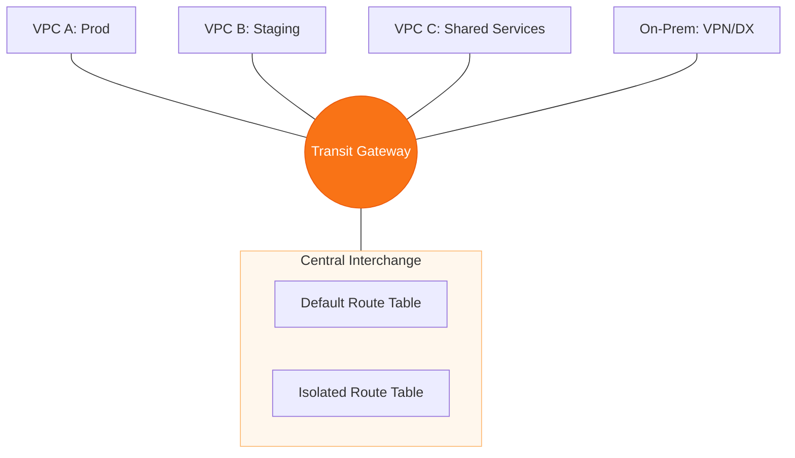

# 🎡 Module 06.03: Transit Gateway Architecture

> **"If VPC Peering is a direct bridge between two houses, AWS Transit Gateway is the central highway interchange that connects thousands of homes, warehouses, and the outside world in a single, manageable hub."**

## 📚 Overview

As your AWS footprint grows beyond 10 VPCs, managing a mesh of peering connections becomes an operational nightmare. **AWS Transit Gateway (TGW)** is a Regional network hub that simplifies this complexity. It acts as a "Cloud Router," allowing you to connect thousands of VPCs and on-premises networks through a single gateway. Crucially, TGW supports **Transitive Routing**, meaning you can centralize your internet egress or security inspection in a single subnet and share it across your entire organization.

## 🎓 Learning Objectives

By the end of this module, you will:

- ✅ Understand the **Hub-and-Spoke** architecture vs. Full Mesh.
- ✅ Configure **TGW Attachments** for VPCs and VPNs.
- ✅ Master the logic of **Associations** and **Propagations**.
- ✅ Architect **Transitive Routing** paths between multiple VPCs.
- ✅ Use **AWS RAM** to share a Transit Gateway across multiple accounts.
- ✅ Implement **Appliance Mode** for centralized security inspection.

---

## 🏗️ Core Components

### 1. Attachments
The physical or logical connection to the TGW hub. You can attach VPCs, VPNs, Direct Connect Gateways, and even other Transit Gateways (Peering).

### 2. TGW Route Tables
Unlike standard VPC route tables, TGW route tables are centralized. You use them to decide which "spokes" can talk to each other.

### 3. Associations vs. Propagations
- **Association**: Defines which Route Table an attachment uses to find its *destination*.
- **Propagation**: The process by which an attachment "tells" the Route Table about its own *source* CIDR blocks.

---

## 🚀 Professional Pattern: The "Inspection VPC" Hub

Security teams often require all traffic between VPCs to be inspected by a firewall (like Palo Alto or Fortinet).

**The Pro Standard**:
1. **The Hub**: Create a dedicated "Security/Inspection" VPC.
2. **The Logic**: Configure the TGW Route Tables so that any traffic from VPC A to VPC B is forced to go through the Security VPC first.
3. **Appliance Mode**: Enable "Appliance Mode" on the TGW attachment for the Security VPC to ensure traffic returns through the same firewall instance (avoiding symmetric routing issues).
4. **The Benefit**: 100% visibility into internal traffic without needing firewalls in every single VPC.

---

## 🏆 Real-World DevOps Story: The Scalability Wall

**The Scenario**: A fast-growing SaaS company started with 15 VPCs peering to a central "Admin VPC." They were adding 2 new VPCs per month for new clients.
**The Crisis**: They hit the hard limit for peering connections. More importantly, every time they added a new client VPC, they had to update 15 existing route tables. One manual mistake caused a 3-hour production outage.
**The Fix**: They migrated to **Transit Gateway**. They deleted the 100+ peering links and replaced them with 15 TGW attachments.
**The Result**: Adding a new client now takes 5 minutes instead of 1 hour. They only update the central TGW Route Table, and all other VPCs automatically "learn" the new route via Propagation.
**The Lesson**: **Infrastructure as Code works best in a centralized model.** Transit Gateway is the only way to scale a modern enterprise network.

---

## ❓ Interview Preparation (Transit Gateway)

1. **Q: What is the primary advantage of TGW over VPC Peering?**
    *A: Scalability and management. TGW uses a hub-and-spoke model which reduces the number of connections from `N*(N-1)/2` (Mesh) to just `N` (Hub). It also supports transitive routing.*

2. **Q: How does a VPC subnet send traffic to the Transit Gateway?**
    *A: You must add a route to the subnet's route table with the destination CIDR pointing to the `tgw-xxxx` ID as the target.*

3. **Q: Does Transit Gateway support Multicast?**
    *A: Yes. One of the unique features of TGW is its support for Multicast traffic, which is not supported in standard VPC networking or Peering.*

4. **Q: What is 'TGW Peering'?**
    *A: It is the ability to connect two Transit Gateways together, even across different AWS regions. This allows you to build a global private network backbone.*

5. **Q: How do you share a Transit Gateway with another AWS Account?**
    *A: You use **AWS Resource Access Manager (RAM)**. You share the TGW resource with the other Account ID or your entire AWS Organization, after which the other account can create attachments to your TGW.*

---

## 📝 Knowledge Check

1. **Which TGW feature allows it to automatically learn routes from an attached VPC?**
    - [ ] a) Association
    - [x] b) Propagation
    - [ ] c) Routing
    - [ ] d) Aggregation

2. **What is the maximum bandwidth for a single VPC attachment to a Transit Gateway?**
    - [ ] a) 1.25 Gbps
    - [ ] b) 10 Gbps
    - [x] c) 50 Gbps (Burstable)
    - [ ] d) 100 Gbps

3. **In a hub-and-spoke model with 10 VPCs, how many connections are needed using Transit Gateway?**
    - [ ] a) 45
    - [x] b) 10
    - [ ] c) 20
    - [ ] d) 100

4. **Which AWS service is used to 'Share' the TGW across accounts or Organizations?**
    - [ ] a) IAM
    - [ ] b) Organizations
    - [x] c) Resource Access Manager (RAM)
    - [ ] d) Secrets Manager

5. **True or False: Transit Gateway supports transitive routing between attached VPNs and VPCs.**
    - [x] True 
    - [ ] False

---

## 🔗 Next Steps

You've built the network. Now let's explore how to optimize it for cost and performance.

Proceed to: **[04. Interconnectivity Optimization](../04-Interconnectivity-Optimization/README.md)** →
Node: This link points to the next lesson.