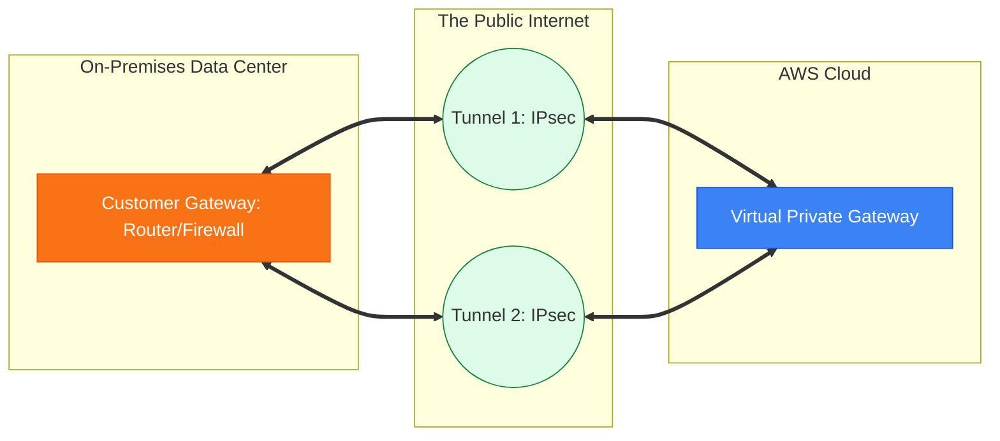

# 📟 Module 09.01: VPN Site-to-Site Fundamentals

> **"A Site-to-Site VPN is the 'Fast-Pass' for hybrid cloud connectivity. It leverages the global presence of the internet to create a secure, encrypted tunnel that turns your office into a virtual room inside your VPC."**

## 📚 Overview

The **AWS Site-to-Site VPN** is the most common way to start a hybrid cloud journey. It creates a secure, encrypted connection between your on-premises network and your VPC over the public internet. Because it uses the internet, it can be set up in minutes without any physical hardware installation by AWS. This module covers the core components—**Customer Gateways** and **Virtual Private Gateways**—and the protocols that make the tunnel work: **IPsec** and **BGP**.

## 🎓 Learning Objectives

By the end of this module, you will:

- ✅ Differentiate between the **Customer Gateway (CGW)** and **Virtual Private Gateway (VGW)**.
- ✅ Understand the high-availability nature of the **Dual-Tunnel** design.
- ✅ Configure **Static** vs. **Dynamic (BGP)** routing for VPN.
- ✅ Master the two phases of the **IPsec (IKE)** handshake.
- ✅ Troubleshoot common VPN issues like **Phase 1 timeouts** and **Rekeying** errors.

---

## 🏗️ Core Components

### 1. Customer Gateway (CGW)
This is not a physical device provided by AWS; it is a logical resource in the AWS console that represents your on-premises router (e.g., a Cisco ASA, Juniper SRX, or even a Linux pfSense box).

### 2. Virtual Private Gateway (VGW)
This is the AWS-side VPN concentrator. It is a managed, highly available resource that you attach to your VPC.

### 3. The Dual-Tunnel Setup
Every AWS VPN connection automatically creates **two separate IPsec tunnels**. For a production-grade connection, your on-premises router should be configured to use both. If AWS performs maintenance on the endpoint for Tunnel 1, your traffic automatically shifts to Tunnel 2.

---

## 🚀 Professional Pattern: The "Dynamic BGP" Standard

While you can manually type in IP ranges (Static Routing), senior DevOps engineers always use **BGP (Border Gateway Protocol)**.

**The Pro Standard**:
1. **The Automation**: Use BGP for dynamic routing.
2. **The Logic**: Your on-premises router "advertises" its internal networks to AWS. AWS "advertises" its VPC subnets to your router.
3. **The Benefit**: If you add a new subnet to your local data center, you don't need to touch the AWS console. The BGP protocol automatically learns the new route and updates the VPC route tables.
4. **The Failover**: BGP handles the automatic switch between Tunnel 1 and Tunnel 2 in seconds if one fails.

---

## 🏆 Real-World DevOps Story: The "Stale Tunnel" Outage

**The Scenario**: A company set up a VPN to their branch office. It worked perfectly for 6 months. Suddenly, every Monday at 9:00 AM, the connection would drop for exactly 60 seconds.
**The Crisis**: Users in the office were kicked out of their cloud-based ERP right at the start of the work week.
**The Discovery**: They were using **Static Routing** and had disabled **Dead Peer Detection (DPD)**. The "IKE Rekeying" (security key refresh) was failing because the on-premises firewall was older than the AWS endpoint. Without DPD, the firewall didn't realize the tunnel was "zombie" until it completely timed out.
**The Fix**: They enabled **DPD** and switched to **Dynamic BGP routing**.
**The Result**: If a rekey fails, BGP immediately detects the dead tunnel and shifts traffic to the backup tunnel. The 60-second drop vanished.
**The Lesson**: **Stability needs a heartbeat.** Always use DPD and BGP for mission-critical links.

---

## ❓ Interview Preparation (VPN Fundamentals)

1. **Q: What are the two phases of an IPsec VPN connection?**
    *A: **IKE Phase 1** establishes a secure management channel (the "Security Association") between the routers. **IKE Phase 2** uses that channel to negotiate the actual encryption keys for the data that will travel through the tunnel.*

2. **Q: How much bandwidth can a single AWS VPN tunnel handle?**
    *A: Each tunnel is capped at **1.25 Gbps**. If you need more, you can use ECMP (Equal-Cost Multi-Path) to aggregate up to 50 tunnels using a Transit Gateway.*

3. **Q: Does the VPN traffic stay on the AWS backbone?**
    *A: **No.** Site-to-Site VPN traffic travels over the **Public Internet**. However, it is fully encrypted using IPsec (AES-256), making it secure even though it's on a public path.*

4. **Q: What is the purpose of 'Dead Peer Detection' (DPD)?**
    *A: DPD is a "heartbeat" mechanism. If one router doesn't receive a response from its peer within a certain timeframe, it marks the tunnel as "Down" so the routing protocol (BGP) can immediately switch to the healthy backup tunnel.*

5. **Q: Can you connect a VPN directly to an Internet Gateway (IGW)?**
    *A: **No.** A VPN must terminate on either a **Virtual Private Gateway (VGW)** or a **Transit Gateway (TGW)**.*

---

## 📝 Knowledge Check

1. **Which resource represents YOUR physical on-premises router in the AWS Console?**
    - [ ] a) Virtual Private Gateway
    - [x] b) Customer Gateway
    - [ ] c) NAT Gateway
    - [ ] d) Internet Gateway

2. **How many tunnels are provided by default for every AWS Site-to-Site VPN?**
    - [ ] a) 1
    - [x] b) 2
    - [ ] c) 4
    - [ ] d) 10

3. **Which protocol is used for 'Dynamic Routing' between a VPC and on-premises?**
    - [ ] a) OSPF
    - [ ] b) RIP
    - [x] c) BGP
    - [ ] d) HTTP

4. **What is the maximum throughput of a single AWS VPN tunnel?**
    - [ ] a) 500 Mbps
    - [ ] b) 1 Gbps
    - [x] c) 1.25 Gbps
    - [ ] d) 10 Gbps

5. **True or False: Site-to-Site VPN requires you to install a physical fiber optic cable between your office and AWS.**
    - [ ] True 
    - [x] False (It uses your existing internet connection)

---

## 🔗 Next Steps

The VPN is great for getting started, but if you need guaranteed performance and high-speed fiber, you need to go "Direct."

Proceed to: **[02. Direct Connect Deep Dive](../02-Direct-Connect-Deep-Dive/README.md)** →
Node: This link points to the next lesson.