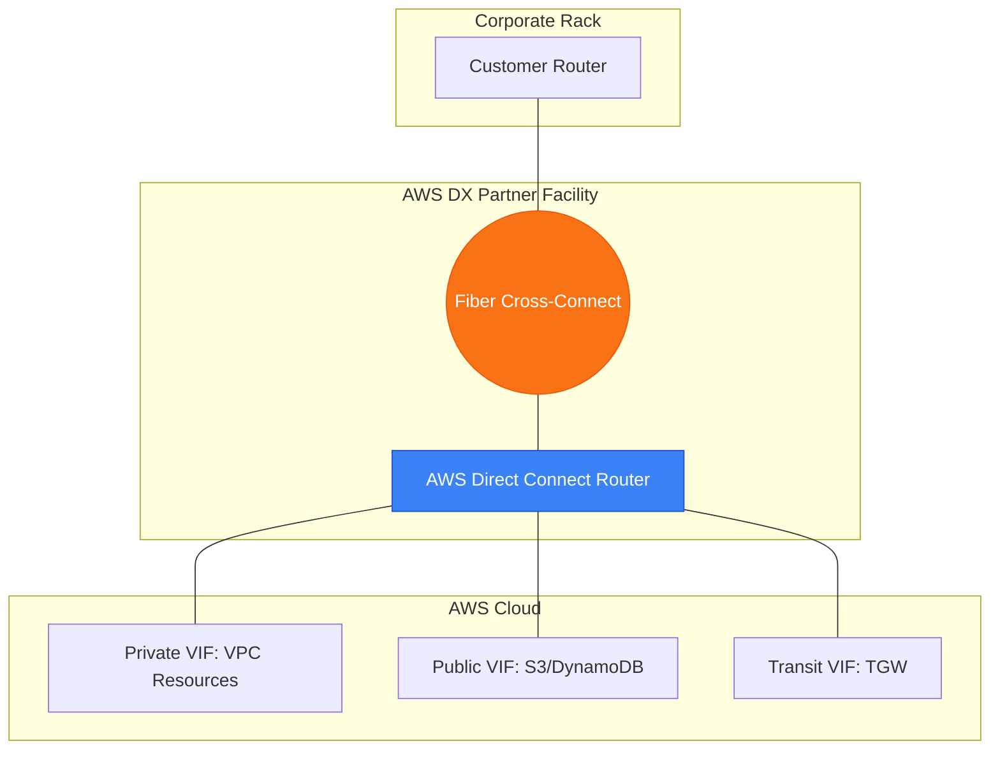

# 🏎️ Module 09.02: Direct Connect Deep Dive

> **"If a VPN is a car on a congested public highway, AWS Direct Connect (DX) is a private, multi-lane high-speed rail line. It bypasses the internet's traffic jams entirely, providing the consistent latency and massive bandwidth required for enterprise-grade applications."**

## 📚 Overview

For businesses moving massive amounts of data or requiring ultra-consistent latency, the public internet is simply too unpredictable. **AWS Direct Connect (DX)** provides a dedicated, physical fiber optic link between your data center and AWS. By bypassing the internet, you gain higher bandwidth, lower latency, and reduced data transfer costs. This module dives into the physical reality of **Cross-Connects**, the logical world of **Virtual Interfaces (VIFs)**, and the security of **MACsec**.

## 🎓 Learning Objectives

By the end of this module, you will:

- ✅ Understand the difference between **Dedicated** and **Hosted** connections.
- ✅ Configure **Private**, **Public**, and **Transit Virtual Interfaces (VIFs)**.
- ✅ Master the physical "Letter of Authorization" (LOA) workflow.
- ✅ Implement **MACsec (Layer 2)** encryption for high-speed security.
- ✅ Differentiate between **LOA-CFA** and an AWS Partner's hosted model.

---

## 🏗️ The Direct Connect Stack

### 1. The Physical Connection
You (or your partner) run a physical fiber cable (Cross-Connect) from your router to the AWS router inside a Direct Connect location (like Equinix or Digital Realty).

### 2. Virtual Interfaces (VIFs)
Once the physical link is up, you create logical partitions:
- **Private VIF**: For resources with private IPs inside a VPC (EC2, RDS).
- **Public VIF**: For AWS public services like S3 or DynamoDB (using public IPs).
- **Transit VIF**: Specifically for connecting to a **Transit Gateway**.

### 3. Dedicated vs. Hosted
- **Dedicated**: You own the physical 1/10/100 Gbps port. You can create 50 VIFs.
- **Hosted**: A partner manages the physical port and "shares" a slice of it with you (50Mbps to 10Gbps). You get only 1 VIF.

---

## 🚀 Professional Pattern: The "Data Lake" Transit VIF

For large enterprises, connecting one Direct Connect link to 50 different VPCs manually is a management nightmare.

**The Pro Standard**:
1. **The Link**: Provision a **Direct Connect Gateway (DXGW)**.
2. **The Interface**: Create a single **Transit VIF** on your physical connection.
3. **The Hub**: Attach the Transit VIF to the **Direct Connect Gateway**, then attach that Gateway to an **AWS Transit Gateway (TGW)**.
4. **The Result**: Every VPC attached to the TGW (regardless of Account or Region) can now reach On-Prem over that single fiber line.
5. **The Benefit**: Scalable, centralized routing for global corporations.

---

## 🏆 Real-World DevOps Story: The Analytics "Shudder"

**The Scenario**: A genomics company was moving 2 petabytes of data from their local storage to Amazon S3. They started with a 10Gbps Site-to-Site VPN.
**The Crisis**: The upload was inconsistent. Every day at 3:00 PM (when local internet traffic peaked), the upload speed dropped by 80%, and many file transfers timed out.
**The Discovery**: The "Jitter" on the public internet was killing their TCP throughput. Even with high bandwidth, the unstable path was the bottleneck.
**The Fix**: They installed a **Direct Connect** link with a **Public VIF**.
**The Result**: The upload speed became a literal straight line on the graph. They hit exactly 9.8 Gbps consistently, 24/7, regardless of time of day.
**The Lesson**: **Bandwidth is vanity; Predictability is sanity.** Use DX for high-volume data moves.

---

## ❓ Interview Preparation (Direct Connect)

1. **Q: Does Direct Connect encrypt your data by default?**
    *A: **No.** Direct Connect is a private line, but it is not inherently encrypted. To secure it, you must use **MACsec** (Layer 2 hardware encryption) or establish an IPsec **VPN over Direct Connect** (Layer 3).*

2. **Q: What is a 'LOA-CFA'?**
    *A: It stands for **Letter of Authorization and Connecting Facility Assignment**. It is the document AWS gives you when you request a connection, which you must give to the data center manager so they are allowed to plug the fiber cable into the AWS router.*

3. **Q: Can you access S3 over a Private VIF?**
    *A: **No.** A Private VIF only reaches the private CIDR ranges of your VPC. To reach S3 over Direct Connect, you either need a **Public VIF** or a **VPC Interface Endpoint** inside your VPC.*

4. **Q: What is the maximum speed of a single Direct Connect port?**
    *A: AWS currently offers **1 Gbps, 10 Gbps, and 100 Gbps** dedicated connections. For higher speeds, you can use a Link Aggregation Group (LAG) to bundle multiple ports together.*

5. **Q: What is the benefit of a 'Direct Connect Gateway' (DXGW)?**
    *A: It allows you to connect a single Direct Connect link to VPCs in **any AWS Region** (except China) and across **multiple AWS Accounts**. It acts as a global router for your fiber.*

---

## 📝 Knowledge Check

1. **Which VIF type is required to connect Direct Connect to an AWS Transit Gateway?**
    - [ ] a) Private VIF
    - [ ] b) Public VIF
    - [x] c) Transit VIF
    - [ ] d) Secure VIF

2. **What is the standard AWS data transfer cost benefit of using Direct Connect?**
    - [ ] a) Data ingress is cheaper
    - [x] b) Data egress (Out to On-Prem) is cheaper than internet egress
    - [ ] c) All data transfer is free
    - [ ] d) There is no cost benefit

3. **Which standard provides Layer 2 hardware encryption for 10G/100G Direct Connect links?**
    - [ ] a) IPsec
    - [ ] b) SSL/TLS
    - [x] c) MACsec
    - [ ] d) GRE

4. **True or False: A 'Hosted Connection' allows you to create up to 50 Virtual Interfaces (VIFs).**
    - [ ] True 
    - [x] False (Usually only 1 VIF is provided per Hosted Connection)

5. **Where do you physically plug your equipment to establish a Direct Connect link?**
    - [ ] a) Directly into the AWS Console
    - [ ] b) Into an AWS Edge Location
    - [x] c) Into an AWS Direct Connect Partner colocation facility
    - [ ] d) Into a standard home router

---

## 🔗 Next Steps

You've built the physical bridge. Now let's explore the "Hub" that manages these links at an enterprise scale: Transit Gateway for Hybrid.

Proceed to: **[03. TGW and Hybrid Architectures](../03-TGW-and-Hybrid-Architectures/README.md)** →
Node: This link points to the next lesson.