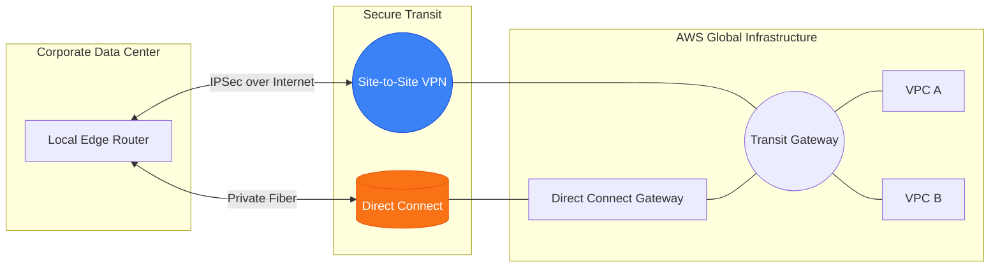

# 🌉 Module 09: Hybrid Connectivity

> **"Hybrid cloud is the bridge between where your business began and where it is going. A high-speed, private connection is the umbilical cord that allows your data center to breathe the air of the cloud."**

## 📚 Overview

For most enterprises, the cloud isn't a replacement for the data center; it's an extension of it. **Hybrid Connectivity** is the technology that makes this extension possible. This module covers the two primary ways to connect your local infrastructure to AWS: **Site-to-Site VPN** for fast, internet-based tunnels and **AWS Direct Connect (DX)** for high-speed, dedicated fiber lines. We will explore how to architect these links for massive scale and "Five-Nines" resiliency.

## 🎓 Learning Objectives

By the end of this module, you will:

- ✅ Establish secure **Site-to-Site VPNs** using IPSec and BGP.
- ✅ Implement **AWS Direct Connect** for consistent, high-performance networking.
- ✅ Use **Direct Connect Gateways** to bridge On-Prem to multiple Regions/Accounts.
- ✅ Architect **High Resiliency** hybrid links (Active-Active DX or DX+VPN).
- ✅ Secure private lines using **MACsec** (Layer 2) or **VPN-over-DX** (Layer 3).
- ✅ Master **BGP Community Tags** for traffic engineering across hybrid links.

---

## 🏗️ Connectivity Comparison

### 1. Site-to-Site VPN (The Internet Bridge)
- **Path**: Public Internet.
- **Speed**: 1.25 Gbps per tunnel.
- **Pros**: Fast to set up (minutes), low upfront cost, encrypted by default.
- **Cons**: Variable latency and jitter, depends on public internet stability.

### 2. Direct Connect (The Dedicated Fiber)
- **Path**: Private, physical fiber optic cable.
- **Speed**: 1Gbps, 10Gbps, or 100Gbps.
- **Pros**: Consistent latency, huge bandwidth, reduced data egress costs.
- **Cons**: High cost, takes weeks/months to install, NOT encrypted by default (requires MACsec or VPN-over-DX).

---

## 🚀 Professional Pattern: The "VPN as Last Resort"

A single Direct Connect link is a single point of failure (SPOF). Physical fiber can be cut by construction crews or local disasters.

**The Pro Standard**:
1. **Primary**: Two Direct Connect links from different providers for a "Reliable-High" configuration.
2. **The Backup**: A **Site-to-Site VPN** connection over the internet as a "Last Resort" emergency path.
3. **The Logic**: Use **BGP Path Prepending** to make the VPN look much "longer" than the DX link.
4. **The Failover**: If the fiber is cut, BGP automatically shifts 100% of the traffic to the VPN in seconds. Once the fiber is repaired, it shifts back.

---

## 🏆 Real-World DevOps Story: The 4K Lag Disaster

**The Scenario**: A world-class visual effects studio moved their rendering farm to AWS US-West but kept their editing desks in London. They started with a 10Gbps Site-to-Site VPN.
**The Crisis**: The editors reported that scrubbing through 4K video was "Stuttery" and "Laggy." Network tests showed that while they had 10Gbps bandwidth, the "Data Jitter" (variation in latency) on the public internet was as high as 50ms.
**The Discovery**: The public internet routing through various ISPs was adding too many "hops" and inconsistent pathing, which killed real-time video performance.
**The Fix**: They installed a **Direct Connect** link with a direct cross-connect in a London peering location. Latency became a rock-solid 140ms with zero jitter.
**The Result**: The "Lag" vanished. The dedicated, private path provided the predictability needed for high-end creative work.
**The Lesson**: **Bandwidth is vanity; Latency/Jitter is sanity.** Always use DX for real-time applications.

---

## ❓ Interview Preparation (Hybrid Networking)

1. **Q: What is the difference between a 'Virtual Private Gateway' (VGW) and a 'Customer Gateway' (CGW)?**
    *A: A **VGW** is the AWS-side VPN endpoint attached to your VPC. A **CGW** is the logical representation of your physical on-premises router (e.g., Cisco, Juniper) in the AWS console.*

2. **Q: How can you increase the bandwidth of a Site-to-Site VPN beyond 1.25 Gbps?**
    *A: You can use **Equal-Cost Multi-Path (ECMP)**. By establishing multiple tunnels and using a Transit Gateway, you can load balance traffic across up to 50 tunnels, providing up to 50 Gbps of VPN throughput.*

3. **Q: What is a Direct Connect 'Public Virtual Interface' (Public VIF) used for?**
    *A: A **Public VIF** allows you to access AWS public services (like S3, DynamoDB, or Glacier) over your private Direct Connect line instead of the public internet. This reduces data transfer costs and improves security for storage traffic.*

4. **Q: What is 'MACsec' and where is it used?**
    *A: MACsec (802.1AE) is a Layer 2 security standard that provides hardware-level encryption directly on the Direct Connect fiber links (10G/100G) between your router and the AWS device. It provides encryption without the performance hit of a Layer 3 VPN.*

5. **Q: Why would you use a 'Direct Connect Gateway'?**
    *A: It is a global resource that allows you to connect a single Direct Connect link to multiple VPCs across different AWS Regions and Accounts. It simplifies the architecture of global companies with centralized data centers.*

---

## 📝 Knowledge Check

1. **Which component is required to connect a Direct Connect link to multiple VPCs?**
    - [ ] a) Internet Gateway
    - [x] b) Direct Connect Gateway
    - [ ] c) NAT Gateway
    - [ ] d) VPC Peering

2. **What is the typical setup time for a standard Direct Connect connection?**
    - [ ] a) 5-10 Minutes
    - [ ] b) 1-2 Days
    - [x] c) 2-4 Weeks (Minimum, often longer for physical install)
    - [ ] d) Instant via the AWS CLI

3. **In a 'Direct Connect with VPN Backup' setup, which protocol is used for automatic failover?**
    - [ ] a) OSPF
    - [ ] b) RIP
    - [x] c) BGP (Border Gateway Protocol)
    - [ ] d) STP

4. **Which Virtual Interface (VIF) type is required to connect a Direct Connect to an AWS Transit Gateway?**
    - [ ] a) Private VIF
    - [ ] b) Public VIF
    - [x] c) Transit VIF
    - [ ] d) Virtual VIF

5. **True or False: Site-to-Site VPN traffic is encrypted by default, while Direct Connect is not.**
    - [x] True 
    - [ ] False

---

## 🔗 Next Steps

You've built the global bridge. Now let's explore how to monitor every single packet and troubleshoot the inevitable issues that arise in high-scale networks.

Proceed to: **[10. Monitoring & Troubleshooting](../10-Monitoring-and-Troubleshooting/README.md)** →
Node: This link points to the next logical step in the curriculum.

---
## 🧭 Additional Modules
- [01 VPN Site to Site Fundamentals](01-VPN-Site-to-Site-Fundamentals/README.md)
- [02 Direct Connect Deep Dive](02-Direct-Connect-Deep-Dive/README.md)
- [03 TGW and Hybrid Architectures](03-TGW-and-Hybrid-Architectures/README.md)
- [04 Resiliency and Security Hybrid](04-Resiliency-and-Security-Hybrid/README.md)
