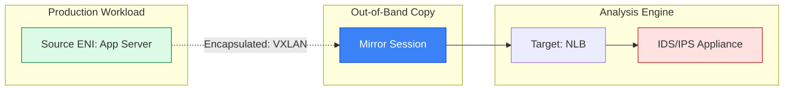

# 📡 Module 10.03: Traffic Mirroring (Deep Packet Inspection)

> **"Flow Logs tell you who knocked on the door. Traffic Mirroring lets you see exactly what they brought inside. When security is on the line, metadata isn't enough; you need to see every byte of the payload."**

## 📚 Overview

**VPC Traffic Mirroring** is the ultimate tool for network security and deep diagnostic analysis. It allows you to duplicate (mirror) the actual network traffic from an Elastic Network Interface (ENI) and send it to a secondary destination—such as an Intrusion Detection System (IDS) or a packet analyzer. Unlike Flow Logs (which only show metadata), Traffic Mirroring captures the **entire packet payload**. This is essential for detecting sophisticated malware, troubleshooting encrypted handshakes, and maintaining strict regulatory compliance.

## 🎓 Learning Objectives

By the end of this module, you will:

- ✅ Understand the **Source-Filter-Target** architecture of a Mirror Session.
- ✅ Implement **VXLAN Encapsulation** for out-of-band packet delivery.
- ✅ Design scalable inspection clusters using **Network Load Balancers**.
- ✅ Differentiate between **Out-of-Band Integrity** and Production Bandwidth.
- ✅ Perform **Forensic Analysis** using tools like Wireshark and Suricata.

---

## 🏗️ Core Components

### 1. Mirror Source
The specific Elastic Network Interface (ENI) you want to monitor. This is typically a high-value target like a public-facing web server or a database.

### 2. Mirror Filter
The "Brain" of the operation. It defines exactly what traffic to copy (e.g., "Only copy inbound TCP traffic on port 443 from this specific subnet"). This prevents your monitoring tools from being overwhelmed by useless data.

### 3. Mirror Target
The destination for the copied traffic. This can be another ENI (running a sniffer) or a **Network Load Balancer (NLB)** that distributes the load across a fleet of security appliances.

---

## 🚀 Professional Pattern: The "Zero-Impact" SIEM

Security teams often fear that putting scanners on their network will slow down the application. Traffic Mirroring solves this through "Out-of-Band" logic.

**The Pro Standard**:
1. **The Capture**: Enable Traffic Mirroring on all production public-facing instances.
2. **The Transport**: Use **VXLAN (UDP port 4789)**. The mirroring happens in the AWS Nitro System hardware, meaning the main EC2 CPU never even knows it's happening.
3. **The Analysis**: Send the mirrored traffic to a dedicated **Security VPC**.
4. **The Benefit**: Your 10k/sec request app stays at 100% performance, while your security team gets a 100% accurate copy of the packets for their IDS.
5. **The Outcome**: High-performance production with enterprise-grade security visibility.

---

## 🏆 Real-World DevOps Story: The "Encrypted" Exfiltration

**The Scenario**: A financial firm noticed a massive spike in outbound traffic to an unknown cloud provider. Flow Logs showed `ACCEPT` on port 443 (HTTPS). It looked like legitimate web traffic.
**The Crisis**: Was it a legitimate backup? Or was a disgruntled employee stealing the database?
**The Discovery**: They enabled **Traffic Mirroring** on the database server's ENI. They sent the traffic to a decryption-capable security appliance.
**The Fix**: By inspecting the mirrored packets, they saw the actual SQL queries being executed. They realized it was a "Data Scraping" bot that was slowly walking through every table and uploading the results to a personal S3 bucket.
**The Result**: The account was locked, and the data breach was stopped before it could finish.
**The Lesson**: **Encrypted traffic is a dark room.** Traffic Mirroring is the flashlight that lets you see what's happening inside the encryption.

---

## ❓ Interview Preparation (Traffic Mirroring)

1. **Q: What is the main difference between VPC Flow Logs and Traffic Mirroring?**
    *A: **Flow Logs** provide metadata only (Source/Dest IP, Port, Protocol, Action). **Traffic Mirroring** provides the whole packet, including the payload (the actual data being sent).*

2. **Q: Does Traffic Mirroring increase the CPU load on the mirrored instance?**
    *A: **No.** On modern Nitro-based instances, the mirroring is handled by the AWS Nitro hardware, not the host CPU. However, it does consume network bandwidth on the instance.*

3. **Q: What is VXLAN, and why is it used here?**
    *A: **VXLAN (Virtual Extensible LAN)** is the encapsulation protocol AWS uses to wrap the mirrored packet. It adds a 50-byte header (wrapped in UDP 4789) to the original packet so it can be routed across the VPC to the mirror target.*

4. **Q: What happens if the network interface becomes saturated with traffic?**
    *A: AWS always prioritizes **Production Traffic**. If the link is full, the mirrored packets are dropped first to ensure your application remains responsive.*

5. **Q: Can you mirror traffic from multiple sources to a single target?**
    *A: **Yes.** You can create multiple Mirror Sessions that all point to the same Network Load Balancer (NLB) or security appliance.*

---

## 📝 Knowledge Check

1. **Which component determines WHICH traffic gets copied (e.g., port 22 only)?**
    - [ ] a) Mirror Source
    - [x] b) Mirror Filter
    - [ ] c) Mirror Session
    - [ ] d) VXLAN Gateway

2. **What protocol and port does AWS use to deliver mirrored traffic?**
    - [ ] a) TCP 80
    - [ ] b) ICMP
    - [x] c) VXLAN (UDP 4789)
    - [ ] d) GRE (TCP 47)

3. **Which Load Balancer type can act as a valid Traffic Mirror Target?**
    - [ ] a) Application Load Balancer (ALB)
    - [x] b) Network Load Balancer (NLB)
    - [ ] c) Classic Load Balancer (CLB)
    - [ ] d) Gateway Load Balancer (GLB)

4. **True or False: Traffic Mirroring allows you to see the actual content of an HTTP request, not just the headers.**
    - [x] True 
    - [ ] False

5. **What is the primary risk of using Traffic Mirroring on an instance that is already at 95% bandwidth capacity?**
    - [ ] a) The instance will crash
    - [ ] b) The production traffic will be slowed down
    - [x] c) The mirrored packets will be dropped
    - [ ] d) The bill will be $0

---

## 🔗 Next Steps

You've mastered the advanced tools. Now let's look at the most common real-world networking disasters and how to fix them using everything you've learned.

Proceed to: **[04. Common Troubleshooting Scenarios](../04-Common-Troubleshooting-Scenarios/README.md)** →
Node: This link points to the "Final Exam" of troubleshooting.