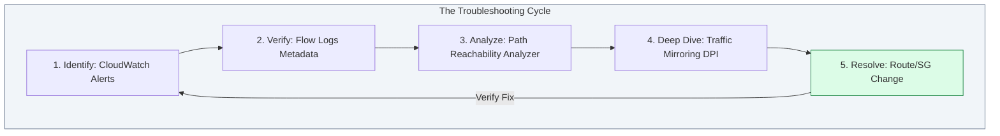

# 🔍 Module 10: Monitoring & Troubleshooting

> **"Visibility is the foundation of reliability. You cannot fix what you cannot see, and in a complex cloud network, what you don't see will eventually bring you down."**

## 📚 Overview

Modern cloud networks are too complex to manage with "guesses" and "hope." When a packet goes missing, you need a systematic, data-driven approach to find it. This module covers the full spectrum of network observability in AWS. We move from **VPC Flow Logs** (Who talked to whom?) to **Reachability Analyzer** (Is the path logically possible?) and finally to **Traffic Mirroring** (What exactly was in that packet?). Master these tools, and you will become the "Network Detective" of your organization.

## 🎓 Learning Objectives

By the end of this module, you will:

- ✅ Analyze **VPC Flow Logs** to identify unauthorized access and cost hotspots.
- ✅ Perform hop-by-hop static analysis using **AWS Reachability Analyzer**.
- ✅ Deploy **Traffic Mirroring** for deep packet inspection and IDS/IPS integration.
- ✅ Use **VPC Network Access Analyzer** to verify "Least Privilege" compliance.
- ✅ Resolve complex networking issues like **Asymmetric Routing** and **MTU Mismatches**.
- ✅ Automate **Self-Healing Networks** using CloudWatch Alarms and Lambda.

---

## 🏗️ The Observability Toolkit

### 1. VPC Flow Logs (The Metadata)
- **Role**: The "Phone Bill" of your network.
- **Data**: Source/Dest IP, Port, Protocol, Action (ACCEPT/REJECT), and Byte count.
- **Best For**: Security audits, cost analysis, and identifying if a firewall is blocking traffic.

### 2. Reachability Analyzer (The Logic)
- **Role**: Static configuration analyst.
- **Data**: It uses "Automated Reasoning" to tell you IF the path is open without sending a single packet.
- **Best For**: Quickly checking if you missed a route table entry or an SG rule.

### 3. Traffic Mirroring (The Packet)
- **Role**: The "Wiretap."
- **Data**: Copies the full raw packet payload from an ENI to a destination.
- **Best For**: Deep Packet Inspection (DPI), troubleshooting application bugs, and feeding data to IDS/IPS appliances.

---

## 🚀 Professional Pattern: The "Inside-Out" Diagnostic Flow

When a connection fails, don't just start clicking randomly in the console. Follow the pro diagnostic sequence.

**The Pro Standard**:
1. **Flow Logs**: Check for `REJECT` packets. If you see them, it's a Security Group or NACL issue.
2. **Reachability Analyzer**: Run a test from Source to Destination. It will highlight exactly which "Hop" is blocking the traffic (e.g., "Missing Route to IGW").
3. **Local Check**: Check the instance OS. Is the service actually listening (`ss -tuln`)? Is the OS firewall (`iptables/ufw`) blocking it?
4. **The Mirror**: If the network is "clean" but the data is corrupted, use Traffic Mirroring to see if the packet is being malformed in transit.

---

## 🏆 Real-World DevOps Story: The Asymmetric Routing Ghost

**The Scenario**: A company added an "Inspection VPC" with a central firewall. They routed all traffic through the firewall and back to the app.
**The Crisis**: Pings worked, but SSH and HTTP connections would hang indefinitely and then timeout.
**The Discovery**: They had **Asymmetric Routing**. The request went *through* the firewall to the app, but the app saw a local route and sent the response *directly* back to the user, bypassing the firewall. Since the firewall never saw the return traffic, it marked the original connection as "Invalid" or "Half-Open" and eventually blocked it.
**The Fix**: Used **Reachability Analyzer** to visualize the return path. They added "Return Routes" to the app's route table to force all traffic back through the firewall.
**The Lesson**: **Packet paths must be symmetrical.** If the firewall sees only half of the conversation, it will eventually silence the whole thing.

---

## ❓ Interview Preparation (Troubleshooting)

1. **Q: What does a 'REJECT' in a VPC Flow Log usually mean?**
    *A: It means a packet was explicitly dropped by either a **Security Group** (stateful) or a **Network ACL** (stateless). If the rejection only happens in one direction, it's likely a NACL ephemeral port issue.*

2. **Q: Why would you use Reachability Analyzer instead of just pinging?**
    *A: Pinging only tells you IF a connection is down. **Reachability Analyzer** tells you WHY it's down by showing the exact hop (Route Table, Gateway, or SG) that is blocking the logical path.*

3. **Q: What is 'MTU Mismatch' and how do you spot it?**
    *A: MTU (Maximum Transmission Unit) determines the size of the packet. If a VPC (MTU 9001) talks to a VPN (MTU 1500), large packets will be dropped if 'ICMP Destination Unreachable' is blocked. You spot it when small packets (like pings) work, but large packets (like file transfers) fail.*

4. **Q: How can Flow Logs help reduce costs?**
    *A: You can identify "Inter-AZ" traffic. By seeing which instances are talking across Availability Zones, you can move those resources into the same AZ to eliminate the inter-zone data transfer fees.*

5. **Q: What is VPC Traffic Mirroring used for in security?**
    *A: It's used to feed production traffic into an IDS (Intrusion Detection System) like Snort or Suricata. This allows for real-time threat detection without adding latency to the main production traffic.*

---

## 📝 Knowledge Check

1. **Which tool is best for verifying that your 'Public' subnets cannot access your 'Database' subnets on port 22?**
    - [ ] a) CloudWatch Metrics
    - [x] b) VPC Network Access Analyzer
    - [ ] c) Route 53
    - [ ] d) IAM Access Analyzer

2. **Flow Log 'Action' field shows 'REJECT'. Which of these is NOT a possible cause?**
    - [ ] a) Security Group Outbound Rule
    - [ ] b) Network ACL Inbound Rule
    - [x] c) An Internet Gateway reaching its throughput limit
    - [ ] d) Security Group Inbound Rule

3. **Traffic Mirroring encapsulates packets using which protocol?**
    - [ ] a) IPsec
    - [ ] b) TLS
    - [x] c) VXLAN
    - [ ] d) GRE

4. **What does 'NODATA' mean in a VPC Flow Log?**
    - [ ] a) The logging service is broken
    - [x] b) No traffic matched the filter during the capture window
    - [ ] c) The database is empty
    - [ ] d) The disk is full

5. **True or False: Reachability Analyzer sends a specialized 'Ping' packet to test the network.**
    - [ ] True
    - [x] False (It uses static configuration analysis and mathematical modeling)

---

## 🔗 Next Steps

Congratulations! You've completed the Intermediate Networking curriculum. You now have the skills to build, scale, and protect production networks in the cloud.

Proceed to: **[Phase 2: Linux & Automation](README.md)** →
Node: This link points to the next phase of the curriculum.

---
## 🧭 Additional Modules
- [01 VPC Flow Logs Network Visibility](01-VPC-Flow-Logs-Network-Visibility/README.md)
- [02 Reachability Analyzer Network Insights](02-Reachability-Analyzer-Network-Insights/README.md)
- [03 Traffic Mirroring Deep Packet Inspection](03-Traffic-Mirroring-Deep-Packet-Inspection/README.md)
- [04 Common Troubleshooting Scenarios](04-Common-Troubleshooting-Scenarios/README.md)
- [05 Advanced Monitoring Tools](05-Advanced-Monitoring-Tools/README.md)
