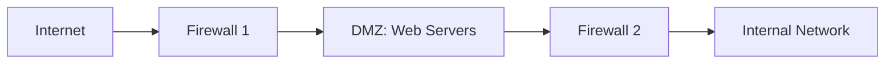
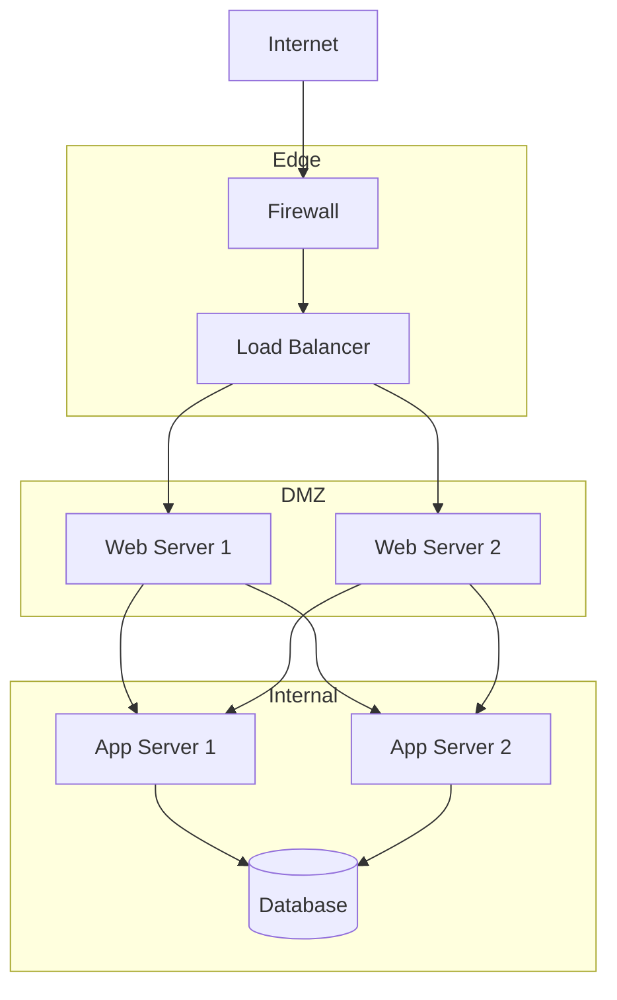

# Enterprise Network Architecture Reference

**Doc Version:** 1.0.0
**Role:** Network Security Architect
**Scope:** VLANs, Segmentation, Firewalls, and Zero Trust

---

## 1. Network Segmentation

### The Problem
A flat network (all devices on one subnet) is a security nightmare:
- **Lateral Movement**: If an attacker compromises one device, they can reach everything
- **Broadcast Storms**: Excessive broadcast traffic degrades performance
- **No Policy Enforcement**: Can't apply different security rules to different zones

### The Solution: VLANs (Virtual LANs)

**VLAN**: Logical separation of a physical network into multiple broadcast domains.

#### Example
```
Physical Switch (Single Device)
├── VLAN 10: Management (10.0.10.0/24)
├── VLAN 20: Production (10.0.20.0/24)
├── VLAN 30: Development (10.0.30.0/24)
└── VLAN 40: Guest (10.0.40.0/24)
```

**Benefit**: Devices in VLAN 10 cannot directly communicate with VLAN 20 without routing through a firewall.

---

## 2. Firewall Architectures

### A. Stateless Firewalls (ACLs)
**Mechanism**: Packet filtering based on 5-tuple (src IP, dst IP, src port, dst port, protocol)

**Example ACL**:
```
# Allow SSH from admin subnet
permit tcp 10.0.10.0/24 any eq 22

# Allow HTTP/HTTPS from anywhere
permit tcp any any eq 80
permit tcp any any eq 443

# Deny everything else
deny ip any any
```

**Limitation**: No context. If you allow outbound traffic, you must manually allow return traffic.

### B. Stateful Firewalls
**Mechanism**: Track connection state. Automatically allow return traffic for established connections.

**Example (iptables)**:
```bash
# Allow established connections
iptables -A INPUT -m state --state ESTABLISHED,RELATED -j ACCEPT

# Allow new SSH connections
iptables -A INPUT -p tcp --dport 22 -m state --state NEW -j ACCEPT

# Drop everything else
iptables -P INPUT DROP
```

**Benefit**: Simpler rules, better security.

### C. Next-Gen Firewalls (NGFW)
**Capabilities**:
- **Deep Packet Inspection (DPI)**: Inspect application-layer data
- **IDS/IPS**: Detect and block malicious patterns
- **Application Awareness**: Block Facebook but allow Slack
- **TLS Inspection**: Decrypt and inspect HTTPS traffic

**Examples**: Palo Alto, Fortinet, Cisco Firepower

---

## 3. DMZ (Demilitarized Zone)

**Purpose**: Isolate public-facing services from internal network.

### Architecture


**Rules**:
- **Internet → DMZ**: Allow HTTP/HTTPS only
- **DMZ → Internal**: Allow database connections only (port 3306)
- **Internal → DMZ**: Allow management (SSH)
- **DMZ → Internet**: Deny (prevent compromised web server from calling home)

---

## 4. Zero Trust Architecture

**Principle**: "Never trust, always verify."

### Traditional Model (Castle and Moat)
- **Inside the network**: Trusted
- **Outside the network**: Untrusted

**Problem**: Once an attacker is inside, they own everything.

### Zero Trust Model
- **No implicit trust**: Every request is authenticated and authorized
- **Micro-segmentation**: Enforce policies at the workload level
- **Least Privilege**: Users/services get minimum required access

### Implementation
1. **Identity-Based Access**: Use mTLS (mutual TLS) for service-to-service auth
2. **Policy Engine**: Centralized authorization (e.g., OPA, AWS IAM)
3. **Continuous Verification**: Re-authenticate periodically

**Example (Kubernetes Network Policy)**:
```yaml
apiVersion: networking.k8s.io/v1
kind: NetworkPolicy
metadata:
  name: deny-all-default
spec:
  podSelector: {}
  policyTypes:
  - Ingress
  - Egress
---
apiVersion: networking.k8s.io/v1
kind: NetworkPolicy
metadata:
  name: allow-frontend-to-backend
spec:
  podSelector:
    matchLabels:
      app: backend
  ingress:
  - from:
    - podSelector:
        matchLabels:
          app: frontend
    ports:
    - protocol: TCP
      port: 8080
```

---

## 5. Load Balancing Strategies

### A. Layer 4 (Transport Layer)
**Mechanism**: Route based on IP and port (no inspection of payload)
**Protocols**: TCP, UDP
**Speed**: Very fast (minimal processing)

**Example**: AWS Network Load Balancer (NLB)

### B. Layer 7 (Application Layer)
**Mechanism**: Route based on HTTP headers, URL paths, cookies
**Protocols**: HTTP, HTTPS, gRPC
**Speed**: Slower (must parse HTTP)

**Example**: AWS Application Load Balancer (ALB), nginx

**Use Case**:
```nginx
# Route /api to backend servers
location /api {
    proxy_pass http://backend_pool;
}

# Route /static to CDN
location /static {
    proxy_pass http://cdn_pool;
}
```

### C. Global Server Load Balancing (GSLB)
**Mechanism**: DNS-based routing to nearest data center
**Example**: Route53, Cloudflare

---

## 6. Visualizing Enterprise Network



> **Enterprise Pattern**: Implement **East-West Firewalling** (between internal services) in addition to **North-South** (internet to internal). This prevents lateral movement after a breach.
