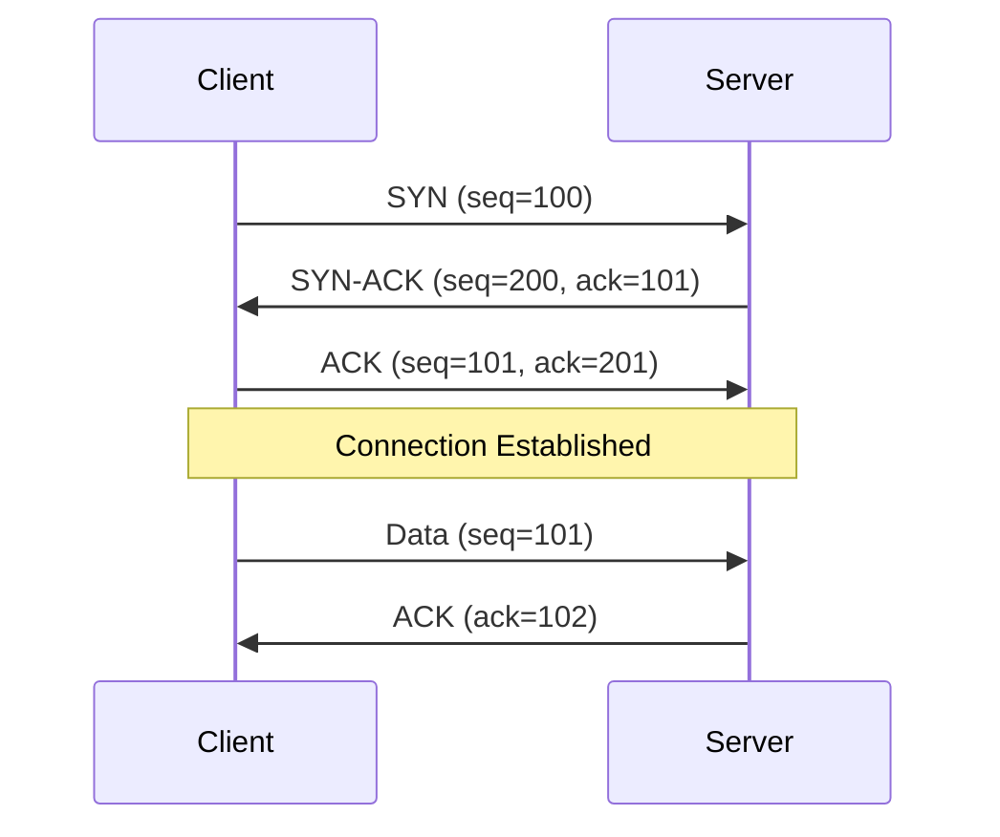
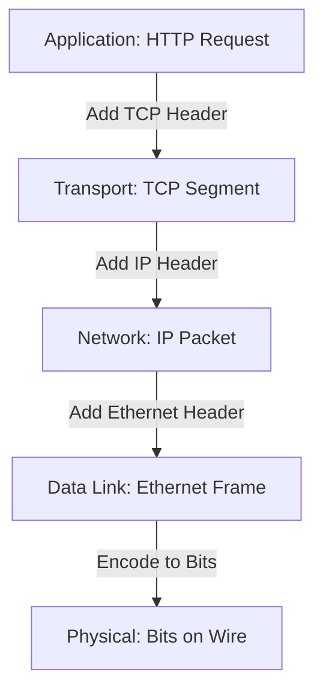

# TCP/IP Stack Deep Dive Reference

**Doc Version:** 1.0.0
**Role:** Network Architect
**Scope:** OSI Model, TCP/IP Layers, and Protocol Internals

---

## 1. The OSI Model vs TCP/IP Model

### OSI (7 Layers) - Theoretical
| Layer | Name | Function | Example Protocols |
|:---|:---|:---|:---|
| **7** | Application | User-facing protocols | HTTP, DNS, SMTP |
| **6** | Presentation | Data encoding/encryption | TLS, JPEG, ASCII |
| **5** | Session | Connection management | NetBIOS, RPC |
| **4** | Transport | End-to-end delivery | TCP, UDP |
| **3** | Network | Routing between networks | IP, ICMP, BGP |
| **2** | Data Link | Node-to-node transfer | Ethernet, Wi-Fi, ARP |
| **1** | Physical | Bits on wire | Cables, Radio Waves |

### TCP/IP (4 Layers) - Practical
| Layer | OSI Equivalent | Function |
|:---|:---|:---|
| **Application** | 5-7 | HTTP, DNS, SSH |
| **Transport** | 4 | TCP, UDP |
| **Internet** | 3 | IP, ICMP |
| **Link** | 1-2 | Ethernet, ARP |

**Why Both?**: OSI is for understanding; TCP/IP is what's actually implemented.

---

## 2. Layer 4: Transport Layer

### A. TCP (Transmission Control Protocol)
**Characteristics**:
- **Connection-Oriented**: 3-way handshake (SYN, SYN-ACK, ACK)
- **Reliable**: Guarantees delivery via acknowledgments and retransmissions
- **Ordered**: Packets arrive in sequence
- **Flow Control**: Prevents sender from overwhelming receiver (sliding window)
- **Congestion Control**: Slows down when network is congested (TCP Slow Start)

**Use Cases**: HTTP, SSH, Database connections (anything requiring reliability)

**Overhead**: ~40 bytes per packet (20 IP + 20 TCP headers)

### B. UDP (User Datagram Protocol)
**Characteristics**:
- **Connectionless**: No handshake
- **Unreliable**: No delivery guarantees
- **Unordered**: Packets may arrive out of sequence
- **Low Latency**: No retransmission delays

**Use Cases**: DNS, VoIP, Video streaming, Gaming (where speed > reliability)

**Overhead**: ~28 bytes per packet (20 IP + 8 UDP headers)

---

## 3. Layer 3: Network Layer

### IP Addressing

#### IPv4
- **Format**: 32-bit (4 octets): `192.168.1.1`
- **Total Addresses**: ~4.3 billion
- **Problem**: Address exhaustion (solved by NAT and IPv6)

#### IPv6
- **Format**: 128-bit (8 groups of 4 hex digits): `2001:0db8:85a3::8a2e:0370:7334`
- **Total Addresses**: 340 undecillion (3.4 × 10^38)
- **Benefits**: No NAT needed, built-in IPsec, better routing

### Subnetting (CIDR Notation)
`192.168.1.0/24`:
- **Network**: `192.168.1.0`
- **Subnet Mask**: `255.255.255.0`
- **Usable IPs**: 254 (256 - 2 for network and broadcast)
- **Broadcast**: `192.168.1.255`

**Calculation**:
- `/24` = 32 - 24 = 8 bits for hosts = 2^8 = 256 addresses

---

## 4. Layer 2: Data Link Layer

### MAC Addresses
- **Format**: 48-bit (6 octets): `00:1A:2B:3C:4D:5E`
- **Scope**: Local network only (doesn't route across the internet)
- **ARP (Address Resolution Protocol)**: Maps IP to MAC
  - Host broadcasts: "Who has 192.168.1.1?"
  - Target responds: "I do, my MAC is 00:1A:2B:3C:4D:5E"

### Ethernet Frame
```
| Preamble | Dest MAC | Src MAC | Type | Payload | FCS |
|  8 bytes |  6 bytes | 6 bytes | 2 B  | 46-1500B| 4 B |
```

**MTU (Maximum Transmission Unit)**: 1500 bytes (standard Ethernet)
- If packet > MTU, it's fragmented (bad for performance)

---

## 5. The TCP 3-Way Handshake



**Why 3-Way?**: Prevents stale connections from being accepted.

---

## 6. Common Protocols

| Protocol | Port | Layer | Purpose |
|:---|:---|:---|:---|
| **HTTP** | 80 | 7 | Web traffic |
| **HTTPS** | 443 | 7 | Encrypted web |
| **SSH** | 22 | 7 | Secure shell |
| **DNS** | 53 | 7 | Name resolution |
| **SMTP** | 25 | 7 | Email sending |
| **FTP** | 21 | 7 | File transfer |
| **ICMP** | - | 3 | Ping, traceroute |

---

## 7. Visualizing the Stack



> **Enterprise Pattern**: Use **Jumbo Frames** (MTU 9000) in data center networks to reduce CPU overhead. This requires end-to-end support (switches, NICs, OS).
