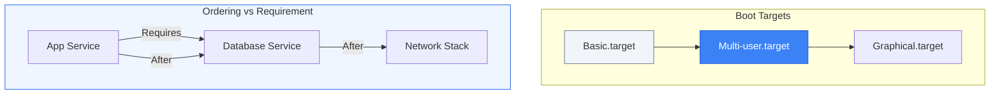

# 🔗 Module 01.04: Dependencies & Targets

> **"A modern server is a complex web of relationships. A database must wait for the disk, a web app must wait for the database, and everything must wait for the network. Targets and Dependencies are the traffic lights that prevent a chaotic boot-up crash."**



## 📚 Overview

One of the main reasons Systemd replaced the old "Init" scripts is its ability to parallelize service startup while respecting complex dependencies. Instead of sequential numbered scripts (`S01`, `S02`), Systemd uses **Targets** and **Unit Directives** to build a dynamic dependency graph. This module covers the difference between "Ordering" (when it starts) and "Requirement" (if it starts), and how to manage the system's overall state using Targets.

## 🎓 Learning Objectives

- ✅ Differentiate between **Ordering (`After/Before`)** and **Requirement (`Requires/Wants`)**.
- ✅ Master the lifecycle of a **Target** (The modern Runlevel).
- ✅ Implement **BindsTo** for hard linkage between parent and child services.
- ✅ Troubleshoot dependency loops using `systemd-analyze plot`.
- ✅ Navigate and switch between boot targets (e.g., rescue, multi-user).

---

## 🏗️ 1. The Dependency Matrix

Systems engineers often confuse *when* a service starts with *why* it starts.

| Directive | Type | Effect |
| :--- | :--- | :--- |
| **After=** | Ordering | If both services start, START THIS ONE AFTER the other. |
| **Before=** | Ordering | If both services start, START THIS ONE BEFORE the other. |
| **Requires=** | Requirement | **HARD LINK**: If the other service fails or is stopped, this one STOPS TOO. |
| **Wants=** | Requirement | **SOFT LINK**: Try to start the other service, but continue even if it fails. |
| **BindsTo=** | Requirement | **CRITICAL LINK**: If the other service vanishes (e.g., device unplugged), kill this one instantly. |

---

## 🏗️ 2. Targets: The Modern Runlevel

In the old days, Linux used "Runlevels" (0-6). Systemd uses **Targets**.

- **default.target**: The one the system boots into by default (usually a symlink).
- **multi-user.target**: The standard production state (Command Line).
- **graphical.target**: Standard desktop state (GUI + Multi-user).
- **rescue.target**: Single-user recovery mode.

```bash
# Check current default target
systemctl get-default

# Switch to a different target (e.g., maintenance mode)
sudo systemctl isolate multi-user.target
```

---

## 🚀 Professional Pattern: The "Soft Dependency" Failover

Junior admins use `Requires=` for everything. This is dangerous because if a non-critical database (like a cache) has a minor issue, it will bring down the entire application.

**The Pro Standard**:
1. **The Logic**: Use `Wants=` for external services and `After=` for ordering.
2. **The Benefit**: Your application will *attempt* to wait for the cache, but it won't be killed if the cache is temporarily unavailable. 
3. **The Outcome**: More resilient systems that can handle partial failures without a total blackout.

---

## ❓ Interview Preparation

1. **Q: Does 'After=network.target' mean the service already has an IP address?**
    *A: No. `network.target` only means the networking service itself has started. For cloud apps, you should usually use `network-online.target` to ensure the network is actually usable with an IP.*

2. **Q: How can you visualize the boot-up sequence of your server?**
    *A: Use `systemd-analyze plot > boot.svg`. This generates a visual timeline showing exactly how long each service took to start and their relationships.*

3. **Q: What is a dependency 'Loop' and how does Systemd handle it?**
    *A: A loop happens if A depends on B, and B depends on A. Systemd will detect this during `daemon-reload`, throw an error in the logs, and usually refuse to start one of the services to prevent a system hang.*

---

## 📝 Knowledge Check

1. **If Service A has 'Requires=Service B' and Service B is manually stopped, what happens to Service A?**

    - [ ] a) Nothing, it keeps running
    - [ ] b) It reloads its config
    - [x] c) It is stopped automatically
    - [ ] d) It enters a 'Failed' state

1. **Which target is the modern equivalent of 'Runlevel 3' (Multi-user with networking, no GUI)?**

    - [ ] a) basic.target
    - [x] b) multi-user.target
    - [ ] c) graphical.target
    - [ ] d) network.target

1. **What is the command to see the graphical boot timeline?**

    - [ ] a) systemctl list-jobs
    - [ ] b) journalctl -b
    - [x] c) systemd-analyze plot
    - [ ] d) top

---

## 🔗 Next Steps

You've mastered the choreography of services. The phase is now complete. You have the foundational knowledge to manage production services at scale.

Return to: **[System Administration Overview](../README.md)** | Proceed to the next phase: **[Process Management](../../02-Process-Management/README.md)** →
 Node: Finalizing Module 01.
