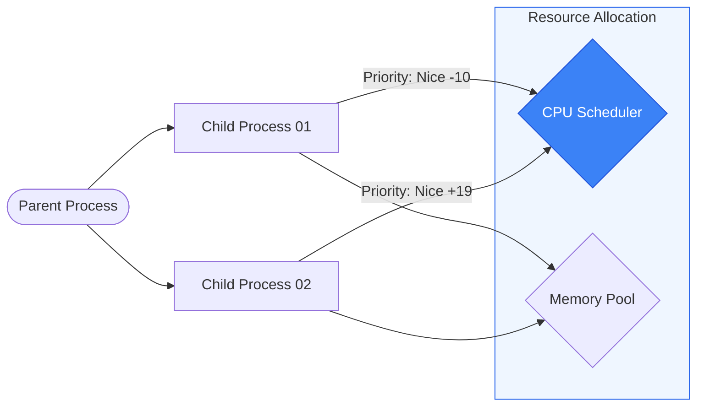

# 📊 Module 02: Process Management & Resource Control

> **"A busy server isn't always a healthy server. Every process on a Linux machine is a competitor for the CPU's attention and the RAM's space. Mastering processes means being the referee who ensures everyone plays fair."**

## 📚 Overview

Everything that "happens" in Linux is a process. From the smallest `ls` command to the largest database, every task is a line in the kernel's process table. As a DevOps engineer, you must move beyond just seeing "high CPU" to understanding **why** it's high, which process is the culprit, and how to surgically remove it or deprioritize it without crashing the entire system.

## 🎓 Learning Objectives

By the end of this module, you will:

- ✅ Decipher the output of `top` and `htop` like a forensic investigator.
- ✅ Manipulate process priorities using **Nice** and **Renice**.
- ✅ Send appropriate **Signals** (SIGTERM, SIGKILL, SIGHUP) to control behavior.
- ✅ Understand the difference between **User Mode** and **Kernel Mode** CPU usage.
- ✅ Monitor I/O bottlenecks using `iotop` and `pidstat`.

---

## 🏗️ 1. The Resource Investigation Toolkit

| Tool | Action | Key Use Case |
| :--- | :--- | :--- |
| `htop` | Visual Monitor | Identifying "CPU Hogs" and memory consumption in real-time. |
| `ps aux` | Process List | Getting a static snapshot of every running process. |
| `kill` | Send Signal | Telling a process to stop, reload, or die immediately. |
| `nice` / `renice` | Priority | Adjusting who gets more CPU time in a crowded system. |
| `lsof` | Open Files | Finding which process is holding a lock on a file or port. |

---

## 🏗️ 2. The Language of Signals

When you run `kill`, you aren't just "stopping" a process—you are sending a message.

- **SIGTERM (15)**: "Please stop gracefully." The process can finish its current task and close files. **Always try this first.**
- **SIGKILL (9)**: "Die now." The kernel kills the process instantly. It cannot clean up, which might result in data corruption. **The nuclear option.**
- **SIGHUP (1)**: "Reload your configuration." Many services (like Nginx) use this to refresh settings without stopping the traffic.

---

## 🚀 Professional Pattern: The "Background Worker" Priority

Junior admins run everything at the default priority. Senior admins ensure that "Utility" tasks (like backups) don't slow down the "Customer" tasks (like the web app).

**The Pro Standard**:
1. **The Tool**: Use `nice -n 19 <backup_command>`.
2. **The Logic**: A 'Nice' value of +19 is the lowest possible priority.
3. **The Benefit**: The backup task will consume 100% of the CPU *only if* the server is idle. As soon as a customer request comes in, the kernel instantly shifts CPU time to the web app, effectively making the backup "invisible" to the end-user.
4. **The Outcome**: You get your work done without ever causing a latency spike for the customers.

---

## 🏆 Real-World DevOps Story: The "Unkillable" Process

**The Scenario**: A developer was testing a script that got stuck in an infinite loop. The admin ran `kill -9 <PID>`, but the process stayed in the list!
**The Crisis**: The process was marked with a `D` state (Uninterruptible Sleep) in `top`. 
**The Discovery**: The process was waiting for an I/O response from a network disk (NFS) that had gone offline. In the `D` state, the process is inside a "Kernel Wait" and cannot receive any signals, even SIGKILL.
**The Fix**: There is only one way to kill a `D` state process: **Fix the hardware/network it is waiting for, or Reboot.** 
**The Lesson**: **Not all kills are instant.** If `kill -9` doesn't work, look for hardware or network disk failures.

---

## ❓ Interview Preparation (Process Management)

1. **Q: What is a 'Zombie' process?**
    *A: A Zombie is a process that has finished execution but still has an entry in the process table. This happens because the 'Parent' process hasn't yet acknowledged (via wait()) that the child is dead. They don't consume CPU, but they do consume a PID.*

2. **Q: What does 'Load Average' (e.g., 5.0, 1.0, 0.5) actually mean in 'top'?**
    *A: It represents the number of processes in the "Runnable" or "Uninterruptible" state over the last 1, 5, and 15 minutes. If your Load Average is higher than your number of CPU cores, your system is "Waiting" for CPU time.*

3. **Q: Explain the 'Nice' scale.**
    *A: It ranges from -20 (Highest Priority) to +19 (Lowest Priority). Zero is the default. Only 'root' can set a negative (higher priority) nice value.*

4. **Q: How do you find which process is using the most Memory?**
    *A: Run `htop` and press `F6` to sort by `MEM%` or run `ps aux --sort=-%mem | head`.*

5. **Q: What is the difference between 'Resident' and 'Virtual' memory?**
    *A: **Resident (RES)** is the physical RAM being used by the process right now. **Virtual (VIRT)** is the total memory the process "thinks" it has access to, including shared libraries and swapped data.*

---

## 📝 Knowledge Check

1. **Which signal allows a process to finish its task before exiting?**
    - [ ] a) SIGKILL
    - [x] b) SIGTERM
    - [ ] c) SIGSTOP
    - [ ] d) SIGCONT

2. **If htop shows a CPU usage bar in 'RED', what does it indicate?**
    - [ ] a) User usage
    - [x] b) Kernel (System) usage
    - [ ] c) Nice usage
    - [ ] d) Virt usage

3. **Which nice value gives a process the HIGHEST priority?**
    - [x] a) -20
    - [ ] b) 0
    - [ ] c) +19
    - [ ] d) 100

4. **What is the state code for a process that is in 'Zombie' mode?**
    - [ ] a) R
    - [ ] b) S
    - [ ] c) D
    - [x] d) Z

5. **True or False: A process with a high Load Average always indicates high CPU usage.**
    - [ ] True 
    - [x] False (High load can also indicate I/O wait, where the CPU is idle but waiting for the disk)

---

## 🔗 Next Steps

Resources are safe when access is controlled. Let's learn to manage users and privilege boundaries.

Proceed to: **[03. User & Identity Management](../03-User-and-Group-Management/README.md)** →
Node: This link points to the security and identity module.
