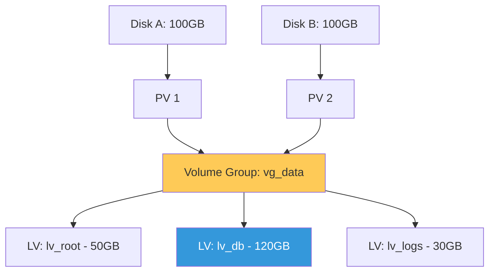

# Storage, Security & Governance Reference

**Doc Version:** 1.0.0
**Role:** Storage Engineer / Security Administrator
**Scope:** LVM Architecture, User Privilege Management, and Log Governance

---

## 1. Logical Volume Management (LVM)

LVM provides an abstraction layer between physical hardware and the operating system, allowing for flexible storage volumes.

### A. The Hierarchy
1.  **Physical Volumes (PV)**: The raw disk or partition (e.g., `/dev/sdb1`).
2.  **Volume Groups (VG)**: A pool of space created from one or more PVs.
3.  **Logical Volumes (LV)**: The actual "partition" that is formatted and mounted.

### B. Core Operations
- **Extension**: Grow a filesystem while it is online (`lvextend` + `resize2fs`).
- **Snapshots**: Point-in-time copies for backups or testing.
- **Thin Provisioning**: Allocating virtual space that is only consumed as data is written.

---

## 2. Identity & Privilege Governance

Hardening access is the first rule of system security.

### A. Sudo Architecture
- **Visudo**: The ONLY safe way to edit `/etc/sudoers`.
- **Aliases**: Grouping users, commands, and hosts for cleaner policies.
- **NOPASSWD**: Use sparingly, primarily for automated monitoring scripts or Ansible tasks.

### B. User Lifecycle
- **Shadow File**: Understanding encrypted passwords and expiration dates (`chage`).
- **Nologin**: Ensuring system accounts (e.g., `bin`, `daemon`) cannot be used for interactive shells.

---

## 3. Visualizing LVM Flexibility

---

## 4. Log Governance & Forensics

Logs are the legal record of system activity.

- **Journald**: Binary, indexed system log with rich metadata (PID, Unit, Timestamp).
- **Rsyslog**: Text-based logging for backward compatibility and remote shipping.
- **Logrotate**: Managing disk space by compressing and purging old log files.

---

## 5. Enterprise Governance Standards

- **Metadata Labeling**: Internal volumes should follow a strict naming convention (e.g., `vg_<App>_<Env>`).
- **Shared Accountability**: No "Generic" admin accounts. Every action must be tied to a specific user via `sudo` logs.
- **Retention Policies**: Compliance frameworks (SOC2, HIPAA) often require system logs to be kept for 1-7 years. Use remote log shipping to immutable storage.

> **Enterprise Pattern**: Implement **The "Growth" Reserve**. Always leave 10-20% of your Volume Group (VG) unallocated. This allows for emergency filesystem expansion without needing to immediately add new physical disks, buying your team time to perform a proper hardware upgrade or cleanup.
