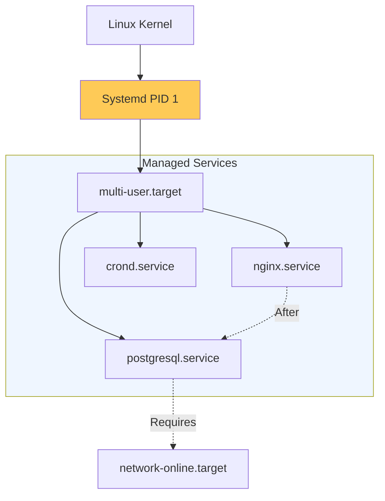

# Linux System Architecture & Service Management Reference

**Doc Version:** 1.0.0
**Role:** System Administrator / SRE
**Scope:** Systemd Architecture, Process Lifecycle, and Service Orchestration

---

## 1. Systemd Architecture: The Core Init

`systemd` is the first process (PID 1) started by the kernel. It is responsible for bringing the system to a usable state by starting services, mounting filesystems, and managing hardware events.

### A. Unit Types
- **Service (.service)**: Manages a daemon or application.
- **Target (.target)**: A group of units (similar to runlevels).
- **Timer (.timer)**: Systemd-native alternative to Cron.
- **Mount (.mount)**: Manages filesystem mount points.

### B. Service Dependencies
- **Wants vs. Requires**: 
    - `Wants`: Weak dependency (A starts even if B fails).
    - `Requires`: Strong dependency (A fails if B fails).
- **After vs. Before**: Determines the *order* of startup, not dependency.

---

## 2. The Process Lifecycle

Understanding how Linux manages execution is critical for performance tuning.

### A. Process States
- **Running (R)**: Actively using the CPU.
- **Sleeping (S/D)**: Waiting for an event (Interruptible vs. Uninterruptible).
- **Zombie (Z)**: Process finished but entry remains in the process table.
- **Stopped (T)**: Suspended by a signal (e.g., Ctrl-Z).

### B. Signals & Control
- **SIGTERM (15)**: Graceful shutdown request.
- **SIGKILL (9)**: Immediate, forced termination (Kernel-level).
- **SIGHUP (1)**: Reload configuration without stopping.

---

## 3. Visualizing Service Orchestration

---

## 4. Resource Limits (Cgroups)

Systemd uses Linux **Cgroups** to enforce resource boundaries on services.
- **CPUQuota**: Limiting a service to a percentage of CPU time (e.g., `CPUQuota=50%`).
- **MemoryLimit**: Preventing a service from consuming more than X amount of RAM.
- **LimitNOFILE**: Increasing file descriptor limits for high-concurrency apps.

---

## 5. Enterprise Governance Standards

- **Restart Policies**: All production services MUST have `Restart=always` or `Restart=on-failure` with a `RestartSec` delay to prevent cascading failures.
- **Isolation**: Services should run under their own dedicated user (e.g., `User=nginx`), never as `root`.
- **Status Auditing**: Automated health scripts should monitor `systemctl is-active` and `systemctl is-failed` across the fleet.

> **Enterprise Pattern**: Implement **The "Immaculate" Service Unit**. Never modify system-provided unit files in `/lib/systemd/system/`. Instead, use **Drop-in files** in `/etc/systemd/system/service.d/override.conf` or a full override in `/etc/systemd/system/`. This ensures your customizations survive package updates while maintaining a clear audit trail of local changes.
