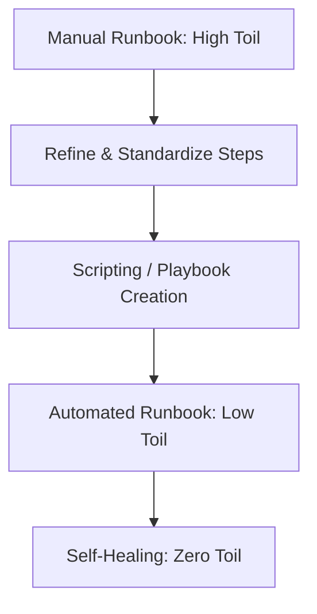
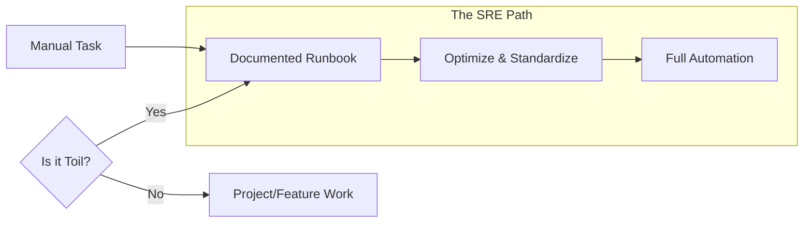

# The SRE Standard for Runbooks

The Google SRE Handbook transformed runbooks from "Optional Notes" to "Operational Requirements."

## Google's "Golden Rules" for Runbooks
1.  **Specificity**: A runbook must be for a specific alert.
2.  **Actionability**: Every step must lead to a result. No "Read this 50-page paper to find the answer."
3.  **Low Friction**: No passwords or complicated logins to access the docs during an outage.
4.  **Feedback-Driven**: After every incident, the first question is: "Was the runbook helpful? If not, fix it."

## Toil Reduction
SREs strive to eliminate **Toil** (repetitive, manual, boring work).
- If a runbook is used 20 times a week, it is a candidate for **Automation (Playbook)**.
- The Runbook is the bridge between Toil and Automation.

## Mermaid Diagram: Toil to Automation Flow

---

## Toil Reduction Strategy

---

## 🏗️ Real-Life Scenarios

### Scenario 1: The "Read the Manual" Trap
**Problem**: An outage occurs. The engineer opens the "Recovery Guide." It is a 40-page PDF containing the history of the database, the architecture of the cloud, and lastly, the 3 commands needed to fix it.
**Outcome**: The engineer takes 30 minutes to find the commands. The site stays down.
**SRE Solution**: Break the PDF into 10 smaller, title-specific Runbooks. Use a "Quick Start" section at the top of each.
**Result**: Time to find the fix drops from 30 minutes to 30 seconds.

### Scenario 2: The "Toil" Tipping Point
**Problem**: An SRE team spent 40% of their week manually resetting stale database connections. The senior manager realized this was "Toil"—repetitive, manual, and has no long-term value.
**Solution**: The team was mandated to spend one "Sprint" automating this. They wrote an automated runbook in Python that cleans connections when they exceed a certain age.
**Result**: Toil dropped from 40% to 5%. The team used the saved time to build a new monitoring platform.

### Scenario 3: The "Feedback Loop" Failure
**Problem**: A runbook for "Updating Nginx" had a typo in the config path. Three different engineers encountered the typo over a month, but no one fixed the runbook because "it wasn't their job."
**Solution**: Implement a "Mandatory Feedback" policy. After every runbook execution, the engineer must provide a Thumbs Up/Down and a comment.
**Result**: The typo was fixed within 1 hour of the next execution, preventing further frustration and errors.

---

## ❓ Interview Questions

1.  **What is 'Toil' and how do runbooks help manage it?**
    - *Answer*: Toil is manual, repetitive, tactical work that lacks enduring value and scales linearly with service size. Runbooks document toil so it can be performed consistently by anyone and serves as the blueprint for future automation.
2.  **Describe the 'SRE mindset' towards documentation.**
    - *Answer*: SREs treat documentation like code. It must be versioned, reviewed by peers, kept in the same repository as the service, and validated through regular testing or "Gamedays."
3.  **What are the Google SRE 'Golden Rules' for Runbooks?**
    - *Answer*: Specificity (one runbook per alert), Actionability (clear steps, no fluff), Low Friction (easy to access and read), and Feedback-Driven (continuously improved).
4.  **How do you measure the 'Effectiveness' of a runbook?**
    - *Answer*: Key metrics include the reduction in MTTR (Mean Time to Recovery), the success rate of junior engineers using it, and the frequency of updates based on new learnings.
5.  **Why should SREs aim to spend only 50% of their time on Ops work?**
    - *Answer*: To prevent burnout and ensure they have enough time for "Project Work" (Engineering) that actually reduces future operational burden through automation and system improvements.
6.  **What is a 'Runbook Review' in a Post-Mortem?**
    - *Answer*: After a major incident, the team reviews if the runbook was accurate, easy to find, and helpful. If it failed to assist the engineer, updating the runbook becomes a P0 follow-up action.

---

## 🧠 Comprehensive Quiz (25 Questions)

<b>1. What is the SRE term for repetitive, manual, tactical work?</b>

Show Answer

Answer: B

<b>2. True/False: SREs should aim to spend 100% of their time on operational tasks.</b>

Show Answer

Answer: B** - Google recommends a cap of 50% to allow for engineering/projects.

<b>3. Which company is credited with formalizing the modern SRE role?</b>

Show Answer

Answer: C

<b>4. A runbook should be "Actionable," meaning:</b>

Show Answer

Answer: B

<b>5. "Toil scales linearly" means:</b>

Show Answer

Answer: B** - This is why automation is required to "break the linear curve."

<b>6. Which of these is NOT a characteristic of Toil?</b>

Show Answer

Answer: C

<b>7. "No Friction" access to runbooks means:</b>

Show Answer

Answer: B

<b>8. After an incident, if a runbook was found to be outdated, what is the SRE priority?</b>

Show Answer

Answer: B

<b>9. Why is 'Feedback' critical in the SRE standard?</b>

Show Answer

Answer: B

<b>10. What is a 'Blameless Post-Mortem'?</b>

Show Answer

Answer: B

<b>11. A 'Quick Start' section at the top of a runbook follows which SRE principle?</b>

Show Answer

Answer: B

<b>12. True/False: High-quality runbooks allow junior engineers to handle senior-level incidents safely.</b>

Show Answer

Answer: A** - This is the "Democratization of Knowledge."

<b>13. Which metric measures the 'Reliability' of a service?</b>

Show Answer

Answer: B

<b>14. Documentation should live:</b>

Show Answer

Answer: B

<b>15. SRE stands for:</b>

Show Answer

Answer: B

<b>16. 'Operational Debt' is another term for:</b>

Show Answer

Answer: B

<b>17. Why is 'Specificity' important in SRE runbooks?</b>

Show Answer

Answer: B

<b>18. A 'Human-in-the-Loop' system implies:</b>

Show Answer

Answer: B

<b>19. What is 'SLI'?</b>

Show Answer

Answer: B

<b>20. Runbooks help bridge the gap between:</b>

Show Answer

Answer: B

<b>21. To 'Eliminate Toil,' we primarily use:</b>

Show Answer

Answer: B

<b>22. True/False: An SRE should avoid 'Tactical' work in favor of 'Strategic' work whenever possible.</b>

Show Answer

Answer: A

<b>23. What is 'Error Budget'?</b>

Show Answer

Answer: B

<b>24. A 'Runbook feedback loop' is triggered when:</b>

Show Answer

Answer: B

<b>25. The core philosophy of SRE is:</b>

Show Answer

Answer: C

