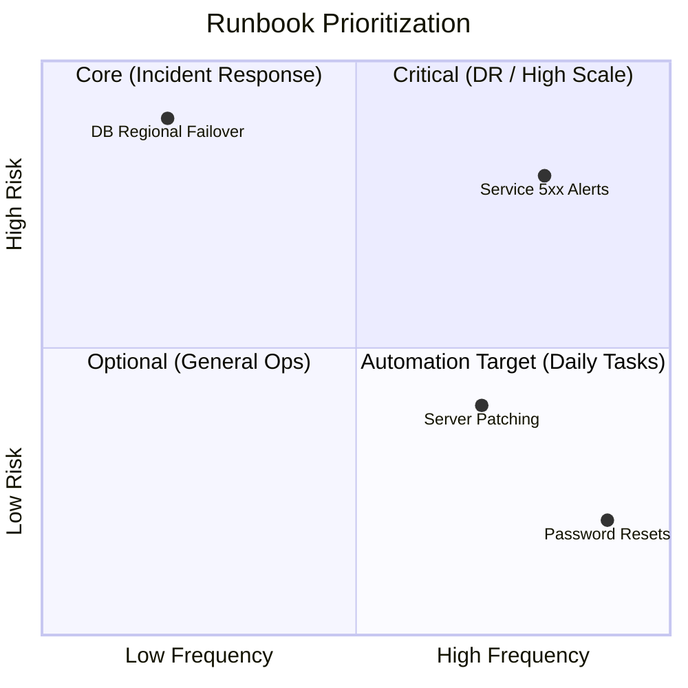

# Operational Scenarios

When do you actually open a runbook? Identifying the right scenarios prevents documentation bloat.

## 1. Incident Response (The "Firefighter" Runbooks)
- **Trigger**: P0/P1 High-priority alerts.
- **Focus**: Speed to recovery.
- **Example**: `Service 5xx Error Spike`, `Memory Leak in Worker-Node`.

## 2. Service Requests (The "Service Desk" Runbooks)
- **Trigger**: Internal tickets from other teams.
- **Focus**: Accuracy and standardized outcomes.
- **Example**: `Provision a new developer sandbox`, `Rotate SSL certificates`.

## 3. Disaster Recovery (The "Lifeboat" Runbooks)
- **Trigger**: Total region outage, large-scale data loss.
- **Focus**: Massive scale orchestration.
- **Example**: `Failover from US-East-1 to US-West-2`.

## 4. Routine Maintenance (The "Health" Runbooks)
- **Trigger**: Scheduled calendar events.
- **Focus**: Preventing future incidents.
- **Example**: `Monthly patch of Linux kernels`, `Database vacuuming`.

---

## The Scenario Matrix (Frequency vs. Risk)

---

## 🏗️ Real-Life Scenarios

### Scenario 1: The Alert Storm
**Problem**: An SRE team receives 50 alerts in 10 minutes. They have 2,000 runbooks.
**The Struggle**: They can't find which runbook corresponds to the specific alert "DiskPressure-NodeA."
**The Fix**: Tag-based mapping. Every Alert in Prometheus now has a link in its description to the exact Runbook URL in GitHub.
**Outcome**: Engineer clicks the alert -> Runbook opens instantly -> Resolution starts in seconds.

### Scenario 2: The "Hidden" Disaster Recovery
**Problem**: A company had a Disaster Recovery (DR) plan in a PDF on a manager's laptop. When the primary data center flooded, the manager was offline, and no one else knew how to trigger the failover.
**Solution**: Move DR scenarios into **Git-based Runbooks** that are shared with the entire engineering team. Conduct quarterly **Gamedays** where the team practices the scenario.
**Result**: In the next minor regional glitch, the team executed the failover in 20 minutes without needing the manager.

### Scenario 3: Routine Maintenance "Drift"
**Problem**: Certificates were expiring every 90 days. The "Rotation Runbook" was manual. One engineer skipped Step 3 (restarting nginx), so the site still served the old certificate and eventually went down.
**Solution**: Reclassify Certificate Rotation from a "Routine Manual" scenario to an **Automated Service Request**. The runbook was replaced by a script that performs the rotation and restart automatically.
**Result**: 100% success rate on rotations and zero human error outages.

---

## ❓ Interview Questions

1.  **How do you decide which operational tasks deserve a dedicated runbook?**
    - *Answer*: Use the **Frequency vs. Risk** matrix. Tasks that are high-risk (Disaster Recovery) or high-frequency (Daily patch management) are the top priorities. Low-risk, low-frequency tasks are better suited for general Wiki notes to avoid "Documentation Bloat."
2.  **What is a 'Gameday' and how does it relate to operational scenarios?**
    - *Answer*: A Gameday is a scheduled, simulated failure where a team practices a specific scenario (e.g., database failure) using their runbooks. It validates both the documentation and the team's ability to execute it under pressure.
3.  **Explain the importance of 'Contextual Linking' in incident scenarios.**
    - *Answer*: It means embedding a direct link to the runbook within the alert itself (e.g., in the PagerDuty or Slack notification). This eliminates the time wasted searching for documentation during a high-stress incident.
4.  **How would you categorize a 'Service Request' runbook compared to an 'Incident' runbook?**
    - *Answer*: Service requests are proactive and planned (e.g., onboarding a user), focusing on accuracy. Incident runbooks are reactive and unplanned (e.g., site is down), focusing on speed to recovery.
5.  **What is 'Documentation Bloat' and why is it dangerous for SRE teams?**
    - *Answer*: It occurs when there are too many low-quality or redundant runbooks. It makes it harder to find the *right* information during an incident, increasing cognitive load and MTTR.
6.  **Can 'Disaster Recovery' scenarios be fully automated?**
    - *Answer*: Technically yes, but usually they are "Hybrid" or "Orchestrated" because they involve massive business impact. A human typically triggers the "Big Red Button" after verifying the situation.

---

## 🧠 Comprehensive Quiz (25 Questions)

<b>1. Which scenario focuses most on speed to recovery?</b>

Show Answer

Answer: B

<b>2. True/False: You should have a runbook for every single possible action in your company.</b>

Show Answer

Answer: B** - Avoid documentation bloat; focus on high-risk and high-frequency tasks.

<b>3. What is the primary focus of 'Disaster Recovery' runbooks?</b>

Show Answer

Answer: B

<b>4. A 'Service Request' scenario usually starts with:</b>

Show Answer

Answer: B

<b>5. Which tool is best for linking an Alert to its corresponding Runbook?</b>

Show Answer

Answer: B

<b>6. 'Documentation Bloat' leads to:</b>

Show Answer

Answer: B

<b>7. In the 'Frequency vs. Risk' matrix, which quadrant is the best candidate for FULL automation?</b>

Show Answer

Answer: B** - Low risk makes it safe to automate, and high frequency makes it worth the effort.

<b>8. What is the goal of a 'Gameday'?</b>

Show Answer

Answer: B

<b>9. 'Routine Maintenance' runbooks are triggered by:</b>

Show Answer

Answer: B

<b>10. What is 'Contextual Linking'?</b>

Show Answer

Answer: B

<b>11. Which scenario type is most likely to be audited for compliance?</b>

Show Answer

Answer: A

<b>12. A 'Firefighter' runbook refers to:</b>

Show Answer

Answer: B

<b>13. Why is 'Tag-based mapping' useful for runbooks?</b>

Show Answer

Answer: B

<b>14. An 'Operational Scenario' is:</b>

Show Answer

Answer: B

<b>15. True/False: Service Requests are usually reactive.</b>

Show Answer

Answer: B

<b>16. 'Disaster Recovery' usually involves:</b>

Show Answer

Answer: B

<b>17. 'Analysis Paralysis' in SRE is caused by:</b>

Show Answer

Answer: B

<b>18. Which scenario is most critical for 'Business Continuity'?</b>

Show Answer

Answer: B

<b>19. Why should you review your 'Scenarios' periodically?</b>

Show Answer

Answer: A

<b>20. A 'P1 Incident' usually corresponds to:</b>

Show Answer

Answer: B

<b>21. 'Reactive' maintenance happens:</b>

Show Answer

Answer: B

<b>22. Which role is most likely to execute a 'Service Request' runbook?</b>

Show Answer

Answer: B

<b>23. 'Shadow IT' occurs when:</b>

Show Answer

Answer: B

<b>24. 'Playbook' in many organizations is synonymous with:</b>

Show Answer

Answer: B

<b>25. The goal of mapping scenarios to runbooks is:</b>

Show Answer

Answer: B

