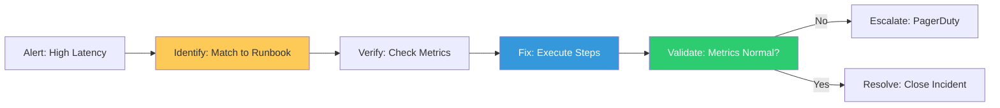

# Incident Response Anatomy & Runbook Design Reference

**Doc Version:** 1.0.0
**Role:** Incident Commander / SRE
**Scope:** Runbook Schema, Human Factors, and Incident Response Workflows

---

## 1. The Anatomy of a Professional Runbook

A runbook used during a 3:00 AM outage must minimize cognitive load. Every section must have a purpose.

- **Title & Metadata**: Clear name, owner, and "Last Tested" date.
- **Abstract/Symptoms**: What does the user see? Which alerts trigger this?
- **Safety Warning (The "Red Box")**: Destructive actions (e.g., "Deleting DB tables") must be highlighted first.
- **Verification Steps**: How do you *prove* the issue exists before taking action?
- **Remediation**: The step-by-step fix (Commands, API calls).
- **Validation**: How do you prove the site is fixed?
- **Escalation**: Who do you call if this doesn't work? (On-call rotations).

---

## 2. Design for Human Factors (The 3:00 AM Rule)

Documentation is a user interface for stressed engineers.

- **Checklists > Paragraphs**: Use bolded bullet points. Large blocks of text are hard to read under stress.
- **Copy-Paste Ready**: Commands should be in code blocks, using standardized variables (e.g., `$NAMESPACE`) that the user can export once.
- **No Ambiguity**: Avoid "Carefully check the logs." Use "Run `kubectl logs | grep ERROR` and look for exit code 137."

---

## 3. Visualizing the Incident Response Loop

---

## 4. Measuring Runbook Effectiveness

- **MTTR (Mean Time To Resolution)**: Did the runbook actually speed up the fix?
- **Documentation Drift**: Does the runbook accurately reflect the current UI/CLI of the system?
- **Toil Factor**: How many manual steps remain? Can this step be scripted next?

---

## 5. Enterprise Governance Standards

- **The "Bystander" Test**: A runbook is only valid if an engineer from a *different* team can follow it successfully without asking questions.
- **Post-Mortem Integrity**: After every SEV-1 incident, the relevant runbooks MUST be updated within 48 hours to include lessons learned.
- **Secret Management**: Audit logs must verify that runbooks do not lead users to perform insecure actions (e.g., "chmod 777" or "Skip SSL verification").

> **Enterprise Pattern**: Implement **Executable Runbooks via Cloud-Native Tools**. Use tools like **ArgoCD Notifications** or **Prometheus Alertmanager** to send not just a link to a doc, but a button that triggers a "Safe" automated remediation (e.g., "Restart Pods"). This "Human-in-the-Loop" automation provides the safety of manual oversight with the speed of a machine.
