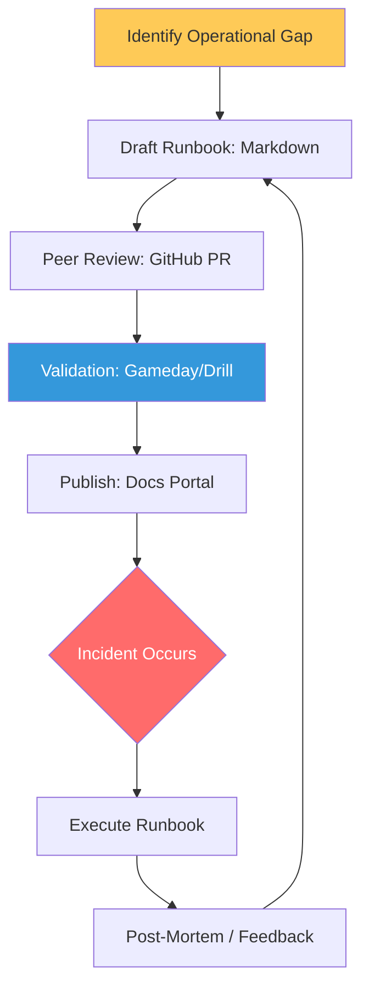

# Runbook Maturity & Operational Standards Reference

**Doc Version:** 1.0.0
**Role:** SRE Lead / Operations Architect
**Scope:** Operational Documentation Hierarchy, Maturity Models, and "Docs-as-Code" Standards

---

## 1. The Documentation Hierarchy

Not all documentation is created equal. Understanding where a document sits in the hierarchy ensures it is used correctly during an incident.

- **Policy (The "What")**: High-level organizational mandates (e.g., "All secrets must be rotated every 90 days").
- **SOP - Standard Operating Procedure (The "How")**: Routine, high-level administrative tasks that aren't tied to a specific incident.
- **Runbook (The "Correction")**: A step-by-step guide to resolving a *specific* alert or failure mode (e.g., "Fixing 5xx Errors on the Web Front-end").
- **Playbook (The "Strategy")**: A broader collection of runbooks and coordination steps for major incidents (e.g., "Site-wide Region Failover").

---

## 2. Runbook Maturity Model

Operating at scale requires moving from "Tribal Knowledge" to "Autonomic Systems."

| Maturity Level | Characteristics | Goal |
| :--- | :--- | :--- |
| **Level 0: Tribal** | Knowledge exists only in the heads of senior engineers. | Document it now. |
| **Level 1: Static** | Text-based wiki pages or PDFs; often outdated. | Centralize and version. |
| **Level 2: Structured** | "Docs-as-Code" in Git; templated and regularly tested. | Ensure accuracy. |
| **Level 3: Executable** | Interactive scripts or Notebooks (Jupyter) that run commands. | Reduce manual steps. |
| **Level 4: Autonomic** | Automated systems (Self-healing) that run without human intervention. | Eliminate toil. |

---

## 3. Visualizing the Documentation Lifecycle

---

## 4. Professional "Docs-as-Code" Standards

- **Git-Based Single Source**: Runbooks live in the same repository as the service code.
- **Markdown Supremacy**: No proprietary formats; only human-readable, grep-able text.
- **Linting for Docs**: Automate checks for broken links, required sections, and stale dates.
- **Contextual Linking**: Every Prometheus alert must include a direct URL to its specific runbook.

---

## 5. Enterprise Governance Standards

- **The "No-Runbook, No-Deploy" Rule**: A service cannot be promoted to production without validated runbooks for its primary failure modes.
- **Quarterly Recertification**: Every runbook must be "Drilled" and signed off as accurate every 90 days.
- **Secret Hygiene**: Runbooks must NEVER contain secrets. They should reference Vault paths or environment variable names.

> **Enterprise Pattern**: Implement **The "Search-First" Architecture**. Host your runbooks in a way that is indexed by your internal developer portal (IDP). During a high-stress outage, engineers shouldn't be hunting through folders; they should be able to type the error code into a search bar and arrive at the fix in under 5 seconds.
