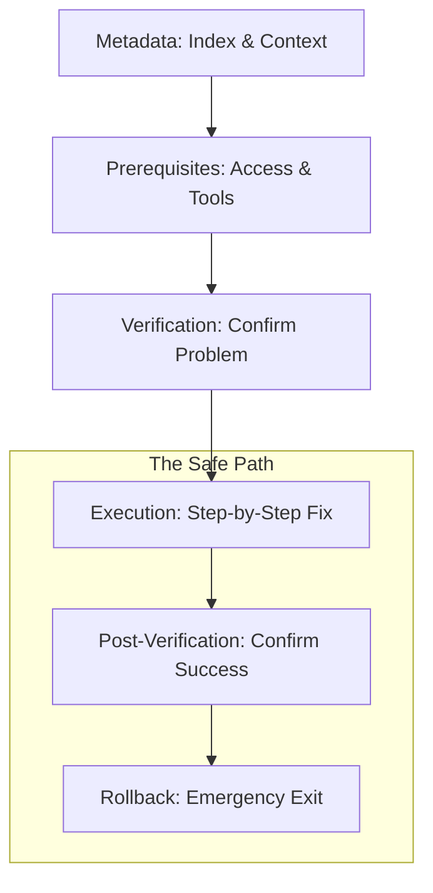

## The SOP Structural Map

---

## 🏗️ Real-Life Scenarios

### Scenario 1: The "Missing Step" Chaos
**Problem**: An SOP for "Rotating API Keys" forgotten to mention that the old keys must be disabled *after* the new ones are confirmed.
**Crisis**: An engineer follows the guide, adds new keys, but leaves the old compromised keys active. The hacker continues the attack.
**Outcome**: A security breach that could have been prevented with a clearer "Verification" section.
**Solution**: Add an "Audit Verification" step to the SOP template to ensure all old credentials are destroyed.
**Result**: In future rotations, the security team verified 100% deletion of legacy tokens.

### Scenario 2: The "Version Drift" Lockout
**Problem**: A runbook for "Updating Kubernetes Deployments" didn't specify the `kubectl` version. An engineer used a version 3 levels ahead of the cluster, causing a syntax error that failed the deployment midway.
**Solution**: Include a **Prerequisites** section that specifies exact tool versions (e.g., `kubectl v1.25.x`) and provides a command to check the version (`kubectl version --client`).
**Result**: Engineers now verify their local tools before touching production, eliminating "Client vs. Server" incompatibility outages.

### Scenario 3: The Ghost of the Rollback
**Problem**: A junior engineer ran a database migration from an SOP that lacked a rollback section. The migration slowed down the site, but the engineer was too afraid to cancel it because they didn't know if "Control-C" would corrupt the data.
**Solution**: Enforce a mandatory **Rollback** section in every SOP. It must include explicit instructions for safe cancellation and reversal.
**Result**: Increased team confidence; the next time a migration stalled, the engineer followed the rollback steps, reverted the change in 2 minutes, and investigated the issue safely.

---

## ❓ Interview Questions

1.  **What is the 'Anatomy' of a professional SOP in your experience?**
    - *Answer*: A robust SOP includes six core sections: Metadata (Context/Ownership), Prerequisites (Access/Tools), Initial Verification (Confirming the issue), Remediation (Atomic steps with expected output), Final Verification (Confirming success), and a Rollback Plan (Emergency exit).
2.  **Why is a 'Rollback' section mandatory for production SOPs?**
    - *Answer*: Because even "proven" fixes can have unexpected side effects due to environmental drift. A rollback plan provides an immediate path to safety, preventing "Action Bias" from making an incident worse during a panic.
3.  **Explain the importance of 'Expected Output' in a step-by-step guide.**
    - *Answer*: It serves as a validation checkpoint. If the output doesn't match the guide, it tells the engineer to "Stop" before they proceed to the next step, catching errors early and preventing a cascading failure.
4.  **How do 'Prerequisites' act as a safety gate?**
    - *Answer*: They ensure the operator has the correct IAM permissions, VPN access, and tool versions *before* they start. This prevents a scenario where a fix is 50% complete but fails because a tool is missing, leaving the system in an unstable state.
5.  **Should 'Self-Correction' loops be included in the remediation steps?**
    - *Answer*: Yes. High-quality SOPs include "If/Then" logic. For example: "If the service fails to restart, check logs at /var/log/app.log before proceeding to Step 4."
6.  **Where should 'High Risk' warnings (e.g., Data Deletion) be placed?**
    - *Answer*: At the beginning of the specific step, often formatted in bold or as an alert box, ensuring the engineer sees the risk *immediately* before taking the action.

---

## 🧠 Comprehensive Quiz (25 Questions)

<b>1. Which section lists the required IAM permissions and CLI tools?</b>

Show Answer

Answer: B

<b>2. True/False: Metadata should include the 'Owner' or team responsible for the document.</b>

Show Answer

Answer: A** - This ensures you know who to contact if the SDR needs updating.

<b>3. Why include 'Expected Output' after a terminal command?</b>

Show Answer

Answer: B

<b>4. The 'Remediation' section is primarily for:</b>

Show Answer

Answer: B

<b>5. A 'Rollback' plan is essential because:</b>

Show Answer

Answer: B

<b>6. 'Initial Verification' helps confirm:</b>

Show Answer

Answer: B

<b>7. Metadata like 'SLO Impact' tells the reader:</b>

Show Answer

Answer: B

<b>8. Code blocks in an SOP should be:</b>

Show Answer

Answer: B

<b>9. 'Atomic Steps' means each numbered step should:</b>

Show Answer

Answer: B

<b>10. A 'Warning' about production downtime should be placed:</b>

Show Answer

Answer: B

<b>11. 'Final Verification' occurs:</b>

Show Answer

Answer: B

<b>12. True/False: An SOP Identifier (e.g., SOP-DB-01) makes documentation searchable.</b>

Show Answer

Answer: A

<b>13. Which section is best for 'Critical Safety' notices?</b>

Show Answer

Answer: B

<b>14. If a step fails, the 'Rollback' instructions are used to:</b>

Show Answer

Answer: B

<b>15. 'Subject Matter Experts' (SMEs) are usually listed in:</b>

Show Answer

Answer: B

<b>16. Why use 'Imperative' verbs (Check, Run, Stop) in steps?</b>

Show Answer

Answer: B

<b>17. 'Environment Specific' instructions belong in:</b>

Show Answer

Answer: B

<b>18. A 'Troubleshooting' section within an SOP handles:</b>

Show Answer

Answer: B

<b>19. 'Linkability' in an SOP refers to:</b>

Show Answer

Answer: B

<b>20. True/False: Standardizing the anatomy of all SOPs reduces 'Cognitive Load' for engineers.</b>

Show Answer

Answer: A

<b>21. 'Visual Aids' (like Mermaid diagrams) are best used for:</b>

Show Answer

Answer: B

<b>22. 'Pre-flight Checks' is another term for:</b>

Show Answer

Answer: B

<b>23. Why specify 'Tool Versions' (e.g., Python 3.9+)?</b>

Show Answer

Answer: B

<b>24. The 'Audience' of an SOP should be:</b>

Show Answer

Answer: B

<b>25. The core purpose of the SOP structure is:</b>

Show Answer

Answer: B

