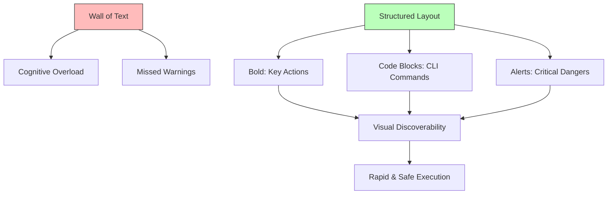

## The Visual Hierarchy of Clarity

---

## 🏗️ Real-Life Scenarios

### Scenario 1: The "Paragraph of Death"
**Problem**: An engineer is in the middle of a P0 outage. The SOP is a wall of text: "First you go to the console and find the EC2 dashboard and look for the instance ID then you might want to stop it but make sure you have a backup first but if you don't then call Bob..."
**Outcome**: The engineer misses the "make sure you have a backup" part in the middle of the paragraph. They stop the server, and data is lost forever because there was no backup.
**Fix**: Rewrite the doc using **Atomic Numbered Steps** and a **Warning Alert** at the top.
**Result**: In the next incident, the engineer saw the backup warning first, verified the snapshot, and proceeded safely.

### Scenario 2: The "Passive Risk"
**Problem**: A security procedure was written as: "It is generally expected that the firewall rules should be evaluated for potential vulnerabilities by the team."
**Outcome**: Because no one was directly told to "Evaluate," the task was ignored for months. A breach occurred through an open port that was "supposed" to be evaluated.
**Solution**: Changed to **Imperative Mood**: "**Evaluate** firewall rules for open ports monthly. **Close** any unused port immediately."
**Result**: Accountability increased, and the task was completed on time every month.

### Scenario 3: The Combined Crisis
**Problem**: An SOP step stated: "Download the patch and then restart the server and update the database."
**Crisis**: The engineer downloaded the patch, but the restart failed mid-way. Because the steps were grouped, the engineer didn't know whether to proceed to the database update or fix the restart first.
**Solution**: **One Thought, One Number**. Split into three distinct steps with verification after each.
**Result**: During the next patch, when the restart failed, the engineer stopped at Step 2 and followed the troubleshooting sub-guide, preventing a database corruption.

---

## ❓ Interview Questions

1.  **What is the 'Imperative Mood' and why is it preferred for SRE documentation?**
    - *Answer*: It is an authoritative, direct way of writing (e.g., "Run this command" instead of "You should run this command"). It removes ambiguity, doubt, and "wordiness," which is critical during the high-stress environment of an incident.
2.  **Explain the concept of 'Visual Discoverability' in technical documentation.**
    - *Answer*: It's the ability for a reader to "scan" a structure and find the most important information (commands, warnings, conclusions) without reading every word. This is achieved through formatting like bolding, code blocks, bullet points, and alert boxes.
3.  **Why should we avoid 'Combining Actions' in a single numbered step?**
    - *Answer*: Combining actions (e.g., "Restart and Update") makes it impossible to know where you are if a partial failure occurs. "One Thought, One Number" ensures that if Step 2 fails, the operator knows exactly where they are in the lifecycle.
4.  **How do you handle 'Negative Constraints' (things you should NOT do) in writing?**
    - *Answer*: They should be highlighted using specialized "Warning" or "Caution" alerts. Placing them in standard text increases the risk of them being skipped during a fast-paced outage.
5.  **What is 'Plain Language' and how does it help in an international team?**
    - *Answer*: Plain language avoids jargon, idioms, and complex sentence structures. It ensures that engineers whose first language might not be English can follow the instructions accurately without misunderstanding "flowery" language.
6.  **Why include 'Subject-Verb-Object' (SVO) structure in steps?**
    - *Answer*: SVO is the most direct way to communicate. E.g., "The Engineer [Subject] must Restart [Verb] the Service [Object]." It creates clear accountability for who does what.

---

## 🧠 Comprehensive Quiz (25 Questions)

<b>1. Which mood is preferred for operational commands?</b>

Show Answer

Answer: B**（e.g., "Run the script"）

<b>2. True/False: You should combine as many actions as possible into one step to save space.</b>

Show Answer

Answer: B** - Use "One Thought, One Number" for clarity.

<b>3. 'Visual Discoverability' is improved by using:</b>

Show Answer

Answer: B

<b>4. A 'Wall of Text' is dangerous because:</b>

Show Answer

Answer: B

<b>5. 'Code Blocks' are essential for CLI commands because:</b>

Show Answer

Answer: B

<b>6. Which of these is an 'Atomic' step?</b>

Show Answer

Answer: B

<b>7. Why use '> [!WARNING]' or alert boxes?</b>

Show Answer

Answer: B

<b>8. 'Plain Language' ensures:</b>

Show Answer

Answer: B

<b>9. In 'Step 1: Restart App', the word 'Restart' is a:</b>

Show Answer

Answer: B

<b>10. True/False: You should use 'We' or 'I' frequently in an SOP.</b>

Show Answer

Answer: B

<b>11. 'Scanning' a document means:</b>

Show Answer

Answer: B

<b>12. 'Active' writing (John ran) is better than 'Passive' (The race was run by John) because:</b>

Show Answer

Answer: A

<b>13. A 'Decision Point' in writing should be represented by:</b>

Show Answer

Answer: B

<b>14. 'Redundancy' in writing (using too many words to say the same thing) should be:</b>

Show Answer

Answer: B

<b>15. Technical writing for operations is optimized for:</b>

Show Answer

Answer: B

<b>16. Why avoid idioms like 'Piece of cake' or 'Down the drain'?</b>

Show Answer

Answer: B

<b>17. 'Numbered Lists' imply:</b>

Show Answer

Answer: B

<b>18. 'Bullet Points' are used for:</b>

Show Answer

Answer: A

<b>19. True/False: Jargon should always be explained or avoided in a general SOP.</b>

Show Answer

Answer: A** - Never assume everyone knows the acronyms.

<b>20. A 'Call to Action' (CTA) in an SOP is:</b>

Show Answer

Answer: B

<b>21. 'Cognitive Overload' occurs when the text is:</b>

Show Answer

Answer: B

<b>22. Which part of 'Check logs for Errors' is the object?</b>

Show Answer

Answer: B

<b>23. Why use 'Bold' for UI elements (e.g., "</b>

Show Answer

Answer: B

<b>24. The 'Verb' in a step should ideally be:</b>

Show Answer

Answer: B

<b>25. Excellence in technical writing leads to:</b>

Show Answer

Answer: B

