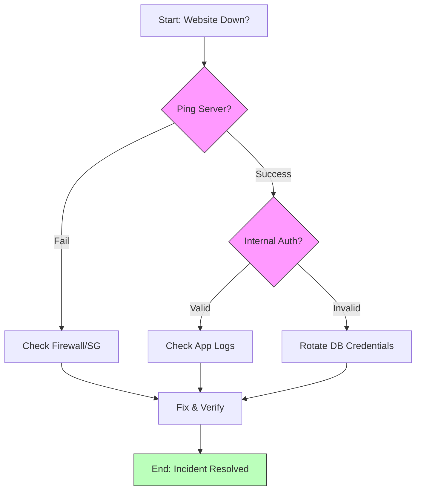

# Visualizing Workflows (Mermaid)

A picture is worth a thousand words, but only if that picture is easy to update. In DevOps, we use **Diagrams-as-Code**.

## Why Mermaid?
- **Text-Based**: Diagrams are written in simple text within your Markdown files.
- **Version Controlled**: You can see exactly how a workflow "evolved" in Git history.
- **No Extra Tools**: Renders automatically in GitHub, GitLab, and most IDEs.

## The Power of Decision Logic

---

## 🏗️ Real-Life Scenarios

### Scenario 1: The Outdated PNG
**Problem**: An architecture diagram was created in Visio in 2021 and saved as a `.png`. The architect left the company.
**Crisis**: The system changed in 2023. No one has the original Visio file. The PNG is now a "lie" that confuses new engineers.
**Outcome**: Now, when a developer adds a new server, they update 2 lines of text, and the diagram is updated for the whole team instantly.

### Scenario 2: The Logic Loop Escape
**Problem**: An SOP for "Onboarding Users" had complex manual logic: "If they are in Department X but also in Group Y, then do Z." New HR staff were constantly making mistakes because they couldn't follow the text logic.
**Solution**: Translate the logic into a **Mermaid Flowchart**.
**Result**: Mistakes dropped by 90% because the staff could visually follow the "Yes/No" paths instead of interpreting dense legalistic text.

### Scenario 3: The Sequence of Success
**Problem**: A troubleshooting guide for "OAuth Failures" was just a list of steps. Engineers struggled to understand *where* the failure was happening between the Client, the Proxy, and the Identity Provider.
**Solution**: Added a **Mermaid Sequence Diagram** showing the token exchange flow.
**Result**: MTTR decreased significantly because engineers could pinpoint the specific components involved in the handshake failure.

---

## ❓ Interview Questions

1.  **What are the primary advantages of Diagrams-as-Code (like Mermaid) over traditional GUI tools?**
    - *Answer*: 1. **Version Control**: Unlike binaries (.vsdx, .png), text-based diagrams produce readable diffs in Git. 2. **Accessibility**: Anyone with a text editor can update them. 3. **Synchronization**: The diagram lives inside the documentation, ensuring it's not forgotten during updates.
2.  **How do you decide between a Flowchart and a Sequence Diagram?**
    - *Answer*: Use a **Flowchart** for decision-making logic and branching paths (the "What happens if...?" scenarios). Use a **Sequence Diagram** to visualize the chronological interaction between different entities or services (the "Who talks to whom and when?").
3.  **Explain why 'Simplicity' is a core requirement for operational diagrams.**
    - *Answer*: During an incident, highly complex architecture maps are overwhelming. An operational diagram should be "Task-Specific," mapping only the logic required to resolve the specific alert, not the entire company infrastructure.
4.  **How does Mermaid improve 'Collaboration' in a DevOps team?**
    - *Answer*: It allows developers to propose diagram changes in the same Pull Request (PR) as their code changes. Peer review for documentation becomes as standard as peer review for code.
5.  **What is the benefit of 'Styling' nodes in a Mermaid flowchart?**
    - *Answer*: Styling (colors/shapes) can represent different environments (Prod vs. Dev) or status (Critical vs. Safe), allowing an engineer to visually prioritize pathing under stress.
6.  **At what point should a diagram NOT be used in an SOP?**
    - *Answer*: When the process is purely linear and simple (e.g., just 3 steps). Over-diagramming can lead to "Visual Noise" that distracts from the actual commands.

---

## 🧠 Comprehensive Quiz (25 Questions)

<b>1. Is Mermaid code-based or image-based?</b>

Show Answer

Answer: B

<b>2. True/False: Mermaid diagrams are stored as separate binary files (.vsdx) in Git.</b>

Show Answer

Answer: B** - They are text blocks inside Markdown files.

<b>3. Which diagram type is best for visualizing 'Decision Trees'?</b>

Show Answer

Answer: B

<b>4. The 'TD' in `graph TD` stands for:</b>

Show Answer

Answer: B

<b>5. Which diagram shows interactions between a User, a Load Balancer, and a Database?</b>

Show Answer

Answer: B

<b>6. Why is text-based diagramming better for Git Pull Requests?</b>

Show Answer

Answer: B

<b>7. In a flowchart, curly braces `{ }` usually represent:</b>

Show Answer

Answer: B

<b>8. 'LR' in a Mermaid graph stands for:</b>

Show Answer

Answer: B

<b>9. True/False: If you don't have the original Visio file, a PNG diagram is hard to update.</b>

Show Answer

Answer: A** - This is why DaC is superior.

<b>10. Mermaid diagrams are rendered by:</b>

Show Answer

Answer: A

<b>11. A 'State Diagram' is most useful for:</b>

Show Answer

Answer: B

<b>12. 'Styling' a node (e.g., `style A fill:#f9f`) helps:</b>

Show Answer

Answer: B

<b>13. Which symbol creates a standard box node in a flowchart?</b>

Show Answer

Answer: B

<b>14. Multi-system communication is best handled by which diagram?</b>

Show Answer

Answer: B

<b>15. True/False: You can embed Mermaid diagrams directly in a README.md on GitHub.</b>

Show Answer

Answer: A

<b>16. 'Diagrams-as-Code' (DaC) means:</b>

Show Answer

Answer: B

<b>17. A 'Gantt Chart' in Mermaid is used for:</b>

Show Answer

Answer: B

<b>18. Why keep diagrams 'Task-Specific'?</b>

Show Answer

Answer: B

<b>19. In a flowchart, `-->` represents:</b>

Show Answer

Answer: B

<b>20. 'Subgraphs' in Mermaid are used to:</b>

Show Answer

Answer: A

<b>21. True/False: Mermaid is only available in VS Code.</b>

Show Answer

Answer: B

<b>22. Which shape represents a 'Starting Node' conventionally in Mermaid?</b>

Show Answer

Answer: B

<b>23. 'Visual Noise' refers to:</b>

Show Answer

Answer: B

<b>24. The 'Actor' in a sequence diagram represents:</b>

Show Answer

Answer: B

<b>25. The ultimate result of using Mermaid is:</b>

Show Answer

Answer: B

