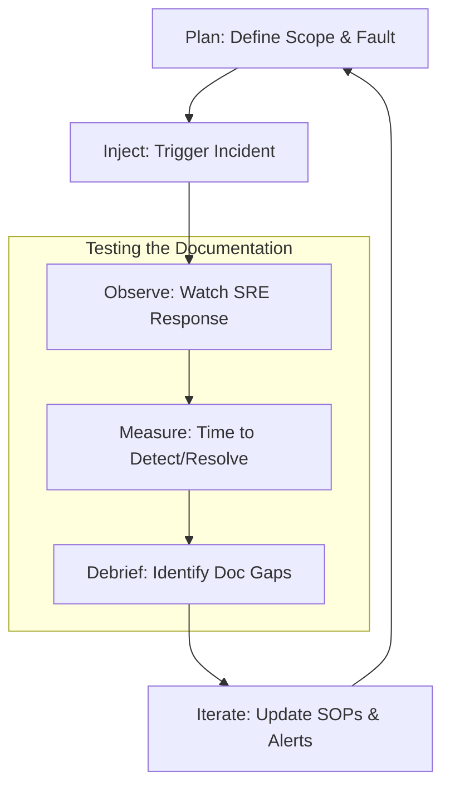

## The Gameday Lifecycle

---

## 🏗️ Real-Life Scenarios

### Scenario 1: The "Blind" Gameday
**Problem**: An SRE team thinks their "Primary Database Failover" SOP is perfect. They wrote it 6 months ago but never ran it.
**Event**: During a Gameday, the senior engineer who wrote the doc is barred from helping. The rest of the team tries to follow it. They discover that a specific CLI tool version was deprecated and the command no longer works.
**Outcome**: The Gameday fails. The data stayed unavailable for 45 minutes because of a single outdated command.
**Lesson**: Better to fail during a Tuesday morning drill than a Saturday night disaster. The SOP is updated immediately after the debrief.

### Scenario 2: The "Hidden Step" Scribe
**Problem**: During a routine Gameday, a "Scribe" (observer) noticed that every engineer was manually SSHing into a server to check a specific log file, even though that step wasn't in the SOP.
**Outcome**: The engineers were relying on "tribal knowledge" rather than the documentation.
**Solution**: The Scribe added a specific step to the SOP listing the `tail -f` command for that log, along with the expected "Healthy" pattern.
**Result**: In the next real incident, a new hire followed the guide perfectly without needing to ask where the logs were.

### Scenario 3: The Rollback Nightmare
**Problem**: An application upgrade SOP had a "Rollback" section that was never tested. During a Gameday, the team attempted to rollback a failed deployment.
**Crisis**: They discovered the rollback script required a database backup that was created *before* the migration, but the SOP didn't tell them to create one.
**Solution**: Updated the **Prerequisites** and **Steps** to include a mandatory snapshot before starting.
**Result**: Increased team confidence; the next real failed deployment was reverted in under 5 minutes because the backup was ready.

---

## ❓ Interview Questions

1.  **What is a 'Gameday' and what is its primary value for an SRE team?**
    - *Answer*: A Gameday is a controlled challenge where a team intentionally injects a fault into a non-production (or staging) environment to test their response systems. Its value lies in identifying gaps in monitoring, alerting, and specifically **documentation** before they cause a real-world outage.
2.  **Explain the role of the 'Scribe' or 'Observer' during a documentation test.**
    - *Answer*: The Scribe does not help fix the issue. Instead, they watch the engineers' behavior. They look for moments of hesitation, "side searches" on Google, or manual steps taken that aren't in the SOP. These represent "Documentation Debt" that needs to be fixed.
3.  **How do you incorporate documentation feedback into a blameless post-mortem?**
    - *Answer*: By making it a standard section of the report. We ask: "Was the documentation discoverable? Was it accurate? Did it include a valid rollback plan?" Any negative responses are converted into prioritized work items for the next sprint.
4.  **What is the 'Junior Test' and why is it effective?**
    - *Answer*: It involves giving a documentation set to a new hire or a junior engineer and asking them to perform the task without assistance. If they struggle, the documentation is too reliant on "Expert Context" and needs to be clarified for general use.
5.  **Should 'Gamedays' be done in Production?**
    - *Answer*: Ideally, you start in Staging to build confidence. More mature organizations (Chaos Engineering) eventually run them in Production (under strict safety protocols) to verify that the environment-specific configs in the SOP are also correct.
6.  **How do 'Failure Modes and Effects Analysis' (FMEA) relate to SOP testing?**
    - *Answer*: FMEA helps identify what *could* go wrong. We then use Gamedays to test the SOPs written for those specific failure modes, closing the loop between theoretical risk and operational readiness.

---

## 🧠 Comprehensive Quiz (25 Questions)

<b>1. What is the main purpose of a 'Gameday'?</b>

Show Answer

Answer: B

<b>2. True/False: Documentation should be updated after every major incident where it was found to be lacking.</b>

Show Answer

Answer: A** - This is the "Feedback Loop."

<b>3. The 'Junior Test' verifies documentation by:</b>

Show Answer

Answer: B

<b>4. When should you ideally test a 'Rollback Plan'?</b>

Show Answer

Answer: B

<b>5. A 'Scribe' in a Gameday is responsible for:</b>

Show Answer

Answer: B

<b>6. 'Tribal Knowledge' is dangerous because:</b>

Show Answer

Answer: B

<b>7. Which metric is most improved by regularly tested SOPs?</b>

Show Answer

Answer: B

<b>8. In the Gameday Lifecycle, what comes after 'Observe'?</b>

Show Answer

Answer: B

<b>9. True/False: A Gameday failure is a bad thing for the team.</b>

Show Answer

Answer: B

<b>10. 'Iteration' in the context of documentation means:</b>

Show Answer

Answer: B

<b>11. Why should the author of an SOP NOT be the one testing it in a Gameday?</b>

Show Answer

Answer: B

<b>12. A 'Debrief' session occurs:</b>

Show Answer

Answer: B

<b>13. 'Stress Testing' documentation refers to:</b>

Show Answer

Answer: B

<b>14. Which document should have a mandatory Gameday test?</b>

Show Answer

Answer: B

<b>15. True/False: Post-mortem reviews should identify specific line numbers or sections in the SOP that failed.</b>

Show Answer

Answer: A

<b>16. 'Confidence Inflation' is the risk that:</b>

Show Answer

Answer: B

<b>17. 'Chaos Engineering' is related to Gamedays because:</b>

Show Answer

Answer: B

<b>18. A 'Documentation Bug' is:</b>

Show Answer

Answer: B

<b>19. 'Time to Success' is a metric that measures:</b>

Show Answer

Answer: B

<b>20. True/False: You should test if your 'Communication' steps in the SOP work (e.g., Slack channels).</b>

Show Answer

Answer: A

<b>21. 'Drift' in documentation happens because:</b>

Show Answer

Answer: B

<b>22. 'Gameday Scope' defines:</b>

Show Answer

Answer: B

<b>23. Why include 'Success Criteria' for a Gameday?</b>

Show Answer

Answer: B

<b>24. 'Documentation Maintenance' is:</b>

Show Answer

Answer: B

<b>25. The ultimate result of Testing and Iteration is:</b>

Show Answer

Answer: B

