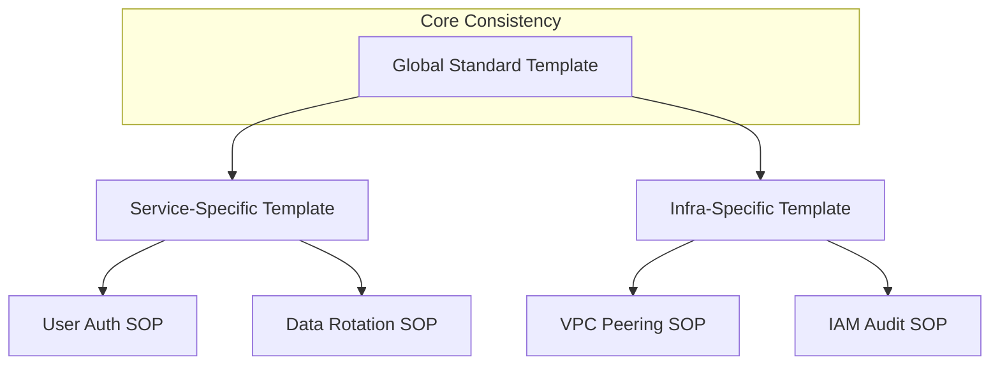

## The Template Hierarchy

---

## 🏗️ Real-Life Scenarios

### Scenario 1: The "Custom" Headache
**Problem**: One team likes to write SOPs as "Stories" in a Wiki. Another team uses "Checklists" in Git. A third team uses "Presentations."
**Crisis**: During a "Cross-Team" incident (e.g., Network + DB), the engineers are constantly confused by the different styles. They take 3 minutes per document just to figure out "how to read it."
**Outcome**: MTTR is pushed back by 10 minutes, leading to a missed SLA.
**Solution**: The CTO mandates a company-wide **Standard Markdown Template**.
**Result**: Context-switching time between teams drops to zero. Engineers "know where the meat is" regardless of which team wrote the doc.

### Scenario 2: The "Ghost" Owner
**Problem**: A critical service failed, and the SOP on file was 2 years old. The engineer tried to contact the "Author," but that person had left the company 18 months ago. There was no "Team Owner" listed.
**Solution**: Updated the **Standard Template** to require a `Team Owner` field and a `Last Reviewed` date.
**Result**: Documentation is now mapped to active teams, and stale docs are caught by automated audit scripts.

### Scenario 3: The "Cookiecutter" Success
**Problem**: Developers were resistant to writing documentation because "setting up the headers and structure is a pain."
**Solution**: Created a `cookiecutter` template. By running one CLI command, a developer gets a perfectly formatted Markdown file with all mandatory sections and sample steps ready to fill in.
**Result**: Documentation volume increased by 40% because the "starting friction" was removed.

---

## ❓ Interview Questions

1.  **Why is standardization of documentation formats critical for large organizations?**
    - *Answer*: It reduces "Cognitive Load" and "Context-Switching" time. When every document looks the same, an engineer's brain doesn't have to waste energy "finding" where the commands or rollback plans are. It also allows for easier automation (linting/auditing).
2.  **How do you handle 'Exceptions' to the standard template?**
    - *Answer*: Exceptions should be deliberate and rare. While the core "Steps" and "Header" should remain identical, a specific team (like Security) may add specialized sections (like Compliance Mapping). The goal is to have a "Global Base" with "Modular Extensions."
3.  **Explain the value of using a 'Cookiecutter' or Template Repository for docs.**
    - *Answer*: It ensures consistency from the very first second of a document's life. It removes the "Blank Page" syndrome for engineers and makes it impossible to accidentally forget mandatory fields like 'Owner' or 'SLO Impact'.
4.  **What role do 'Pre-commit Hooks' play in organizational documentation?**
    - *Answer*: They act as an automated gatekeeper. They can check if a new Markdown file contains all the mandatory headers (like an ID or a valid team name) and block the `git push` if they are missing, enforcing standards without manual review.
5.  **Should templates include 'Example Text'?**
    - *Answer*: High-quality templates include "In-line Examples." Instead of an empty `Steps:` section, it should have a commented-out sample: `# 1. Run [Command] | Expected: [Success]`. This guides the author toward the correct writing style.
6.  **How does a standard template help with 'Accessibility'?**
    - *Answer*: It ensures a consistent heading hierarchy (H1 -> H2 -> H3), which is essential for screen readers and automated table-of-contents generation.

---

## 🧠 Comprehensive Quiz (25 Questions)

<b>1. What is the primary benefit of a standardized Header in every doc?</b>

Show Answer

Answer: B

<b>2. True/False: You should allow every team to invent their own unique document style.</b>

Show Answer

Answer: B** - This increases "Cognitive Load" for the rest of the company.

<b>3. 'Cognitive Load' in documentation refers to:</b>

Show Answer

Answer: B

<b>4. Which section of the template describes the severity of the business impact?</b>

Show Answer

Answer: B

<b>5. A 'Cookiecutter' is a tool used to:</b>

Show Answer

Answer: B

<b>6. 'Metadata' in an SOP usually includes:</b>

Show Answer

Answer: B

<b>7. True/False: Pre-commit hooks can enforce that an SOP has a 'Rollback' section before it's saved to the repo.</b>

Show Answer

Answer: A

<b>8. 'Context-Switching' occurs when:</b>

Show Answer

Answer: B

<b>9. What is 'In-line Example Text'?</b>

Show Answer

Answer: B

<b>10. A 'Template Repository' on GitHub allows you to:</b>

Show Answer

Answer: A

<b>11. Why is 'Version Correlation' a good template field?</b>

Show Answer

Answer: B

<b>12. 'Atomic Steps' should be formatted as:</b>

Show Answer

Answer: B

<b>13. True/False: The 'Rollback' section is optional in the global template.</b>

Show Answer

Answer: B

<b>14. What is the benefit of a 'Last Reviewed' date?</b>

Show Answer

Answer: B

<b>15. 'Front Matter' is often used at the top of Markdown files to store:</b>

Show Answer

Answer: B

<b>16. Standardizing the template across 50 teams helps best with:</b>

Show Answer

Answer: B

<b>17. 'Template Friction' refers to:</b>

Show Answer

Answer: B

<b>18. Which section of the template should come FIRST after the header?</b>

Show Answer

Answer: B

<b>19. True/False: You can use a Markdown Linter to check for 'H1 Heading' presence.</b>

Show Answer

Answer: A

<b>20. 'Global Searchability' is improved by templates because:</b>

Show Answer

Answer: B

<b>21. A 'Service-Specific' template should:</b>

Show Answer

Answer: B

<b>22. Why include 'Prerequisites' before the 'Steps'?</b>

Show Answer

Answer: B

<b>23. 'Checklist Formatting' is better for:</b>

Show Answer

Answer: B

<b>24. The 'Outcome of Interest' section helps:</b>

Show Answer

Answer: B

<b>25. Excellence in organizational templates leads to:</b>

Show Answer

Answer: B

