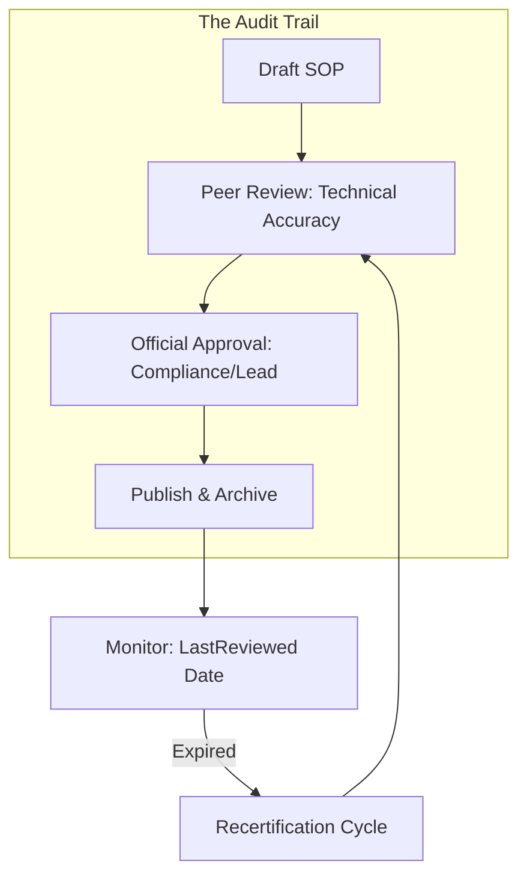

## The Compliance Lifecycle

---

## 🏗️ Real-Life Scenarios

### Scenario 1: The $2M Audit Failure
**Problem**: An auditor asks a Fintech company for the "Disaster Recovery" plan. They provide an SOP. The auditor points to a line that says "Use the Admin password from Bob's drawer."
**Outcome**: Immediate compliance failure. Bob hasn't worked at the company for 2 years, and the safe was deleted. The company loses a primary banking license for 2 months, leading to millions in lost revenue.
**Fix**: Implement a **Secret Management Policy** for documentation and an automated **Review Audit**.
**Result**: All credentials are now in HashiCorp Vault, and the auditor is satisfied that the docs are "Living, Secure, and Verified."

### Scenario 2: The "Shadow IT" Rollback
**Problem**: An engineer updated a production SOP without a peer review. They changed a `DROP TABLE` command to be "faster" but accidentally removed a filter.
**Crisis**: During the next maintenance, the table was cleared completely, and the rollback failed because the engineer had also deleted the backup instructions to "save space."
**Solution**: Enforced **Governance rules** in Git. All SOP changes require 2 approvals and a passing build that verifies the existence of a "Rollback" section.
**Result**: Data integrity improved, and "cowboy docs" were eliminated.

### Scenario 3: The Expired Certificate Outage
**Problem**: An SOP for "Certificate Renewal" was accurate in 2022. In 2023, the CA provider changed their API. The documentation was never reviewed or updated.
**Crisis**: When the certificate expired, the engineer followed the old guide and failed, resulting in 4 hours of global downtime.
**Solution**: Automated **Recertification Cycle**. Every SOP is assigned an "Expiry Date" in the metadata. If it's not reviewed by a human, a warning is sent to the team lead.
**Result**: The team now reviews 5 documents a week, ensuring 100% accuracy of critical procedures.

---

## ❓ Interview Questions

1.  **How do you prevent sensitive information (secrets) from leaking into your documentation?**
    - *Answer*: Through a combination of three layers: 1. **Policy**: Training engineers never to use hardcoded secrets. 2. **Detection**: Using secret scanning tools (like Gitleaks or TruffleHog) in the CI pipeline to block commits with patterns matching API keys. 3. **Reference**: Instructions should always point to a Secret Management tool (Vault, AWS Secrets Manager) instead of the value itself.
2.  **What is 'Documentation Rot' and how do you combat it at scale?**
    - *Answer*: It is the gradual obsolescence of documentation as systems evolve. We combat it by making documentation updates part of the "Definition of Done" for all engineering work, using metadata to track 'Last Reviewed' dates, and performing automated audits that flag documents older than 6 months.
3.  **Explain 'Segregation of Duties' (SoD) in the context of documentation.**
    - *Answer*: It means the person who designs or implements a system should not be the *sole* person who approves its operational documentation. Requiring a second, independent reviewer ensures that the instructions are clear, accurate, and not reliant on the author's personal assumptions.
4.  **Why is 'Git Blame / Git History' considered a vital audit tool?**
    - *Answer*: It provides a non-repudiable audit trail of who changed which line of an SOP and when. When linked to a Jira or Service Ticket, it proves "Why" the change was made, providing full traceability for auditors.
5.  **What should be included in a 'Governance Policy' for Runbooks?**
    - *Answer*: It should define the mandatory sections (Anatomy), the required approval workflow, the maximum frequency of reviews (Recertification), the storage location (Source of Truth), and the prohibition of secrets.
6.  **How do Gamedays assist in Compliance?**
    - *Answer*: They provide physical evidence that the "Policy" (the SOP) actually works in practice. Many high-compliance frameworks require proof of testing for critical procedures like Disaster Recovery or Failovers.

---

## 🧠 Comprehensive Quiz (25 Questions)

<b>1. How often should a 'Critical' SOP ideally be reviewed?</b>

Show Answer

Answer: B**（To prevent "Documentation Rot"）

<b>2. True/False: It is okay to put 'Temporary' passwords in documentation if they are changed 24 hours later.</b>

Show Answer

Answer: B** - Secrets should **never** enter the documentation repository.

<b>3. 'Segregation of Duties' (SoD) ensures that:</b>

Show Answer

Answer: B

<b>4. What does 'Documentation Rot' mean?</b>

Show Answer

Answer: B

<b>5. An 'Audit Trail' in Git is primarily provided by:</b>

Show Answer

Answer: B

<b>6. Which tool helps automate secrect detection in Markdown files?</b>

Show Answer

Answer: B

<b>7. 'Non-Repudiation' in an audit means:</b>

Show Answer

Answer: B

<b>8. Metadata like `LastReviewed: 2023-10-01` helps:</b>

Show Answer

Answer: B

<b>9. True/False: A documentation portal should have restricted access based on Role-Based Access Control (RBAC).</b>

Show Answer

Answer: A** - Only authorized people should read or edit sensitive operational docs.

<b>10. 'Compliance' in documentation means:</b>

Show Answer

Answer: B

<b>11. Why link an SOP change to a Jira/ServiceNow ticket?</b>

Show Answer

Answer: B

<b>12. 'Recertification' is the process of:</b>

Show Answer

Answer: B

<b>13. In a highly regulated environment, who should approve a 'Finance' SOP?</b>

Show Answer

Answer: B

<b>14. A 'Secret Manager' is used in SOPs to:</b>

Show Answer

Answer: B

<b>15. True/False: 'Docs-as-Code' makes compliance easier because it uses the same audit tools as software development.</b>

Show Answer

Answer: A

<b>16. 'Governance' provides:</b>

Show Answer

Answer: B

<b>17. 'Staleness' is a metric that measures:</b>

Show Answer

Answer: B

<b>18. Why use 'Protected Branches' for a documentation repository?</b>

Show Answer

Answer: B

<b>19. Which of these is a 'Red Flag' for an auditor?</b>

Show Answer

Answer: B

<b>20. True/False: An SOP can be considered 'Compliant' if it has never been tested.</b>

Show Answer

Answer: A

<b>21. 'Separation of Environments' in docs means:</b>

Show Answer

Answer: A

<b>22. If a secret scanner finds an API key in a doc, what is the first action?</b>

Show Answer

Answer: B

<b>23. 'Traceability' allows an auditor to follow a change from:</b>

Show Answer

Answer: B

<b>24. The 'Definition of Done' (DoD) for a task should include:</b>

Show Answer

Answer: B

<b>25. The ultimate result of good Governance and Compliance is:</b>

Show Answer

Answer: B

