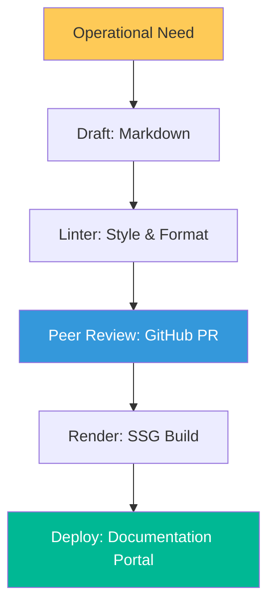

# SOP Architecture & Documentation Lifecycle Reference

**Doc Version:** 1.0.0
**Role:** Technical Writer / SRE Lead
**Scope:** Docs-as-Code, Technical Writing Standards, and SDRY Principles

---

## 1. The Docs-as-Code Architecture

Modern SOPs are managed like software. This ensures they are version-controlled, testable, and always up-to-date.

- **Source Control**: SOPs live in Git repositories (Markdown files).
- **Automation (CI/CD)**: Every PR triggers linters (vale, markdownlint) to maintain high standards.
- **Single Source of Truth (SSOT)**: Documentation is rendered through Static Site Generators (SSG) like MkDocs or Hugo.
- **Semantic Versioning**: SOP versions match the software or infrastructure they describe.

---

## 2. Technical Writing: The Imperative Standard

Professional SOPs must minimize ambiguity and reduce cognitive load, especially during high-stress incidents.

### A. The Imperative Mood
Always use action-oriented sentences.
- **Bad**: "The user should then try to restart the service."
- **Good**: "Restart the `nginx` service."

### B. Atomic Steps
Each step should perform exactly ONE action. Large paragraphs are the enemy of execution.

### C. Visual Clarity
Use code blocks for commands, bold for UI elements, and Mermaid.js for complex logic paths.

---

## 3. SDRY: Single Source of Documentation Truth

Following the "Don't Repeat Yourself" (DRY) principle, we use **SDRY** for documentation reusability.

- **Modular Fragments**: Creating reusable snippets (e.g., "Prerequisites" or "Kubernetes Context Setup") that can be embedded into multiple SOPs.
- **Reference Over Duplication**: Link to existing SOPs rather than copy-pasting their content.

---

## 4. Visualizing the Documentation Workflow

---

## 5. Enterprise Governance Standards

- **Metadata Mandatory**: Every SOP must include `owner`, `team`, and `last_verified_date`.
- **Review Cadence**: SOPs that haven't been modified or verified in 180 days are automatically flagged as "Stale."
- **Immutable History**: Use Git history as the official audit trail for who changed an operational procedure and why.

---

> **Enterprise Pattern**: Implement **The "Verify-After-Step" Policy**. Every technical action in an SOP must be followed by a verification step. For example: "1. Run `systemctl restart nginx`. 2. Verify status is active by running `systemctl is-active nginx`." This ensures the administrator immediately knows if a step failed before proceeding to the next.
