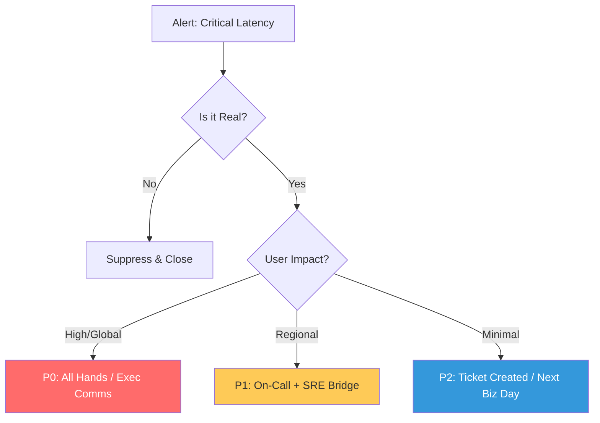

# Incident Response Lifecycle & Command Reference

**Doc Version:** 1.0.0
**Role:** Incident Commander / SRE
**Scope:** Incident Lifecycle, Command Structure (ICS), and Mitigation Strategies

---

## 1. The Incident Response Lifecycle (The Operational Loop)

Managing an incident is a race against time. A structured lifecycle ensures that every second counts toward restoration.

1.  **Detection & Alerting**: The moment the system deviates from the SLO (Service Level Objective).
2.  **Triage & Assessment**: Determining the severity (P0-P4) and assembling the initial response team.
3.  **Mobilization**: Activating the Incident Command System (ICS) and communication channels.
4.  **Mitigation & Restoration**: Taking the "Quickest Defensible Action" to restore service (Rollback, Traffic Shift).
5.  **Resolution**: Confirming the fix is stable and closing the bridge.
6.  **Post-Incident Analysis**: The blameless review to prevent recurrence.

---

## 2. The Incident Command System (ICS)

DevOps teams borrow ICS from emergency services to manage complex outages without "Hero Syndrome."

- **Incident Commander (IC)**: The ultimate authority. They do NOT fix the code; they orchestrate the response.
- **Operations Lead (Scribe/Ops)**: Manages the technical implementation and technical bridge.
- **Communications Lead (Comms)**: Manages stakeholder updates and status pages.
- **Liaison**: Coordinates with external teams or vendors (e.g., AWS Support).

---

## 3. Visualizing the Decision Tree (Triage)

---

## 4. Mitigation Strategies (The "Restoration" Toolbox)

The goal is to stop the bleeding, not necessarily to perform a permanent fix during the outage.

- **Rollbacks**: Reverting to the last known good container image or code version.
- **Traffic Shedding**: Dropping non-essential requests (e.g., analytics) to save the core API.
- **Feature Flags**: Disabling the specific new feature that is causing the degradation.
- **Vertical/Horizontal Scaling**: Adding "Brute Force" resources to survive the load.

---

## 5. Professional "Bridge" Etiquette

- **Single Voice**: Only the IC gives orders.
- **Closed-Loop Communication**: "I am restarting the API nodes." -> "Copy, restarting API nodes." -> "API nodes restarted."
- **Blamelessness**: "What failed?" and "How did it fail?" instead of "Whose fault is it?"

---

> **Enterprise Pattern**: Implement **The "Golden Rule" of Mitigation**. If the fix takes longer than 15 minutes to design, you MUST rollback first. Never attempt to "patch in production" during a P0 incident unless rollback is impossible. This preserves the "Mean Time to Recovery" (MTTR) as the primary success metric.
