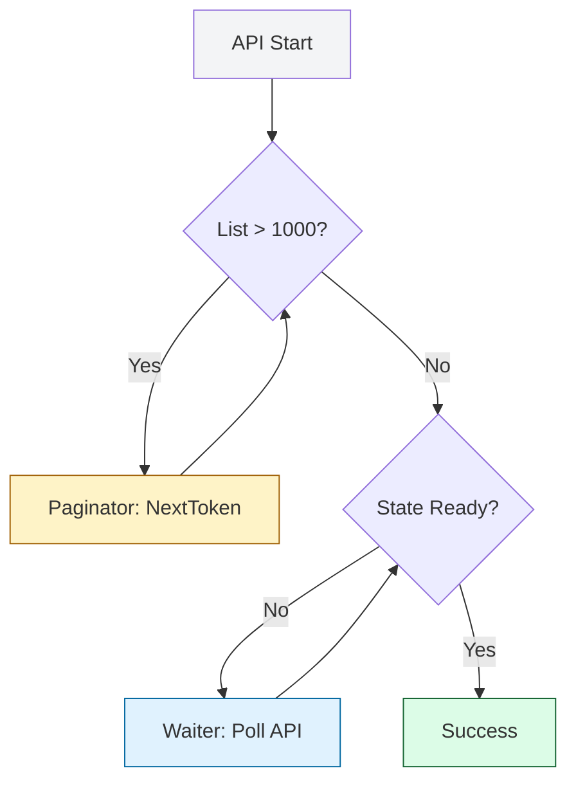

# ☁️ 03. Cloud & Networking: Scripting the Global Fleet

> **"The Network is the computer. In DevOps, your script is rarely local. It's calling an API in Virginia, SSHing to a server in Frankfurt, and pushing data to a bucket in Tokyo. Modern Infrastructure Engineers use Python to orchestrate the world."**

This reference covers the libraries for Remote Execution, API Interaction, and Cloud SDK mastery. At this level, you aren't just sending data; you are managing **Resilience**, **Retries**, and **Scale**.

---

## 🏗️ The Cloud Resilience Mandala

Reliable cloud automation relies on three pillars: **Paging**, **Waiting**, and **Retrying**.



---

## 🐍 1. AWS SDK (`boto3`)

The standard for AWS Automation. Understanding the internal mechanics of Boto3 is the difference between a Junior script and a Production platform.

### Client vs Resource
- **Client (Staff Choice)**: Low-level access. Returns raw dictionaries. 100% API coverage. Fast and Thread-safe.
- **Resource**: Object-oriented abstraction. Returns high-level objects. Easier to read but covers only 60% of AWS services.

### 🚀 Staff Pattern: The Paginator Loop
Never use `list_objects()`. It only returns 1000 items. If your bucket has 1 million files, your script will miss 99.9% of them. Use **Paginators**.
```python
import boto3

s3 = boto3.client('s3')
paginator = s3.get_paginator('list_objects_v2')

# Automates the "NextToken" logic for you
for page in paginator.paginate(Bucket='prod-data'):
    for obj in page.get('Contents', []):
        print(f"Found: {obj['Key']}")
```

### 🚀 Staff Pattern: The Intelligent Waiter
Don't use `time.sleep(60)` to wait for an RDS database to spin up. Use **Waiters**.
```python
db = boto3.client('rds')
db.create_db_instance(...)

# This blocks and polls efficiently via AWS API
waiter = db.get_waiter('db_instance_available')
waiter.wait(DBInstanceIdentifier='my-db', WaiterConfig={'Delay': 15, 'MaxAttempts': 40})
```

---

## 🌐 2. HTTP Requests (`requests`)

The "Human" HTTP library. In the enterprise, we use **Sessions** and **Mounting** to handle resilience.

| Feature | Junior Approach | Staff Approach |
|:---|:---|:---|
| **Connections** | `requests.get()` Every time. | `requests.Session()` (TCP Reuse). |
| **Failures** | Script crashes on 504. | `requests.adapters` with Retries. |
| **Security** | Hardcoded tokens. | `.env` or AWS Secrets Manager. |

### 🚀 Staff Pattern: The Self-Healing Request
```python
import requests
from requests.adapters import HTTPAdapter
from urllib3.util.retry import Retry

def get_resilient_session():
    s = requests.Session()
    # Retry logic for 500, 502, 503, 504
    retries = Retry(total=5, backoff_factor=1, status_forcelist=[500, 502, 503, 504])
    s.mount('https://', HTTPAdapter(max_retries=retries))
    return s

resp = get_resilient_session().get("https://api.internal/health")
resp.raise_for_status() # Instant Error if 4xx/5xx
```

---

## 🔑 3. SSH & Remote Scale (`asyncssh`)

When you need to reboot 1,000 Linux servers at once, `paramiko` is too slow because it is synchronous. We use **AsyncIO**.

### 🚀 Staff Pattern: Parallel SSH Execution
```python
import asyncio, asyncssh

async def check_uptime(host: str):
    try:
        async with asyncssh.connect(host, username='admin') as conn:
            result = await conn.run('uptime', check=True)
            print(f"{host}: {result.stdout}")
    except Exception as e:
        print(f"Failed {host}: {e}")

async def main():
    hosts = ['10.0.0.1', '10.0.0.2', '10.0.0.3'] # Imagine 1000 here
    await asyncio.gather(*(check_uptime(h) for h in hosts))

asyncio.run(main())
```

---

## 🎭 Real-World DevOps Scenarios

### 🛡️ Scenario: The "Boto3 Throttling Storm"

**The Incident**: A central cleanup script was scheduled to run across 500 AWS accounts simultaneously to find "Unused Load Balancers." 

**The Crisis**: Within 5 seconds, the script crashed with `RequestLimitExceeded`. AWS throttled the IAM role because it sent too many `DescribeELB` requests too fast.

**The Fix**: Implemented **Exponential Backoff** using the `botocore` config.
```python
from botocore.config import Config

# Standardize retry behavior across the entire bot
config = Config(
   retries = {
      'max_attempts': 10,
      'mode': 'adaptive' # Automatically slows down when throttled
   }
)
client = boto3.client('elb', config=config)
```
**The Lesson**: The Cloud API is a shared resource. Respect its limits with **Adaptive Retries**.

---

## 🎙️ Interview Preparation

### Foundation Questions
1. **"What happens if you don't use a Paginator in Boto3?"**
   - **Answer**: Most AWS API calls (like `list_objects` or `describe_instances`) are limited to 1,000 results per call. If you don't use a Paginator, the API will return a `NextToken`, and your script will silently ignore every resource beyond the first 1,000.

2. **"Why use `requests.Session()` instead of `requests.get()`?"**
   - **Answer**: `requests.Session()` reuses the underlying TCP/SSL connection (Keep-Alive). This avoids the "SSL Handshake" overhead for every request, which can make a sequence of API calls 2-3x faster.

### Advanced Scenario Questions
3. **"How do you handle 'Stateful' cloud operations (e.g., waiting for an EBS volume to detach)?"**
   - **Answer**: I use Boto3 **Waiters**. Instead of writing custom while-loops with `time.sleep()`, waiters provide a standardized, battle-tested polling mechanism that handles timeouts and specific state transitions correctly.

---

## 🧠 Knowledge Check

1. **Which Boto3 Config mode automatically adjusts request speed based on throttling responses?**
   - [ ] `standard`
   - [ ] `legacy`
   - [x] `adaptive`

2. **True or False: `requests.raise_for_status()` will raise an exception for a 404 error.**
   - [x] True.
   - [ ] False.

---
## 🎓 Self-Assessment Checklist
- [ ] I always use Paginators for `list` operations in AWS.
- [ ] I use Waiters instead of `time.sleep()`.
- [ ] I implement Retry Adapters for HTTP API calls.
- [ ] I understand the performance benefit of Connection Pooling (`Session`).

---
**Status**: ✅ Staff-Enhanced (2026-02-03)
