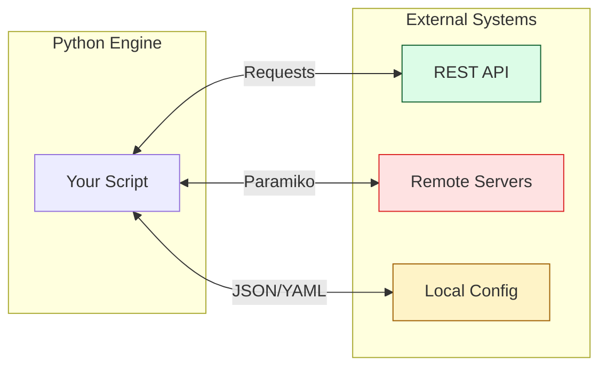

# ⚙️ Part 2: The Engine (Connectivity)

> **"Infrastructure is no longer a physical thing; it's a series of API endpoints. If your code can't talk to them, your code is useless."**

Welcome to **The Engine**. In this section, we transition from writing "local tools" to building "system connectors." We move from manipulating local files to orchestrating remote infrastructure and web services.

---

## 🧠 The Mental Model: The Power Station

If **Part 1** was the blueprint, **Part 2** is the engine room. It's about connectivity, data transmission, and remote execution. In a modern DevOps environment, your scripts rarely run in isolation. They are constantly:
- Consuming configuration from files (JSON/YAML).
- Requesting status from web services (REST APIs).
- Orchestrating tasks on remote Linux servers via SSH.

---

## 🎯 Why This Part Matters for Juniors

**Before this section**, you might:
- Struggle to parse complex configuration files without breaking the formatting.
- Manually check web dashboards to get status information.
- Use `ssh -t` in bash scripts with fragile "Expect" patterns for remote commands.

**After this section**, you'll understand:
- **Data Serialization**: Mastering the "languages of the web" (JSON and YAML).
- **RESTful Orchestration**: Using the `requests` library to automate anything with an API.
- **Agentless Execution**: Using `Paramiko` to run Python logic on remote servers without installing anything there first.

**The Difference**: You move from "Manual Inspector" to "**System Integrator**."

---

## 🎯 Learning Objectives

By the end of Part 2, you will:

- ✅ **Master Data Exchange**: Parse and generate JSON/YAML for configuration management.
- ✅ **Automate APIs**: Build robust HTTP clients that can query, update, and delete cloud resources.
- ✅ **Remote Control**: Implement SSH automation for parallel command execution on multiple servers.
- ✅ **Secure Workflows**: Protect API keys and SSH credentials using environment variables.

---

## 🏗️ Architecture: The Connected Logic

---

## 📂 What's Covered in Part 2

### 📖 Table of Contents

1. **[Data Formats: JSON & YAML](./01-Data-Formats-JSON-YAML/)**: The fuel for your automation engine.
2. **[API Automation: Requests](./02-API-Automation-Requests/)**: Talking to the cloud and beyond.
3. **[Remote Ops and SSH](./03-Remote-Ops-and-SSH/)**: Controlling the terminal from Python.

---

## 🎓 Junior's Reality Check

### "Why learn JSON/YAML when I have flat files?"
**The Reality**: Modern infrastructure is **data**. AWS answers in JSON. Kubernetes configures in YAML. Ansible inventories are YAML. If you can't parse these formats natively and safely, you are stuck in the "Legacy Admin" world. Regular Python strings aren't enough—you need structured data.

### The "Requests" Gold Standard
**Crucial Tip**: Python has a built-in `urllib`, but *no one* in professional DevOps uses it if they can avoid it. The `requests` library is the industry standard for a reason: it makes complex tasks like Auth, Retries, and JSON parsing simple and readable.

---

## ❓ Interview Preparation (Part 2)

### 🎯 Screening Questions

1. **Q: What is the main difference between JSON and YAML in an infrastructure context?**
   * **Answer**: JSON is strict and machine-friendly (great for APIs). YAML is more flexible, supports comments, and is human-friendly (great for configuration files).

2. **Q: How do you handle a "401 Unauthorized" error in the `requests` library?**
   * **Answer**: You check `response.status_code`. You should also use `response.raise_for_status()` to automatically catch and handle common HTTP errors in your `try/except` blocks.

3. **Q: Why use `Paramiko` instead of calling `subprocess.run(["ssh", ...])`?**
   * **Answer**: `Paramiko` provides a "Python native" way to handle SSH. It allows for finer control over authentication, handles interactive shells better, and doesn't require the `ssh` binary to be installed on the host system.

---

## 📝 Knowledge Check

1. **Which Python method converts a dictionary into a JSON string?**
   - [ ] `json.load()`
   - [ ] `json.read()`
   - [x] `json.dumps()`
   - [ ] `json.stringify()`

2. **What is the standard HTTP method for "updating" an existing resource?**
   - [ ] `GET`
   - [ ] `POST`
   - [x] `PUT` (or `PATCH`)
   - [ ] `DELETE`

3. **True or False: `Paramiko` requires an agent to be installed on the remote server.**
   - [ ] True
   - [x] False (It uses standard SSH).

---

## 🔗 Next Steps

You've connected to the system. Now it's time to build with it.

**Proceed to**: [Part 3: The Building Blocks (Cloud Automation) →](../03-Part-3-The-Building-Blocks/README.md)
