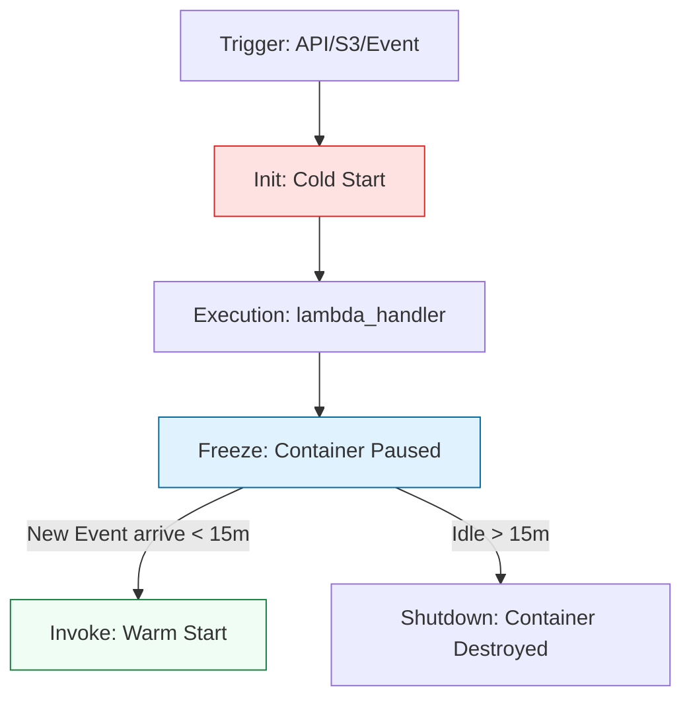

# 🏗️ Lambda Foundations: The Anatomy of a Cloud Function

> **"Architecture is often about what you leave out. In Serverless, you leave out the server management, the patching, and the idle costs. You are left with pure logic and raw event-driven power."**

Welcome to the **Foundations of AWS Lambda**. In this module, we move from "scripts that run on servers" to **"functions that run in the cloud."** You will master the anatomy of the Lambda handler, the execution lifecycle, and the critical design patterns that ensure your code is fast, stateless, and reliable.

---
## 📚 Table of Contents

1. [The Junior's Mission](#-the-juniors-mission)
2. [Operational Reality: The Serverless Trade-off](#-operational-reality-the-serverless-trade-off)
3. [The Serverless Lifecycle: Hot vs. Cold](#-the-serverless-lifecycle-hot-vs-cold)
4. [The Development Lifecycle Breakdown](#-the-development-lifecycle-breakdown)
5. [Anatomy of a Handler: Event vs. Context](#-anatomy-of-a-handler-event-vs-context)
5. [The Execution Environment (Firecracker)](#-the-execution-environment-firecracker)
6. [Staff Patterns: Efficiency & State](#-staff-patterns-efficiency--state)
7. [Senior SRE Pro-Tips](#-senior-sre-pro-tips)
8. [Hands-On Challenge: The "Secret Scrubber"](#-hands-on-challenge-the-secret-scrubber)
9. [Interview Preparation](#-interview-preparation)

---

## 🎯 The Junior's Mission
Your mission is to transition from **Imperative Scripting** (managing the box) to **Event-Driven Engineering** (responding to signals). You will learn to write code that is "born" on a trigger, executes in milliseconds, and vanishes instantly, costing only for the time it spent working.

---

## 🌩️ Operational Reality: The Serverless Trade-off
In a traditional VM, you have logs, `top`, and `uptime`. In Lambda, the "server" is an abstraction.
*   **The Win**: No OS patching, instant scaling to 1,000s of concurrent users, and $0 cost for idle time.
*   **The Hazard**: You lose the ability to "SSH in" and debug. If your code is slow, your logs are your only weapon. **Observability is not optional—it is your lifeline.**

---

## 🏗️ The Serverless Lifecycle: Hot vs. Cold
Understanding how AWS executes your code is the difference between a functional script and a production-grade tool.



### 🔍 Technical Deep-Dive:
*   **The Cold Start**: Occurs when a new "Execution Environment" must be created. AWS downloads your code, starts a **Firecracker MicroVM**, and runs your global code.
*   **The Warm Start**: Reuses the env. Global variables and the `/tmp` directory stay populated. This is why you **must** reset stateful variables inside the handler.

---
## 🔄 The Development Lifecycle Breakdown
Building for Serverless requires a disciplined engineering approach. Here is the lifecycle of a high-quality Lambda project:
**Stage 1: Environment Isolation**
- **What**: Creating a dedicated, sanitized Python installation for the project.
- **Why**: Prevents "Dependency Hell" and ensures your local dev environment matches the Cloud runtime. In Lambda, this is critical because some libraries (like `pandas` or `numpy`) have C-extensions that must be compiled for **Amazon Linux 2**.
- **How**: Using `venv` for simple scripts, or **Docker containers** (e.g., `public.ecr.aws/lambda/python:3.11`) to compile and test code in a perfect mirror of the Lambda environment.

**Stage 2: Dependency Management**
- **What**: Tracking and locking library versions explicitly.
- **Why**: Ensures **Reproducible Builds**. In a Serverless world, we often use **Lambda Layers** to share common code; without version locking, a change in a Layer could break hundreds of downstream functions simultaneously.
- **How**: Use `requirements.txt` for simple deployments, or `Pipfile/poetry.lock` for enterprise-grade dependency pinning and security auditing.

**Stage 3: Structured Code**
- **What**: Moving away from "one giant script" toward organized, modular files.
- **Why**: Improves **Maintainability and MTTR**. When an incident occurs, a modular structure allows you to swap out or fix specific business logic without touching the AWS-specific glue (the handler).
- **How**: Standardize on a project layout:
  - `/src/handlers/`: AWS-specific entry points.
  - `/src/lib/`: Pure Python business logic (reusable).
  - `/tests/`: Logic verification scripts.

**Stage 4: Verification**
- **What**: Automated validation and self-documenting code.
- **Why**: Prevents bugs at scale. In a large microservices architecture, **Type Hints** act as a contract between teams, ensuring data flowing from a Queue to a Lambda is correctly interpreted.
- **How**: Enforce **Type Annotations** (`data: dict[str, Any]`), and use tools like `pydantic` for strict data validation at the handler entry point.

**Stage 5: Fail-Fast Pattern**
- **What**: Immediate validation of triggers and environment requirements.
- **Why**: Protects against **Cost Spikes and Data Corruption**. A Lambda that fails slowly still costs money. A Lambda that fails after deleting a file but before writing to a DB is a disaster.
- **How**: Use **Guard Clauses** to check for environment variables and event schema before any state-changing operations:
  ```python
  if not os.getenv("DB_URL"):
      raise RuntimeError("Infrastructure Error: Missing DB_URL")
  ```

---
## 🐍 Anatomy of a Handler: Event vs. Context
```python
def lambda_handler(event, context):
    """
    event: A dictionary containing the trigger payload.
    context: An object providing runtime metadata.
    """
```

### 🎯 The "Event" (The Payload)
The structure depends entirely on the trigger. An S3 event looks nothing like an API Gateway event.
*   **Staff Tip**: Use `print(json.dumps(event))` during development to see the raw message from AWS.

### 🎯 The "Context" (The Environment)
This is how your function knows its own limits.
*   **`context.get_remaining_time_in_millis()`**: The most important method. Use it to stop a loop gracefully before a hard timeout.
*   **`context.aws_request_id`**: The unique ID for this execution. Essential for tracing logs in CloudWatch.

---

## 📦 The Execution Environment (Firecracker)
Lambda doesn't run on "bare metal." It runs in **Firecracker MicroVMs**.
*   **Read-Only Filesystem**: Your code is mounted to `/var/task` and is read-only.
*   **Writable Space**: You get up to 10GB of `/tmp` storage. This is the only place you can write local files.
*   **The Permission Boundary**: Lambda runs with an **Execution Role**. If your function needs to read from S3, the *Role* must have the permission, not the developer's keys.

---

## 🌍 Staff Patterns: Efficiency & State Management

A Staff Engineer optimizes for **Cold Starts** and **API Efficiency**.

### ✅ The Staff Pattern: Global Client Initialization
```python
import boto3
import os

# GLOBAL SCOPE: Initialized once per Cold Start
# Reused thousands of times during Warm Starts
S3_CLIENT = boto3.client('s3')
CONFIG = os.getenv("APP_CONFIG", "default")

def lambda_handler(event, context):
    # Do NOT create boto3 clients here!
    # Reuse S3_CLIENT from global scope.
    pass
```

### ❌ The Junior Mistake: Accumulating State
```python
LOG_CACHE = [] # Global list

def lambda_handler(event, context):
    LOG_CACHE.append(event['id']) # RISK: LOG_CACHE keeps growing across warm starts!
    # Eventually, the Lambda will crash with an Out-of-Memory (OOM) error.
```

---

## 💡 Senior SRE Pro-Tips

*   **Log JSON, Not Text**: Use structured logging. Instead of `print("Error: " + err)`, log `{"message": "Error processing file", "error": str(err), "bucket": bucket}`. This makes CloudWatch Insights 10x more powerful.
*   **The "/tmp" Cleanup**: Always delete files in `/tmp` before your function finishes. If the container is reused, a 500MB file from a previous run could block your next execution.
*   **Avoid "Fat Lambdas"**: Don't put your entire application in one function. Smaller zip files = Faster cold starts.

---

## 🏗️ Hands-On Challenge: The "Secret Scrubber"

**Goal**: Create a Lambda function that monitors an S3 bucket for new `.txt` files. If a file contains a string matching a regex for "API_KEY" or "PASSWORD", the Lambda moves the file to a `quarantine/` folder and logs a critical alert.

### 🛠️ The Challenge Requirements:
1.  **Trigger**: S3 ObjectCreated.
2.  **Stateless**: Don't store any file data in the global scope.
3.  **Resilience**: Use `context.get_remaining_time_in_millis()` to stop processing if the file is too large to finish within the timeout.
4.  **Logging**: Log a unique Request ID for every scan.

---

## 🎙️ Interview Preparation

1.  **"How does Lambda handle concurrency?"**
    *   *Answer*: Each concurrent request gets its own dedicated Execution Environment. If 10 requests hit simultaneously, AWS spawns 10 containers.
2.  **"What happens if a Lambda function times out?"**
    *   *Answer*: The execution is terminated immediately. Any state in memory is lost. It is critical to use `try/finally` or the `context` object to attempt a clean exit.
3.  **"How do you share code between multiple Lambda functions?"**
    *   *Answer*: **Lambda Layers**. You package libraries (like `requests` or `pandas`) into a Layer, making your deployment packages smaller and more maintainable.

---

**Status**: ✅ Staff-Enhanced (2026-02-04)
