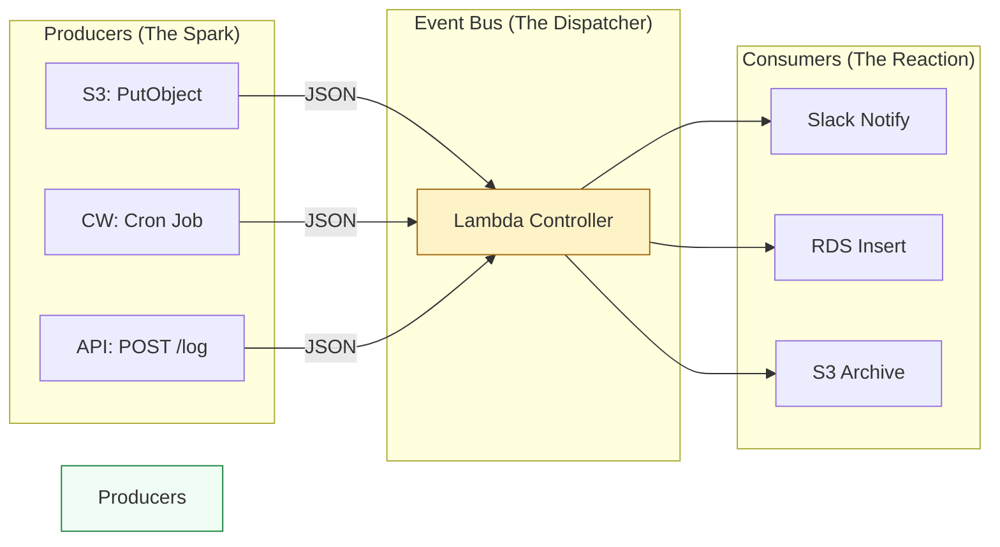

# ⚡ Event Architecture: Reactive Cloud Design

> **"In the world of Serverless, your code is a reactant. It waits for the spark of an event to trigger a chain reaction. Mastery of Events is the transition from 'running scripts' to 'orchestrating systems'."**

Welcome to **Event-Driven Architecture (EDA)**. In this module, we explore the "Reactive" side of DevOps. You will learn how to build systems that respond automatically to file uploads, database changes, and scheduled maintenance windows. We focus on the JSON structure of different event sources and how to build **Idempotent** logic that survives duplicate triggers.

---
## 📚 Table of Contents

1. [The Junior's Mission](#-the-juniors-mission)
2. [Operational Reality: The EDA Shift](#-operational-reality-the-eda-shift)
3. [The Reactive Mindset](#-the-reactive-mindset)
4. [The Development Lifecycle Breakdown](#-the-development-lifecycle-breakdown)
5. [Decoding JSON Triggers (S3, SNS, EventBridge)](#-decoding-json-triggers-s3-sns-eventbridge)
6. [Idempotency: The #1 Rule of Events](#-idempotency-the-1-rule-of-events)
7. [Staff Patterns: Anti-Recursion & Fans](#-staff-patterns-anti-recursion--fans)
8. [Senior SRE Pro-Tips](#-senior-sre-pro-tips)
9. [Hands-On Challenge: The "S3-to-SQS Decoupler"](#-hands-on-challenge-the-s3-to-sqs-decoupler)
10. [Interview Preparation](#-interview-preparation)

---

## 🎯 The Junior's Mission
Your mission is to stop thinking about **"When do I run this?"** and start thinking about **"What signal starts this?"**. You will learn to parse the complex JSON "handshakes" between AWS services and write resilient code that only activates when the exact conditions of the cloud environment are met.

---

## 🌩️ Operational Reality: The EDA Shift
In traditional systems, you have a cron job checking every minute (Polling). In EDA, the system is silent until a change occurs (Push).
*   **The Win**: Massive cost savings (no idle polling) and near-zero latency.
*   **The Hazard**: **Asynchronous complexity.** If an event fails to trigger, or triggers twice, tracking down "why" across a distributed system requires advanced logging and tracing (AWS X-Ray).

---

## 🏗️ The Reactive Mindset

In traditional architecture, you "Poll" for changes. In Serverless, you are "Pushed" data via the Event Bus.



---

## � The Development Lifecycle Breakdown
Building for EDA requires a disciplined engineering approach to handle the "At-Least-Once" nature of the cloud.

**Stage 1: Environment Isolation**
- **What**: Creating a dedicated, sanitized Python installation for the project.
- **Why**: Prevents "Dependency Hell" and ensures your local dev environment matches the Cloud runtime. In EDA, this ensures that the libraries used for JSON parsing or DB interaction (like `pydantic` or `boto3`) are pinned exactly.
- **How**: Using `venv` for simple scripts, or **Docker containers** (e.g., `public.ecr.aws/lambda/python:3.11`) to test event payloads in a mirror of the Lambda environment.

**Stage 2: Dependency Management**
- **What**: Tracking and locking library versions explicitly.
- **Why**: Ensures **Reproducible Builds**. EDA handlers often depend on specific SDK versions to parse new event schemas (e.g., a new S3 event field).
- **How**: Standardizing on `requirements.txt` or `poetry.lock`.

**Stage 3: Structured Code**
- **What**: Moving away from "one giant script" toward organized, modular files.
- **Why**: Improves **Maintainability and MTTR**. In EDA, you should separate the "Event Parser" from the "Business Logic." This allows you to test your logic using local JSON mocks without needing to trigger a real S3 upload every time.
- **How**: Organizing code into `/handlers/` (parsing) and `/lib/` (logic).

**Stage 4: Verification**
- **What**: Automated validation and self-documenting code.
- **Why**: Prevents bugs at scale. **Type Hints** and schema validation ensure that when an SNS message is received, you aren't guessing the dictionary keys.
- **How**: Using **Type Annotations** and `pydantic` models to validate the incoming `event` dictionary immediately.

**Stage 5: Fail-Fast Pattern**
- **What**: Immediate validation of triggers and environment requirements.
- **Why**: Protects against **Double-Billing and Partial Failures**. If a required field is missing from an event, you want to fail in the first 10ms, not after 20 seconds of expensive processing.
- **How**: Using **Guard Clauses** at the very top of the `lambda_handler`:
  ```python
  if 'Records' not in event:
      raise ValueError("Mismatched Event: Expected S3 Records")
  ```

---

## 🔍 Decoding JSON Triggers

Every AWS service sends a different "Flavor" of JSON. Your handler must be a professional at parsing these structures.

### 1. S3 Event (The Batch Record)
**Key Insight**: S3 events always arrive as a **List** (`Records`), even if only one file was uploaded.
```python
# Staff Pattern: Loop through records even if only expecting one
for record in event.get('Records', []):
    bucket = record['s3']['bucket']['name']
    key = record['s3']['object']['key']
    print(f"Processing: s3://{bucket}/{key}")
```

---

## 🛡️ Idempotency: The #1 Rule of Events

AWS Lambda guarantees **At-Least-Once Delivery**. This means, on rare occasions, your function may be triggered twice for the same event.

### 🛠️ The Idempotency Pattern (The "Deduplicator")
1.  **Extract ID**: Find a unique identifier in the event (e.g., S3 `eTag` or SQS `messageId`).
2.  **Check DB**: Query DynamoDB to see if this ID has already been "Marked as Processed."
3.  **Execute & Record**: If not found, perform the task and save the ID to the DB with a TTL (Time-To-Live).

---

## � Staff Patterns: Anti-Recursion & Fans

### � The Recursive Loop (The Bill Killer)
**The Incident**: A Lambda triggered by "All S3 Creates" writes its output back to the **same folder** in the **same bucket**.
**The Result**: Each write triggers a new Lambda. 1 file -> 10,000 runs -> $2,000 bill.
**The Fix**: Always use prefixes (e.g., `input/` vs `output/`) or separate buckets to prevent loops.

---

## � Senior SRE Pro-Tips

*   **Dead Letter Queues (DLQ)**: Always configure an SQS DLQ for your asynchronous Lambdas. If an event fails after 3 retries, it is saved in the queue for manual auditing instead of vanishing.
*   **The "Shadow" Event**: During migrations, use EventBridge to "shadow" events to a test Lambda to verify logic against real production data without affecting the live flow.
*   **Structured Schema Logging**: Log the entire `event` object (after scrubbing PII) on failure. This is the only way to reproduce an "edge case" trigger in your local environment.

---

## �️ Hands-On Challenge: The "S3-to-SQS Decoupler"

**Goal**: Build a system where an S3 upload doesn't trigger a Lambda directly. Instead, S3 sends a message to **SQS**, and the Lambda reads from SQS.

### 🛠️ The Challenge Requirements:
1.  **Architecture**: S3 → SQS → Lambda.
2.  **Resilience**: Implement a visibility timeout on SQS so that if the Lambda fails, the message returns to the queue.
3.  **Idempotency**: Use the SQS `messageId` to ensure a file isn't processed twice.
4.  **Logging**: Log the "Queue Depth" to monitor if your processing is keeping up with uploads.

---

## 🎙️ Interview Preparation

1.  **"What is the difference between SQS and SNS in an event-driven architecture?"**
    *   *A*: SNS is "Fan-out" (Push to many). SQS is "Point-to-point" (Pull/Queue for one). You use SNS to notify multiple systems and SQS to decouple and smooth out traffic spikes.
2.  **"How do you handle 'Poison Pill' messages (events that always cause a crash)?"**
    *   *A*: I use a **Dead Letter Queue (DLQ)** with a `maxReceiveCount` policy. After X failures, the message is moved to the DLQ so it doesn't block the rest of the queue.

---

**Status**: ✅ Staff-Enhanced (2026-02-04)
