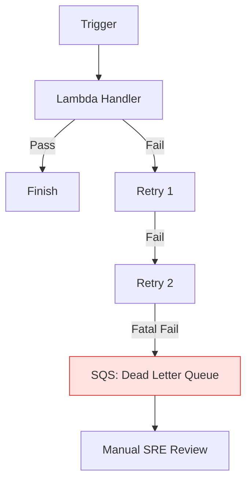

# 🏆 Production Reliability: Deployment & Compliance

> **"A Lambda function is only as safe as its IAM role and only as reliable as its error handling. Production-grade Serverless requires transitioning from 'writing handlers' to 'governing environments'."**

Welcome to the **Endgame of Serverless Mastery**. In this module, we focus on the "Day 2" operations of AWS Lambda. You will learn how to secure your functions with **Minimal IAM Roles**, manage multi-version dependencies with **Layers**, and navigate complex network topologies with **Lambda in VPC**.

---

## 📚 Table of Contents

1. [The Junior's Mission](#-the-juniors-mission)
2. [Operational Reality: The Governance Burden](#-operational-reality-the-governance-burden)
3. [The Development Lifecycle Breakdown](#-the-development-lifecycle-breakdown)
4. [Securing Identity: The Execution Role](#-securing-identity-the-execution-role)
5. [Managing Complexity: Lambda Layers](#-managing-complexity-lambda-layers)
6. [Networking: Lambda in a VPC](#-networking-lambda-in-a-vpc)
7. [Resilience: Retries & Dead Letter Queues (DLQ)](#-resilience-retries--dead-letter-queues-dlq)
8. [Senior SRE Pro-Tips](#-senior-sre-pro-tips)
9. [Hands-On Challenge: The "Secure VPC Messenger"](#-hands-on-challenge-the-secure-vpc-messenger)
10. [Interview Preparation (Staff Level)](#-interview-preparation-staff-level)

---

## 🎯 The Junior's Mission
Your mission is to graduate from a "Developer" to a "Custodian." You are no longer just making code work; you are ensuring it is **audit-compliant**, **network-secure**, and **self-healing**. You will learn to lock down the "Blast Radius" of a function so that even a compromised script cannot destroy your infrastructure.

---

## 🌩️ Operational Reality: The Governance Burden
Serverless reduces "Server Ops" but increases "Configuration Ops."
*   **The Win**: Automated scaling and no patching.
*   **The Hazard**: **Permissions sprawl.** With 100 Lambdas comes 100 IAM Roles. If you aren't disciplined, you'll end up with a "Swiss Cheese" security posture where every function has too much power.

---

## 🔄 The Development Lifecycle Breakdown

Production Reliability starts on the developer's laptop. Use this lifecycle to ensure "Works on My Machine" actually means "Production Ready."

**Stage 1: Environment Isolation**
- **What**: Sanitizing the local development workspace using containers or virtual environments.
- **Why**: Prevents "Library Drift." A Production Lambda uses **Amazon Linux 2**. If you develop on a Mac without isolation, a library like `cryptography` will crash in production because of binary mismatches.
- **How**: Using **Docker-Lambda** to test code in an exact clone of the AWS runtime.

**Stage 2: Dependency Management**
- **What**: Abstracting libraries into shared **Lambda Layers**.
- **Why**: Keeps deployment packages small and ensures all functions use the corporate-approved version of security libraries (e.g., `requests`, `pyjwt`).
- **How**: Creating a `python.zip` layer and attaching it via the AWS Console or Terraform.

**Stage 3: Structured Code**
- **What**: Separating **Infrastructure Glue** from **Pure Logic**.
- **Why**: Enables **Unit Testing**. You should be able to test your business logic without needing an actual S3 bucket or a live Database connection.
- **How**: Using the "Hexagonal Architecture" - put your core logic in a separate file/module and only use the `lambda_handler` for parsing events and returning responses.

**Stage 4: Verification**
- **What**: Implementing **IAM Policy Simulation** and **Dry Runs**.
- **Why**: Prevents "403 Forbidden" errors in production. Most Lambda failures are permission-based.
- **How**: Using the **IAM Policy Simulator** to verify your function's role *before* deployment.

**Stage 5: Fail-Fast Pattern**
- **What**: Implementing proactive environment health checks.
- **Why**: Prevents **Partial Failures**. If your Lambda needs a Database and a Vault Secret, check both in the first 10ms. Don't process half an event and then crash.
- **How**: Using **Guard Clauses** and global-scope connectivity checks during the Warm Start.

---

## 🔐 Securing Identity: The Execution Role

In production, your Lambda function MUST NOT have administrative access.

### The Staff Standard: Least Privilege
- **No**: Giving `S3:*` to your function.
- **Yes**: Giving `s3:GetObject` on `arn:aws:s3:::my-prod-bucket/*` ONLY.

> **Staff Principle**: If a function doesn't need to delete, its role shouldn't have `DeleteObject`. If it doesn't need to read, it shouldn't have `ListBucket`.

---

## 🌐 Networking: Lambda in a VPC

By default, Lambda runs in a public-managed network. If your function needs to talk to a private RDS database, you must put it **inside your VPC**.

### The Staff Choice: VPC Endpoints
When a Lambda is in a private VPC subnet, it **loses its ability to talk to the Public Internet**. To reach S3 from a VPC-Lambda without paying for a NAT Gateway, use **VPC Gateway Endpoints** (S3 and DynamoDB). This is faster, more secure, and cheaper.

---

## 🛡️ Resilience: Retries & Dead Letter Queues (DLQ)

What happens if your Lambda fails?
1. **Synchronous (API)**: Immediate error returned.
2. **Asynchronous (S3/SNS)**: AWS retries **twice** automatically.

---

## 💡 Senior SRE Pro-Tips

*   **Observability with X-Ray**: Always enable **Active Tracing**. It allows you to see exactly where the bottleneck is—is it the Lambda code, or is the RDS database taking too long to respond?
*   **The Circuit Breaker**: If your downstream database is crashing, don't let your Lambda keep retrying and making it worse. Use a "Circuit Breaker" pattern to pause executions automatically until the DB recovers.
*   **Version Pinning**: Never point a trigger at `$LATEST`. Use **Lambda Aliases** (e.g., `prod`, `dev`) and perform **Canary Deployments** (send 10% of traffic to the new version first).

---

## �️ Hands-On Challenge: The "Secure VPC Messenger"

**Goal**: Build a Lambda that lives in a **Private VPC Subnet**, fetches a secret from **Secrets Manager**, and sends a message to a **Private RDS Database**.

### 🛠️ The Challenge Requirements:
1.  **Identity**: Create a "Zero-Trust" IAM role that can *only* read one specific secret.
2.  **Networking**: Configure the Security Group to allow the Lambda to talk to the DB (Port 5432) but deny everything else.
3.  **Resilience**: Implement a `try/except` block that logs a JSON error if the DB is unreachable.
4.  **Logging**: Include the `context.aws_request_id` in every DB log entry.

---

## 🎙️ Interview Preparation (Staff Level)

1.  **"How do you handle 'Cold Start' latency for a latency-sensitive application?"**
    *   *A*: Use **Provisioned Concurrency**. It keeps a set number of environments "Warm" at all times. I also optimize by keeping the deployment package small and removing unnecessary libraries.
2.  **"A Lambda function is timing out even though the code is simple. What do you check?"**
    *   *A*: I check the **Networking**. If it's in a VPC, it might be trying to reach a public API (like Slack or S3) without a NAT Gateway or VPC Endpoint, causing the request to hang until the Lambda times out.

---

**Status**: 🏆 Staff-Enhanced (2026-02-04)
