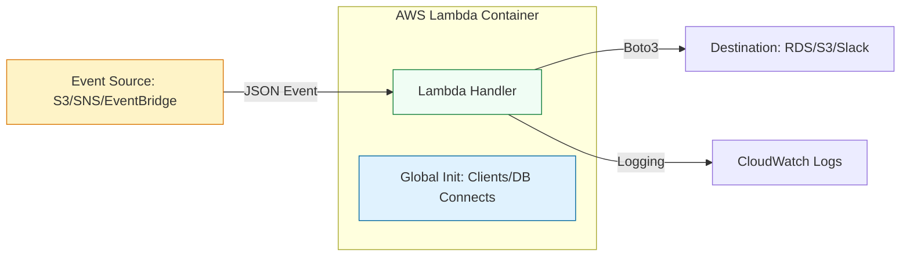

# ⚡ Serverless Projects: Python & AWS Lambda (Mastery)

> **"Servers are a burden. Infrastructure is a cost. Code should only exist when it is active. This is the philosophy of the Serverless Master."**

Welcome to the **Serverless Automation** curriculum. In modern DevOps, we move away from "Management Servers" toward event-driven logic. AWS Lambda allows your Python code to react instantly to system events—a file upload, a cloudtrail alert, or a scheduled cron—without a single server to patch. This curriculum takes you from a basic script writer to a "Staff Level" architect capable of governing high-scale, reactive ecosystems.

---

## 🛣️ The Curriculum Path

### [01. 🏗️ Lambda Foundations](./01-Lambda-Foundations/README.md)
**The Objective**: Mastering the Anatomy and Lifecycle.
*   **Key Concepts**: The `lambda_handler`, Cold vs. Warm Starts, and the strategic use of Global Scope for high-performance execution.

### [02. ⚡ Event Architecture](./02-Event-Architecture/README.md)
**The Objective**: Designing Reactive, Idempotent Systems.
*   **Key Concepts**: JSON triggering from S3/SNS/EventBridge and the "#1 Rule of Serverless": **Idempotency**.

### [03. 🏆 Production Reliability](./03-Production-Reliability/README.md)
**The Objective**: Governance, Security, and Networking.
*   **Key Concepts**: Minimal IAM Roles, Lambda Layers for dependency management, VPC Networking, and Dead-Letter Queue (DLQ) resilience.

---

## 🚀 The Operational Bar: Junior vs. Senior

| Feature          | Junior Approach             | Principal Approach            |
| :--------------- | :-------------------------- | :---------------------------- |
| **Logic**        | Monolithic handlers.        | **Modular Code**: Pure logic separated from AWS Event logic. |
| **Performance**  | Re-init clients inside the handler. | **Global Reuse**: Optimizes clients for Warm Starts. |
| **Networking**   | Default AWS Network.        | **VPC Awareness**: Secure peering and NAT isolation. |
| **Dependencies** | Large .zip files with libs. | **Shared Layers**: Consistent, slim deployment artifacts. |
| **Security**     | Over-permissive IAM Roles.  | **Least Privilege**: Granular resource-level permissions. |

---

## 🏗️ The Reactive Lifecycle

---

## 🎭 High-Impact Real-World Scenarios

### 🛡️ Scenario: The "Recursive Loop" Bill Shock
**The Incident**: A developer created a Lambda to watermark images. The trigger was "All Object Creates" on `bucket-A`. The Lambda saved the watermarked image **back to `bucket-A`**.
**The Failure**: Infinite loop. AWS processed 10,000 files in minutes.
**The Fix**: Architected separate Input vs. Output buckets.

---

## 🎙️ Interview Preparation

### Foundation Questions
1. **"What is a Cold Start?"**
   - *Answer*: The latency added when AWS initializes a new container environment for your function. Occurs on the first request or when scaling up.

### Advanced Scenario Questions
2. **"How do you ensure 'Exactly-Once' processing in an 'At-Least-Once' environment?"**
   - *Answer*: I implement **Idempotency**. I use an external state store (like DynamoDB) to track processed `request_ids` or `messageIds`. If a duplicate arrives, the function detects the existing ID and exits without repeating the action.

---
**Status**: ✅ Organized & Enhanced (2026-02-03)
