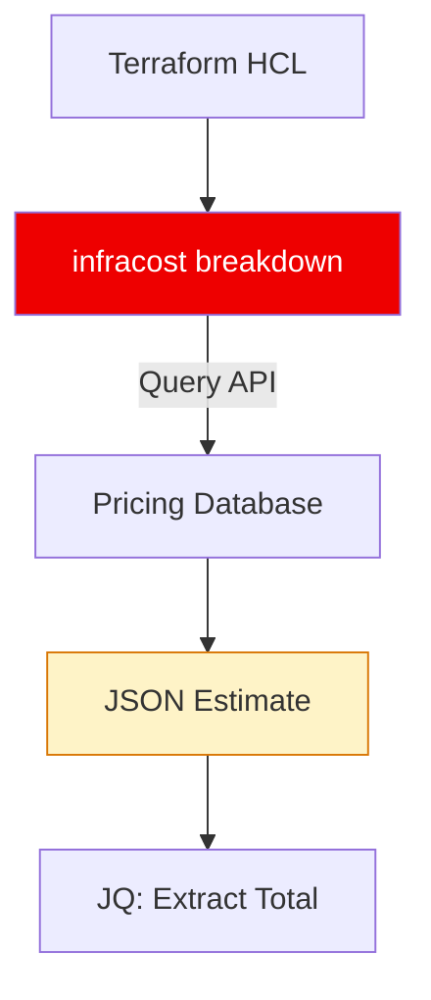

# 🏗️ CLI Automation: The FinOps Engine

> **"A GUI is for confirmation. The CLI is for automation. A true SRE never looks at a cost dashboard if they can build a script that does it for them."**

Welcome to the **CLI Automation** module. To master FinOps, you must master the command line. This module defines how to extract **Predictive Costs** (Before Deploy) using `Infracost` and **Historical Costs** (After Deploy) using `aws ce`.

**Why This Matters for Junior DevOps Engineers:**
- 🔮 **Prediction**: "How much will this Terraform change cost?" (Infracost).
- 📉 **History**: "How much did we spend on EC2 last month?" (AWS CLI).
- 🤖 **Automation**: Running these checks in CI/CD pipelines.

---

## 📚 Table of Contents

1. [Predictive Cost (Infracost)](#-predictive-cost-infracost)
2. [Historical Cost (AWS CLI)](#-historical-cost-aws-cli)
3. [Advanced Usage: Usage Files](#-advanced-usage-usage-files)
4. [Real-World DevOps Scenarios](#-real-world-devops-scenarios)
5. [Common Pitfalls & Solutions](#-common-pitfalls--solutions)
6. [Hands-On Exercises](#-hands-on-exercises)
7. [Interview Preparation](#-interview-preparation)

---

## 🔮 Predictive Cost (Infracost)

Infracost parses Terraform (HCL) and estimates the monthly bill.



### The "Diff" Workflow
This tells you the *Delta* (Change) in cost.

```bash
# 1. Generate Baseline (Main Branch)
infracost breakdown --path . --format json --out-file baseline.json

# 2. Make Changes (Edit main.tf)
# ...

# 3. Generate Diff (Feature Branch)
infracost diff --path . --compare-to baseline.json
```

**Output**:
```text
Project: my-infra

+ aws_instance.web_server
  +$42.00/mo

Monthly Cost Increase: +$42.00
```

---

## 📉 Historical Cost (AWS CLI)

Predicting is nice, but what did we *actually* spend? Use `aws ce` (Cost Explorer).

### The Command
```bash
aws ce get-cost-and-usage \
    --time-period Start=2023-10-01,End=2023-11-01 \
    --granularity MONTHLY \
    --metrics "UnblendedCost" \
    --group-by Type=DIMENSION,Key=SERVICE
```

### The Parsing (JQ)
The JSON output is verbose. We use `jq` to extract just the **Service Name** and **Dollar Amount**.

```bash
aws ce get-cost-and-usage ... | jq -r '
  .ResultsByTime[0].Groups[] | 
  "\(.Keys[0]): $\(.Metrics.UnblendedCost.Amount)"
'
```

**Output**:
```text
Amazon Elastic Compute Cloud - Compute: $120.50
Amazon Simple Storage Service: $15.00
AWS Lambda: $0.02
```

---

## ⚙️ Advanced Usage: Usage Files

Infracost assumes "0 usage" for variable resources like Lambda or S3. You must tell it: "I expect 1 million requests."

### `infracost-usage.yml`
```yaml
version: 0.1
resource_usage:
  aws_lambda_function.my_function:
    monthly_requests: 1000000 
    request_duration_ms: 150
  aws_s3_bucket.my_data:
    standard_storage_gb: 500
```

### Run with Usage
```bash
infracost breakdown --path . --usage-file infracost-usage.yml
```

---

## 🎭 Real-World DevOps Scenarios

### 🛡️ Scenario 1: The "Silent" Lambda Bill
**The Incident:** A developer wrote a Lambda that ran fine in testing, but in Prod, it processed 10GB files.
**The Fix:** Before deploy, they added a `usage.yml` estimating 10GB file processing. Infracost alerted that this would cost **$300/mo** (vs $5/mo for EC2). They switched architecture *before* deploying.

### 🔥 Scenario 2: The Daily Spend Alert
**The Task:** Alert if daily spend exceeds $100.
**Solution:** Cron job running `aws ce` for the *last 24h*.
```bash
DAILY=$(aws ce get-cost-and-usage --granularity DAILY ... | jq '.Total')
if [ "$DAILY" -gt 100 ]; then
  curl -X POST slack.com/webhook "🔥 Alert: Spent $$DAILY yesterday!"
fi
```

---

## ⚠️ Common Pitfalls

### Pitfall 1: Ignoring Data Transfer (Infracost)
Infracost often cannot estimate "Data Transfer" because it doesn't know your traffic volume.
**Fix**: Always explicitly add `data_transfer_gb` to your `usage.yml` for Load Balancers and NAT Gateways.

### Pitfall 2: AWS CE Delays
AWS Cost Explorer data is **NOT Real-Time**. It has a 24-48 hour delay.
**Fix**: Do not use `aws ce` for "Instant" feedback. Use CloudWatch Metrics for that.

---

## 🎯 Hands-On Exercises

### Exercise 1: Infracost Diff
**Objective**: Calculate the cost of an upgrade.
**Task**:
1. Create a `main.tf` with `t3.micro`.
2. Generate `baseline.json`.
3. Upgrade to `t3.xlarge`.
4. Run `infracost diff`.

### Exercise 2: AWS Cost Query
**Objective**: Find the top spender.
**Task**: Write a bash script using `aws ce` and `jq` to list the Top 3 most expensive AWS services for the last month.

---

## 🎙️ Interview Preparation

### Foundation Questions

**1. "Does Infracost analyze my actual AWS bill?"**
- **Answer**: No. Infracost is **Static Analysis** of Terraform code. It uses public pricing data. It does not look at your AWS account history.

**2. "What is `UnblendedCost`?"**
- **Answer**: The raw cost of usage before any discounts, credits, or reservations are applied. It is the "Price list" cost.

### Advanced Scenario Questions

**3. "How do you automate cost checks for a monorepo with 50 projects?"**
- **Answer**: Use an `infracost.yml` config file at the root. It lists all projects (`projects: [path: app1, path: app2]`). Run `infracost breakdown --config-file infracost.yml` to get a summarized report for all apps.

---

## 🧠 Knowledge Check

**1. Which tool looks at *Predictive* (Future) costs?**
- [ ] AWS Cost Explorer
- [x] Infracost
- [ ] AWS Budgets

**2. To estimate S3 storage costs in Infracost, what do you need?**
- [ ] A credit card
- [x] A Usage File (`usage.yml`)
- [ ] Access to the bucket

**3. How fresh is the data from `aws ce` command?**
- [ ] Real-time (Seconds)
- [ ] 1 Hour
- [x] 24-48 Hours

---

## 🎓 Self-Assessment Checklist

Before moving to the next module, ensure you can:
- [ ] Run `infracost diff` on a local Terraform file.
- [ ] Create a `usage.yml` for a Lambda function.
- [ ] Execute an `aws ce` command to see monthly costs.
- [ ] Use `jq` to extract a dollar amount from the JSON.

**Score yourself**: 5+/5 = Ready to advance | <5 = Review exercises

[⬅️ Back to FinOps](../README.md) | [Next: GitHub Actions](../02-GitHub-Actions-Integration/README.md) ➡️
