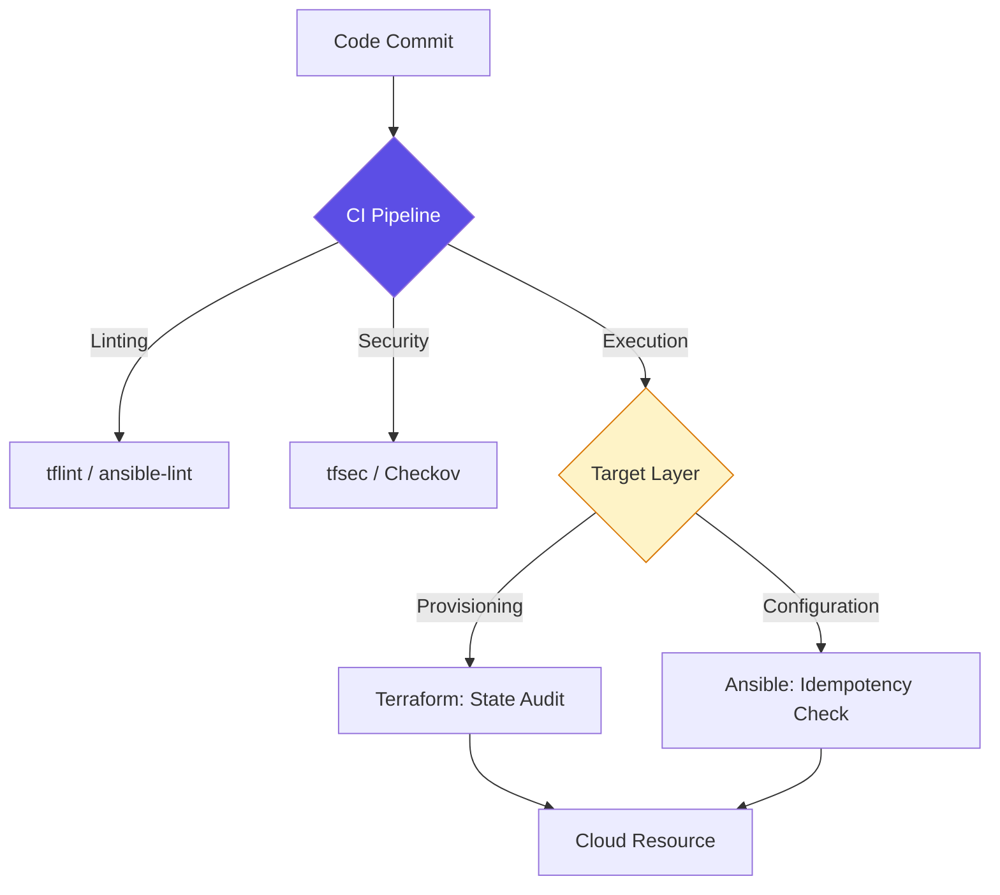

# 📔 Config Management: The Keyword Encyclopedia

Welcome to the central reference hub for **Infrastructure-as-Code (IaC) and Configuration Management**. This guide provides the technical foundation for building scalable, drift-resistant environments.

---

## 🏗️ Technical Reference Manuals

### 1. [🛠️ Architecture Patterns](./IaC-Architecture-Patterns-Ref.md)
Provisioning vs. Configuration, State management, and the "Module" pattern.

### 2. [🛡️ Immutable Governance](./Immutable-Infrastructure-Governance-Ref.md)
The "Bake vs. Fry" philosophy, Golden Images, and standardizing the Image Lifecycle.

### 3. [🔐 Provisioning & IaC Keywords](./Provisioning-IaC-Keywords.md)
Deep dive into Lifecycle Management: HCL, Providers, Resources, and Backends.

### 4. [📟 Config Management Keywords](./Config-Management-Keywords.md)
Understanding the "Inside" code: Inventories, Handlers, Roles, and Facts.

---

## 🛠️ The "Staff Level" IaC Bar

In a production environment, infrastructure code is judged by its **DRYness**, **Explicitness**, and **Safety**.

| Junior Level | Staff Engineer Level |
| :--- | :--- |
| Hardcodes IP addresses and VPC IDs. | Uses **Dynamic Lookups** (Data segments) for resource discovery. |
| Manually manages state files locally. | Uses **Remote Backend** with versioned state and DynamoDB locks. |
| Writes one giant `main.tf` file. | Builds **Modular Libraries** reusable across multiple environments. |
| Runs `apply` manually on their laptop. | Enforces **GitOps** pipelines with PR-based plan reviews. |
| Allows "SSH into Prod" for quick fixes. | Enforces **Immutable Infrastructure**; replaces nodes for all updates. |

---

## 🏗️ The Execution Flow

---

[⬅️ Back to Config Management Index](../README.md)

---
## 🧭 Additional Modules
- [samples](samples/README.md)
