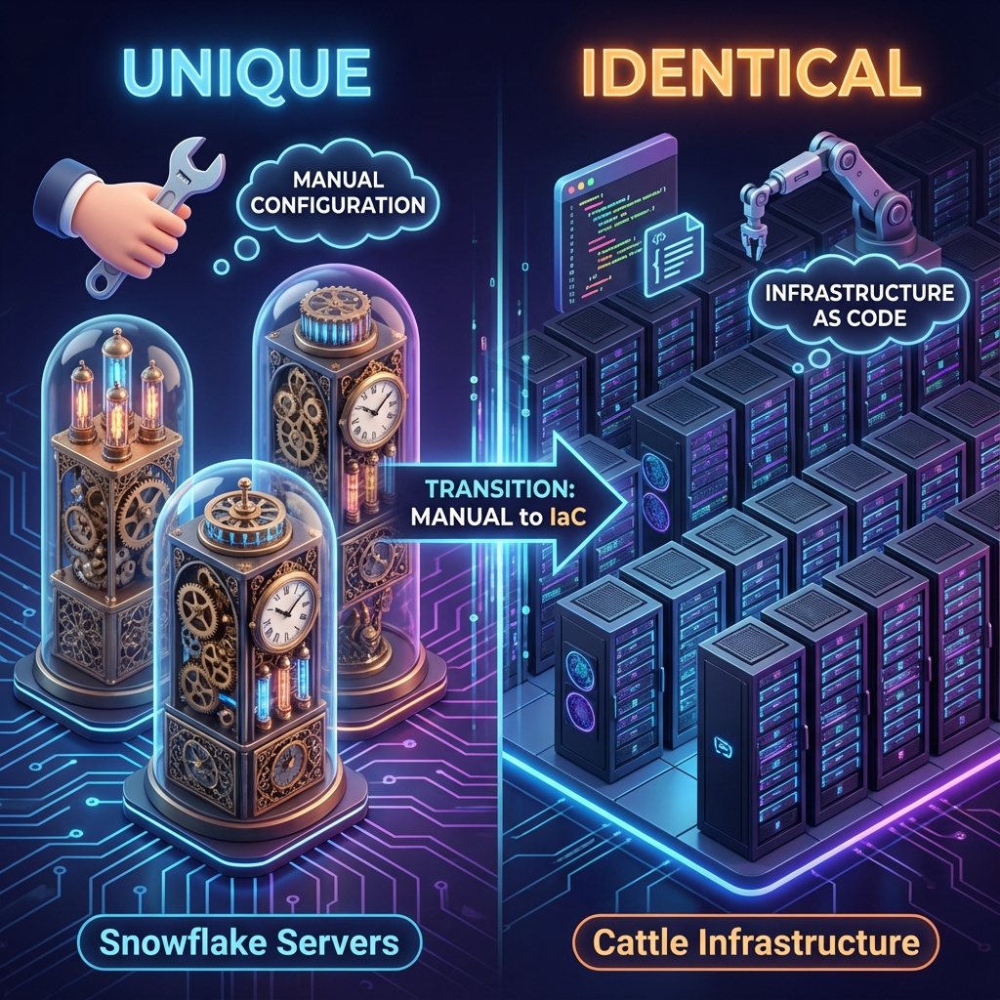
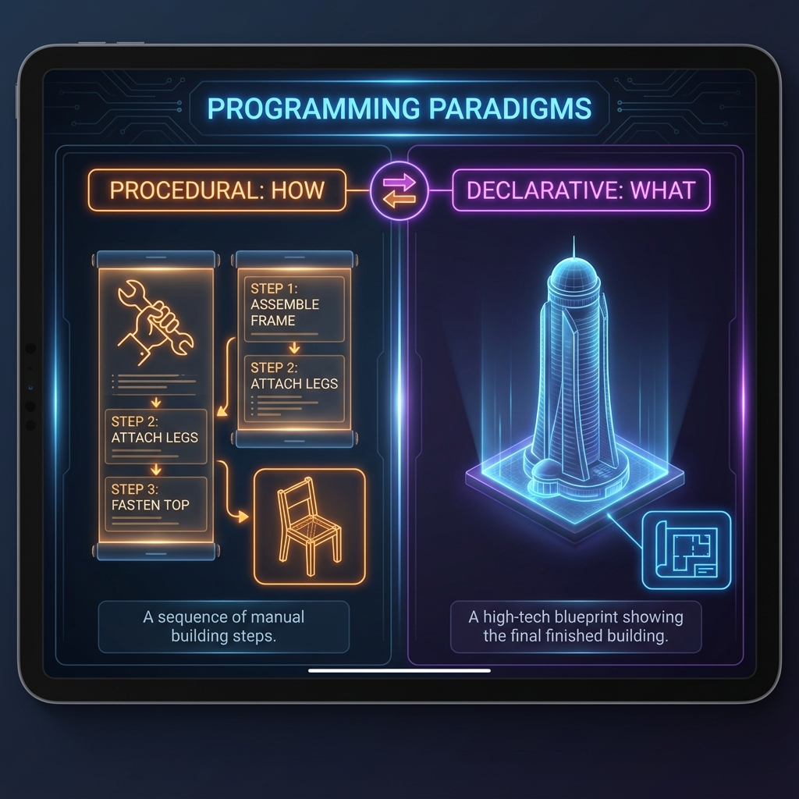

**Infrastructure as Code (IaC)** is the management and provisioning of infrastructure through code instead of manual processes. It involves using a descriptive model (scripts or definition files) to manage networks, virtual machines, load balancers, and connection topologies using the same versioning as a DevOps team uses for source code.

This paradigm shift moves infrastructure from being a "hardware problem" to being a "software problem," allowing teams to apply software engineering rigor to the underlying platform.

---
## 🎨 Core IaC Philosophy: Cattle vs. Pets
Before diving into the technical principles, it's essential to understand the mindset change. Traditional infrastructure management treats servers as "**Pets**"—unique, named, and carefully nurtured. If a pet gets sick, you nurse it back to health (manual patching).

Modern IaC treats infrastructure as "**Cattle**"—identical, numbered, and easily replaceable. If a cow gets sick, you replace it with a healthy one from the herd (immutable infrastructure).

---

## 🏗️ The Four Core Principles

### 1. Idempotency
**"No matter how many times you run the same code, the result is identical."**
In an idempotent system, running a script once or one hundred times on the same target results in the exact same state without unintended side effects. If the infrastructure already matches the code, the tool performs a "No-Op" (No Operation) and changes nothing.
### 2. Immutability
**"Never modify; always replace."**
Instead of logging into a server to update a package or change a config file (mutability), you modify the code and deploy a brand-new instance while disposing of the old one. This eliminates **Configuration Drift** and ensures mirrors of production are always available.
### 3. Declarative over Procedural
- **Procedural (The "How")**: Like a cooking recipe. "1. Open AWS Console, 2. Click EC2, 3. Select t3.micro..." Tools like Ansible follow this step-by-step logic.
- **Declarative (The "What")**: Like a blueprint. "I need 3 t3.micro servers in the US-East-1 region." Tools like **Terraform** handle the "How" automatically by calculating the difference between the blueprint and reality.

### 4. Version Control (The Single Source of Truth)
IaC means your infrastructure lives in **Git**. This enables:
- **Audit Trails**: See exactly who changed what, when, and why.
- **Rollbacks**: If a deployment fails, revert to the previous Git commit and re-apply.
- **Peer Reviews**: Infrastructure changes are reviewed via Pull Requests before they go live.
---
## 🚀 The 4 Pillars of IaC Benefits

| Pillar | Explanation | Impact |
| :--- | :--- | :--- |
| **Velocity** | Automate complex environments in minutes rather than days. | Faster Time-to-Market |
| **Reliability** | Ensure Dev, Staging, and Prod are 100% consistent. | Fewer Production Outages |
| **Scalability** | Spin up 1 or 1,000 servers using the exact same logic. | Unlimited Growth |
| **Economy** | Spin down resources when not in use (e.g., nights/weekends). | Significant Cost Savings |

---
## 🔄 The IaC Workflow (The Modern Pipeline)
Modern infrastructure isn't "clicked" into existence; it is **deployed** through a structured lifecycle.

1.  **Code**: Define your infrastructure using HCL (HashiCorp Configuration Language).
2.  **Commit**: Push your code to a Version Control System (GitHub/GitLab).
3.  **Plan**: Run `terraform plan` to preview exactly what will be added, changed, or destroyed.
4.  **Review**: Team members provide a peer review to ensure compliance and security.
5.  **Apply**: Run `terraform apply` to provision the resources in the cloud.

---
## 🏗️ Real-Life Scenarios
### Scenario 1: The "Snowflake Server" Outage
*   **The Problem**: A senior engineer manually tweaked a DB connection pool setting on a production server to solve a latency spike but didn't document it. Six months later, the server crashed due to a hardware failure. The automated rebuild script failed to include that manual tweak, causing the application to fail under load.
*   **The IaC Fix**: When the tweak is needed, it's added to the Terraform code. The change is reviewed and applied. When the server fails, the IaC tool recreates it with the **exact** same settings, including the optimized connection pool.
*   **Metric**: Reduced MTTR (Mean Time to Recovery) from **4 hours** to **5 minutes**.
### Scenario 2: Environment Disparity (Prod vs Dev)
*   **The Problem**: A critical bug appeared only in Production. After 12 hours of debugging, the team found that the Production Load Balancer had a "Sticky Session" timeout of 20 minutes, while Development was set to 5 minutes. No one knew when or why they differed.
*   **The IaC Fix**: Both environments use the same code. Variables define the count (e.g., `prod_count = 10`, `dev_count = 1`), but the load balancer logic is dictated by the same block of code.
*   **Business Impact**: Eliminated "works on my machine" excuses and improved developer productivity.
### Scenario 3: Global Expansion in 15 Minutes
*   **The Problem**: A US-based startup suddenly gained viral traction in Europe. Provisioning a new data center in a European region would typically take the ops team weeks of manual setup and security audits.
*   **The IaC Fix**: The team copied their US configuration, changed the `region` variable to `eu-central-1`, and ran `terraform apply`. In under 15 minutes, a mirror of their entire US stack was online and ready for users.
*   **Business Impact**: Captured market momentum that would have been lost during manual provisioning.
---
## ❓ Interview Questions
1.  **Explain the difference between Declarative and Procedural IaC.**
    

    
Show Answer

    Declarative (Terraform) defines the end state, and the tool calculates the steps. Procedural (Ansible) defines the specific steps to be taken in order. One says "What," the other says "How."
    

2.  **What is "Configuration Drift," and how does IaC prevent it?**
    

    
Show Answer

    Drift occurs when manual changes cause reality to deviate from the code. IaC tools detect this during the "Plan" phase and can automatically revert the manual changes to restore the desired state.
    

3.  **What is Idempotency in the context of IaC?**
    

    
Show Answer

    It ensures that running the same operation multiple times results in the same outcome. If the infrastructure already matches the code, Terraform does nothing (a No-Op).
    

4.  **How does "Immutability" improve infrastructure reliability?**
    

    
Show Answer

    Instead of patching existing servers (which can fail or leave residue), immutable infrastructure replaces them entirely. This ensures a clean, predictable state every time.
    

5.  **What are the risks of manual infrastructure changes (ClickOps)?**
    

    
Show Answer

    No audit trail, configuration drift, single point of failure (knowledge silos), and extremely slow disaster recovery.
    

6.  **Can you use IaC for multi-cloud environments?**
    

    
Show Answer

    Yes, tools like Terraform use "Providers" to interact with different APIs (AWS, Azure, GCP) using the same consistent HCL language, though the resource types vary by provider.
    

7.  **What is "Infrastructure as Code" versioning?**
    

    
Show Answer

    
Show Answer

    Storing infra logic in tools like Git, allowing for branching, pull requests, version tagging, and rollbacks.
    

8.  **Explain the "Cattle vs Pets" analogy.**
    

    
Show Answer

    Pets are unique and cared for individually (manual); Cattle are identical and easily replaced (automated). Modern IaC treats servers as cattle.
    

9.  **What is a "Snowflake Server"?**
    

    
Show Answer

    A server that has been uniquely modified over time and cannot be easily replicated or understood because its history isn't captured in code.
    

10. **Does Terraform manage the OS configuration?**
    

    
Show Answer

    Usually no. Terraform manages "Infrastructure" (VMs, Networks). Tools like Ansible or Cloud-Init manage the "OS Configuration" (Packages, Users) inside the VM.
    

11. **What is a "Dry Run" in Terraform?**
    

    
Show Answer

    This is the `terraform plan` command. It shows you the proposed changes without actually executing them.
    

12. **Why is "Peer Review" important for IaC?**
    

    
Show Answer

    Just like application code, infrastructure code can have bugs or security holes. Peer review ensures a second pair of eyes catches issues before they hit production.
    

13. **How does IaC support Disaster Recovery?**
    

    
Show Answer

    By having the entire environment defined in code, you can recreate the entire stack in a different region in minutes following a regional outage.
    

14. **What is a "Source of Truth" in DevOps?**
    

    
Show Answer

    The Git repository containing the code. If it isn't in Git, it shouldn't exist in the infrastructure.
    

15. **What are "Meta-arguments" in IaC?**
    

    
Show Answer

    In Terraform, these are special arguments (like `count`, `for_each`, or `depends_on`) that change how a resource is created without changing its intrinsic properties.
    

16. **What is the benefit of a "Declarative" tool for a larger team?**
    

    
Show Answer

    It reduces the complexity of management. You don't need to know the current state of 500 servers; you only need to look at the code to know what the state *should* be.
    

17. **Explain "Blast Radius" in the context of IaC.**
    

    
Show Answer

    This refers to the potential damage a single command can do. Dividing infrastructure into smaller state files or modules helps limit the blast radius.
    

18. **What is "Self-Healing Infrastructure"?**
    

    
Show Answer

    An environment where monitoring tools detect a failure and IaC tools automatically provision a replacement to restore the desired state.
    

19. **How does IaC help with Security Compliance?**
    

    
Show Answer

    You can use automated scanners (like `tfsec`) to scan your code for security violations (e.g., open S3 buckets) before the infrastructure is even created.
    

20. **What is GitOps?**
    

    
Show Answer

    An operational framework that takes DevOps best practices (version control, collaboration, CI/CD) and applies them to infrastructure automation.
    

---
## 🧠 Comprehensive Quiz (25 Questions)
<b>1. Which principle ensures a script produces the same result no matter how many times it's run?</b>

Show Answer

**Answer: Idempotency** - It ensures the target state is reached regardless of the starting state.

<b>2. What is the primary characteristic of "Declarative" IaC?</b>

Show Answer

**Answer: It focuses on the "What" (Result)** - Declarative tools like Terraform focus on the desired outcome, not the steps to get there.

<b>3. What is the leading cause of "Configuration Drift"?</b>

Show Answer

**Answer: Manual Changes (ClickOps)** - Direct modifications in the cloud console are the primary source of drift.

<b>4. True/False: Immutable infrastructure focuses on patching existing servers.</b>

Show Answer

**Answer: False** - Immutability favors replacing resources entirely rather than modifying them.

<b>5. Which of these is a benefit of Version Control for IaC?</b>

Show Answer

**Answer: Auditability and Rollback** - Git history provides a timeline of changes and the ability to revert.

<b>6. The "Cattle" analogy refers to infrastructure that is:</b>

Show Answer

**Answer: Disposable and Identical** - Resources are replaced if they fail, not repaired.

<b>7. "Snowflake Servers" are a result of:</b>

Show Answer

**Answer: Manual Configuration** - Each server becomes a unique "Snowflake" over time due to ad-hoc tweaks.

<b>8. What happens if you run an idempotent script on a system that is already in the desired state?</b>

Show Answer

**Answer: Nothing (No-Op)** - The tool recognizes the state matches and does not trigger changes.

<b>9. Which tool is most famous for Declarative IaC?</b>

Show Answer

**Answer: Terraform** - It is the industry standard for declarative infrastructure.

<b>10. What does "Single Source of Truth" refer to in IaC?</b>

Show Answer

**Answer: The Git Repository** - The code in Git is the authoritative definition of what exists.

<b>11. Peer review of IaC code helps prevent:</b>

Show Answer

**Answer: Security Holes and Human Error** - A second set of eyes catches potentially destructive changes.

<b>12. Disaster Recovery is faster with IaC because:</b>

Show Answer

**Answer: The stack can be redeployed instantly in a new region** - No need to follow manual PDFs.

<b>13. In the "IaC Workflow," what follows "Automated Plan"?</b>

Show Answer

**Answer: Peer Review** - Changes should be reviewed by teammates before being applied.

<b>14. Multi-environment consistency means:</b>

Show Answer

**Answer: Dev, Staging, and Prod behave identically** - Minimizing disparities that hide bugs.

<b>15. What is "Infrastructure Disposal" in immutability?</b>

Show Answer

**Answer: Tearing down old resources after new ones are live** - part of the replace-and-swap strategy.

<b>16. Which of these is NOT an IaC principle?</b>

Show Answer

**Answer: Manual Patching** - This is the opposite of IaC principles.

<b>17. Auditability in IaC is achieved through:</b>

Show Answer

**Answer: Git Commit Logs** - A record of every change made to the environment.

<b>18. "Day 0" operations typically refer to:</b>

Show Answer

**Answer: Initial Infrastructure Planning/Provisioning** - Setting the foundation for the project.

<b>19. What is a "Snowflake" in technical terms?</b>

Show Answer

**Answer: A uniquely configured, non-replicable server** - The bane of scalability.

<b>20. Declarative code says:</b>

Show Answer

**Answer: "I need X"** - It defines the goal, not the instructions.

<b>21. Why is mutability considered "Bad" for scaling?</b>

Show Answer

**Answer: It creates inconsistency across instances** - Managing 1,000 unique servers manually is impossible.

<b>22. "Time to Market" is reduced by IaC through:</b>

Show Answer

**Answer: Automation and Standardization** - Reusing templates to launch environments quickly.

<b>23. Which lifecycle stage follows "Peer Review"?</b>

Show Answer

**Answer: Automated Apply** - Executing the reviewed changes in the cloud.

<b>24. GitOps is a practice that uses:</b>

Show Answer

**Answer: Git as the single source for all infra management** - Automating via Git triggers.

<b>25. Does IaC replace the cloud provider's UI?</b>

Show Answer

**Answer: For provisioning, Yes; for viewing, No** - Real engineers use the UI for monitoring, not for building.

---
## 🛡️ Best Practices for IaC
1.  **Code Everything**: If it’s in the console but not in the code, it’s a liability.
2.  **Modularize**: Break your code into reusable components (Modules) to avoid "Large File Syndrome."
3.  **Separate States**: Keep Network, Database, and Application state files separate to limit the **Blast Radius**.
4.  **Use Automated Tools**: Integrate tools like `tfsec` (security), `tflint` (linting), and `terraform fmt` (formatting) into your CI/CD.
5.  **Tag Everything**: Ensure resources are tagged with Environment, Owner, and Project for cost tracking.

---
## 📖 Summary
Transitioning to **Infrastructure as Code** is more than just switching tools; it's a fundamental change in **DevOps Culture**. By embracing **idempotency, immutability, and declarative logic**, organizations can build systems that are not only faster to deploy but significantly more resilient and scalable than traditional manual configurations.

**If you aren't doing it through code, you aren't doing it at scale.**
