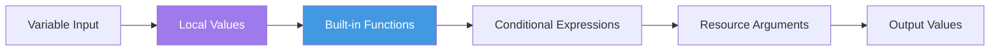

## Configuration Language (HCL) Basics

HashiCorp Configuration Language (HCL) is designed to be human-readable and machine-friendly for defining infrastructure. It strikes a balance between the simplicity of JSON and the power of a full programming language.

### 📜 Core Syntax
```hcl
# Block syntax
resource "resource_type" "local_name" {
  argument_name = "value"
}
```

### 💎 Expressions & Logic
For a deep dive into how Terraform handles data, logic, and transformations, see the comprehensive guide:
👉 **[Detailed Terraform Expressions Guide](Expressions.md)**

---

## Data Types
Terraform values are categorized into primitives and complex structures:
- **String**: `"t3.micro"`
- **Number**: `10`
- **Boolean**: `true`
- **List**: `["us-east-1a", "us-east-1b"]`
- **Map**: `{ Name = "Web", Env = "Dev" }`
- **Object**: Complex nested structures.

## Functions & Expressions
Terraform provides over 100 built-in functions (no custom functions allowed).
- **upper("hello")** -> "HELLO"
- **element(list, index)** -> retrieves an item from a list.
- **lookup(map, key, default)** -> safe retrieval of a map key.
- **Ternary Logic**: `var.env == "prod" ? 1 : 0`

## HCL Expression Evaluation



---
## 🏗️ Real-Life Scenario: Dynamic Naming
**Problem**: An organization needs to tag all resources with the environment name. Hardcoding tags works but is prone to errors.
**Solution**: Use **Locals** and **String Interpolation**.
```hcl
locals {
  name_prefix = "${var.project}-${var.env}"
}
resource "aws_instance" "app" {
  ...
  tags = { Name = "${local.name_prefix}-server" }
}
```

---

## ❓ Interview Questions

1. **What is HCL?**
   - *Answer*: HashiCorp Configuration Language. It is a declarative language used across HashiCorp products like Terraform, Vault, and Nomad.

2. **Can you write custom functions in Terraform?**
   - *Answer*: No, but you can use the wide range of built-in functions provided by HashiCorp.

3. **What is the difference between `locals` and `variables`?**
   - *Answer*: Variables are inputs to your module that can be set externally. Locals are computed values used internally within the module for DRY code and complex expressions.

4. **How do you use conditionals in Terraform?**
   - *Answer*: Using the ternary operator syntax: `condition ? true_val : false_val`. Example: `instance_type = var.env == "prod" ? "t3.large" : "t3.micro"`

5. **What is string interpolation in HCL?**
   - *Answer*: Embedding expressions within strings using `${}` syntax (older) or direct references in modern Terraform. Example: `"${var.name}-server"` or just using expressions directly.

6. **Can you use HCL for JSON?**
   - *Answer*: Yes, Terraform also accepts JSON syntax as an alternative to HCL, using `.tf.json` file extension.

7. **What are the primitive types in HCL?**
   - *Answer*: `string`, `number`, and `bool`.

---

## 🧠 Comprehensive Quiz (25 Questions)

<b>1. What is the extension for Terraform files?</b>
<details>
<summary>Show Answer</summary>
Answer: C
</details>


<b>2. Which data type stores a key-value pair?</b>
<details>
<summary>Show Answer</summary>
Answer: B
</details>


<b>3. What is the purpose of 'Locals'?</b>
<details>
<summary>Show Answer</summary>
Answer: B
</details>


<b>4. How do you comment a single line in HCL?</b>
<details>
<summary>Show Answer</summary>
Answer: C
</details>


<b>5. What is interpolation in Terraform?</b>
<details>
<summary>Show Answer</summary>
Answer: B
</details>


<b>6. Which function converts a string to uppercase?</b>
<details>
<summary>Show Answer</summary>
Answer: B
</details>


<b>7. What is the syntax for a conditional expression?</b>
<details>
<summary>Show Answer</summary>
Answer: B
</details>


<b>8. Can you nest blocks in HCL?</b>
<details>
<summary>Show Answer</summary>
Answer: B
</details>


<b>9. What does the `length()` function return?</b>
<details>
<summary>Show Answer</summary>
Answer: B
</details>


<b>10. How do you define a list in HCL?</b>
<details>
<summary>Show Answer</summary>
Answer: B
</details>


<b>11. What keyword defines reusable internal values?</b>
<details>
<summary>Show Answer</summary>
Answer: C
</details>


<b>12. Which character starts a heredoc string?</b>
<details>
<summary>Show Answer</summary>
Answer: C
</details>


<b>13. Can HCL files use JSON format?</b>
<details>
<summary>Show Answer</summary>
Answer: B
</details>


<b>14. What function joins list elements into a string?</b>
<details>
<summary>Show Answer</summary>
Answer: C
</details>


<b>15. How do you access a map value?</b>
<details>
<summary>Show Answer</summary>
Answer: A
</details>


<b>16. What does `coalesce()` function do?</b>
<details>
<summary>Show Answer</summary>
Answer: B
</details>


<b>17. Which are valid primitive types in HCL?</b>
<details>
<summary>Show Answer</summary>
Answer: B
</details>


<b>18. How do you create a multi-line string?</b>
<details>
<summary>Show Answer</summary>
Answer: B
</details>


<b>19. What does `flatten()` do?</b>
<details>
<summary>Show Answer</summary>
Answer: B
</details>


<b>20. Can you use arithmetic operations in HCL?</b>
<details>
<summary>Show Answer</summary>
Answer: B
</details>


<b>21. What is the `for` expression syntax?</b>
<details>
<summary>Show Answer</summary>
Answer: B
</details>


<b>22. How do you reference a local value?</b>
<details>
<summary>Show Answer</summary>
Answer: B
</details>


<b>23. What does `merge()` function do?</b>
<details>
<summary>Show Answer</summary>
Answer: B
</details>


<b>24. Can you define functions in `.tf` files?</b>
<details>
<summary>Show Answer</summary>
Answer: B
</details>


<b>25. What is the operator for NOT equals?</b>
<details>
<summary>Show Answer</summary>
Answer: B
</details>


