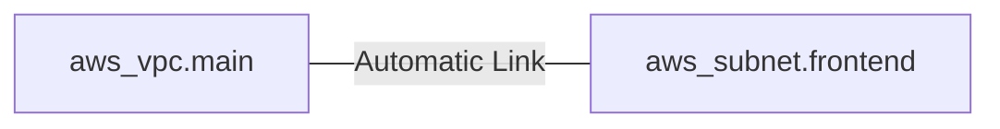

Resources are the most important element in the Terraform language. Each resource block describes one or more infrastructure objects.

## Basic Resource Syntax
```hcl
resource "aws_instance" "web_server" {
  ami           = "ami-0c02fb55956c7d316"
  instance_type = "t3.micro"
  
  tags = { Name = "Web" }
}
```

## Resource Meta-Arguments
Meta-arguments allow you to modify how Terraform handles resources:
- **count**: Creates multiple instances of the same resource.
- **for_each**: Creates multiple instances based on a map or set.
- **depends_on**: Explicitly defines the order of creation.
- **lifecycle**: Modifies behavior (e.g., `prevent_destroy`).

## Implicit vs Explicit Dependencies

### 1. Implicit Dependencies
The most common way to link resources. Terraform "reads" the code and automatically figures out the order when one resource references an attribute of another.

**Example**:
```hcl
resource "aws_vpc" "main" {
  cidr_block = "10.0.0.0/16"
}

resource "aws_subnet" "frontend" {
  vpc_id = aws_vpc.main.id # Reference creates implicit dependency
  cidr_block = "10.0.1.0/24"
}
```



### 2. Explicit Dependencies
Used when there is a dependency that Terraform *cannot* see through code references (e.g., an application requires an S3 bucket to exist before starting, but doesn't reference its ID in the config).

**Example**:
```hcl
resource "aws_instance" "app" {
  ami           = "ami-xyz"
  instance_type = "t3.micro"

  depends_on = [aws_s3_bucket.data] # Manual link
}
```


---

## 🏗️ Real-Life Scenario: Blue/Green Cleanup
**Problem**: You want to update an EC2 instance, but destroying the old one before the new one is ready causes downtime.
**Solution**: Use the `create_before_destroy` lifecycle meta-argument.
```hcl
lifecycle {
  create_before_destroy = true
}
```
Terraform will create the new instance first and only delete the old one once the new one is running successfully.

---

## ❓ Interview Questions

1. **What is the difference between an implicit and explicit dependency?**
   - *Answer*: Implicit dependencies are created automatically by Terraform when one resource references another. Explicit dependencies are manually defined using the `depends_on` meta-argument.

2. **When should you use `count` vs `for_each`?**
   - *Answer*: `count` is better for identical resources (e.g., 5 web servers). `for_each` is better when resources have unique attributes (e.g., 3 subnets with different CIDRs).

3. **Explain the purpose of the `lifecycle` meta-argument.**
   - *Answer*: `lifecycle` modifies how Terraform handles resource creation, updates, and deletion. It supports options like `create_before_destroy` (create new before deleting old), `prevent_destroy` (block accidental deletion), and `ignore_changes` (ignore specific attribute changes).

4. **What happens if you remove a resource block from your configuration?**
   - *Answer*: During the next `terraform apply`, Terraform will detect the resource is no longer in the configuration and will destroy it in the actual infrastructure (unless `prevent_destroy` is set).

5. **How does `depends_on` affect Terraform's execution plan?**
   - *Answer*: `depends_on` creates an explicit ordering constraint, forcing Terraform to wait for the specified resources to be created/updated before proceeding with the current resource, even if there's no direct attribute reference.

6. **What is the difference between `count` and creating separate resource blocks?**
   - *Answer*: Using `count` creates multiple instances of the same resource type with a single block, making code DRY and easier to manage. Separate blocks would be repetitive and harder to maintain, though they allow for more customization per resource.

7. **Can you use both `count` and `for_each` in the same resource block?**
   - *Answer*: No, you cannot use both simultaneously in the same resource block. You must choose one or the other based on your use case.

---

## 🧠 Comprehensive Quiz (25 Questions)

<b>1. Which block defines a real-world object in Terraform?</b>
<details>
<summary>Show Answer</summary>
Answer: C
</details>


<b>2. What meta-argument handles multiple identical resources?</b>
<details>
<summary>Show Answer</summary>
Answer: B
</details>


<b>3. True/False: Resources are provisioned exactly in the order they appear in the file.</b>
<details>
<summary>Show Answer</summary>
Answer: B
</details>


<b>4. Which lifecycle meta-argument prevents resource deletion?</b>
<details>
<summary>Show Answer</summary>
Answer: C
</details>


<b>5. What command lists all resources in the state?</b>
<details>
<summary>Show Answer</summary>
Answer: C
</details>


<b>6. How do you create an implicit dependency between resources?</b>
<details>
<summary>Show Answer</summary>
Answer: B
</details>


<b>7. What is the syntax for referencing a resource attribute?</b>
<details>
<summary>Show Answer</summary>
Answer: B
</details>


<b>8. Which meta-argument creates resources based on a map or set?</b>
<details>
<summary>Show Answer</summary>
Answer: B
</details>


<b>9. What does `create_before_destroy = true` do?</b>
<details>
<summary>Show Answer</summary>
Answer: B
</details>


<b>10. When should you use `depends_on`?</b>
<details>
<summary>Show Answer</summary>
Answer: B
</details>


<b>11. What is the first argument in a resource block?</b>
<details>
<summary>Show Answer</summary>
Answer: B
</details>


<b>12. What is the second argument in a resource block?</b>
<details>
<summary>Show Answer</summary>
Answer: C
</details>


<b>13. Can you have multiple resources with the same type but different names?</b>
<details>
<summary>Show Answer</summary>
Answer: B
</details>


<b>14. What does `ignore_changes` do in a lifecycle block?</b>
<details>
<summary>Show Answer</summary>
Answer: B
</details>


<b>15. How do you access a resource created with count?</b>
<details>
<summary>Show Answer</summary>
Answer: B
</details>


<b>16. What happens if you reference a non-existent resource attribute?</b>
<details>
<summary>Show Answer</summary>
Answer: B
</details>


<b>17. Can a resource depend on a module output?</b>
<details>
<summary>Show Answer</summary>
Answer: B
</details>


<b>18. What is the purpose of resource meta-arguments?</b>
<details>
<summary>Show Answer</summary>
Answer: B
</details>


<b>19. Which is NOT a valid lifecycle meta-argument?</b>
<details>
<summary>Show Answer</summary>
Answer: D
</details>


<b>20. How does Terraform handle resources with no dependencies?</b>
<details>
<summary>Show Answer</summary>
Answer: B
</details>


<b>21. What value does `count.index` start at?</b>
<details>
<summary>Show Answer</summary>
Answer: B
</details>


<b>22. Can you use expressions in resource type or name arguments?</b>
<details>
<summary>Show Answer</summary>
Answer: D
</details>


<b>23. What does `each.key` reference when using for_each?</b>
<details>
<summary>Show Answer</summary>
Answer: B
</details>


<b>24. If a resource block is removed, when is the resource destroyed?</b>
<details>
<summary>Show Answer</summary>
Answer: B
</details>


<b>25. What is a common use case for `ignore_changes`?</b>
<details>
<summary>Show Answer</summary>
Answer: B
</details>


