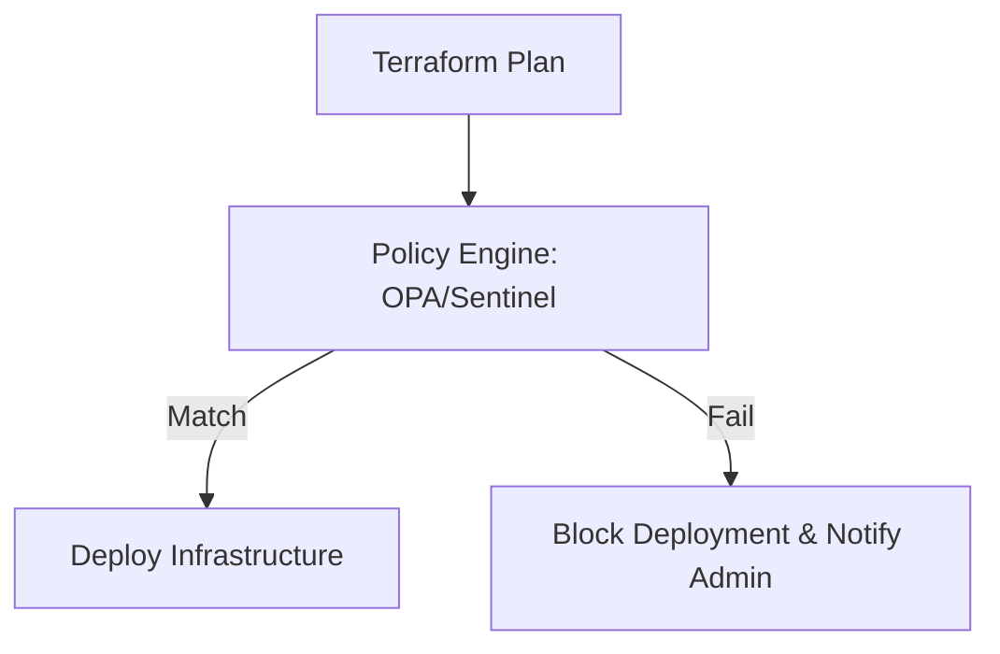

Governance ensures that your infrastructure follows company policies and regulatory requirements.

## Policy as Code (PaC)
Instead of manual audits, use code to enforce rules. This ensures that every deployment meets your compliance standards *before* it happens.
### 1. Open Policy Agent (OPA)
OPA uses the **Rego** language to query the Terraform JSON plan. It is open-source and widely adopted.

**Example: Mandatory Tagging Strategy**
Prevent deployment if `Owner` or `CostCenter` tags are missing.
```rego
package terraform

import input.resource_changes as changes

# Deny if tags are missing on supported resources
deny[msg] {
    r := changes[_]
    is_taggable_resource(r.type)
    
    # Check if 'tags' attribute is present and contains required keys
    tags := r.change.after.tags
    not has_key(tags, "Owner")
    not has_key(tags, "CostCenter")
    
    msg := sprintf("Resource '%v' is missing mandatory tags: Owner, CostCenter", [r.address])
}

is_taggable_resource(type) {
    type == "aws_instance"
    # Add other resources here
}
```
### 2. HashiCorp Sentinel (Enterprise)
Sentinel is policy-as-code embedded directly into Terraform Cloud/Enterprise. It allows for "Soft Mandates" (warning but allow) and "Hard Mandates" (block).

**Example: Restricting EC2 Instance Types**
```sentinel
import "tfplan"

# Get all EC2 instances from the plan
instances = tfplan.resources.aws_instance

# Allowed types
allowed_types = ["t2.micro", "t3.micro", "t3.small"]

# Rule: All instances must use an allowed type
main = rule {
    all instances as _, r {
        r.applied.instance_type in allowed_types
    }
}
```
## Governance Actions

### 1. Drift Detection
In a perfect world, no one touches the AWS Console ("ClickOps"). In reality, valid emergencies happen.
*   **Run a Daily Plan**: Schedule a `terraform plan -detailed-exitcode`.
*   **Exit Code 2**: Means there is a diff (Drift). Alert the team to investigate.
### 2. Common Policy Rules
*   **Cost**: "No instances larger than 4xlarge."
*   **Security**: "No Security Groups allowing 0.0.0.0/0 on port 22."
*   **Encryption**: "All EBS volumes must be encrypted."
*   **NAMING**: "All S3 buckets must start with `company-env-*`."

## Governance Workflow



---

## 🏗️ Real-Life Scenarios

### Scenario 1: The Regional Outlier
**Problem**: A developer accidentally provisions resources in `us-east-1` instead of the company's standard `us-west-2`, causing latency and networking complexity.
**Solution**: Implement an **OPA policy** that checks the `provider` and `region` attributes. The CI pipeline will automatically fail any deployment targeting an unauthorized region.

### Scenario 2: The Mandatory Tagging Fine
**Problem**: An organization's finance department threatened to shut down the cloud account because 40% of the resources had no `CostCenter` tag, making it impossible to attribute the $200k monthly bill.
**Solution**: Deploy a **Sentinel Policy** (or OPA) as a "Hard Mandate." This policy scans every resource in the `terraform plan` and blocks the `apply` if the `CostCenter` tag is missing. This enforced 100% tagging compliance overnight.

### Scenario 3: Preventing Instance "Bloat"
**Problem**: A junior developer meant to test a module but accidentally provisioned an `m5.24xlarge` EC2 instance ($2,000+/month). The mistake wasn't caught until the end-of-month audit.
**Solution**: Use **Policy as Code** to restrict the allowed `instance_type`. A rule states that in the `dev` environment, only `t2.micro` and `t3.small` are allowed. Any attempt to provision a larger, more expensive instance is instantly blocked by the pipeline.

---

## ❓ Interview Questions

1.  **What is Policy as Code (PaC) and why is it important in enterprise environments?**
    - *Answer*: PaC is the programmatic enforcement of organizational rules (security, budget, compliance). It's critical because it shifts "Compliance" to the Left, catching violations automatically before infrastructure is even created.
2.  **What is the difference between a Linter (TFLint) and a Policy Engine (OPA)?**
    - *Answer*: Linters check for syntax, style, and provider-specific errors. Policy engines check for *business rule* violations (e.g., "Is this instance too expensive?" or "Is this region allowed?").
3.  **Explain the difference between OPA (Rego) and HashiCorp Sentinel.**
    - *Answer*: OPA is an open-source, multi-tool standard that uses the Rego language. Sentinel is a proprietary policy-as-code framework integrated into Terraform Cloud/Enterprise.
4.  **What are "Soft" vs. "Hard" mandates in Sentinel?**
    - *Answer*: A **Soft Mandate** allows a deployment to proceed with a warning (or after an override), whereas a **Hard Mandate** strictly blocks the deployment until the policy violation is fixed.
5.  **How do you handle "Exemptions" in Policy as Code?**
    - *Answer*: You can add logic to the policy (e.g., `if user_name == "senior_admin"`) or use a specific tag (`skip_compliance = true`) that allows for a documented, auditable bypass for specific edge cases.
6.  **Why is "Drift Detection" considered a form of Governance?**
    - *Answer*: It identifies when someone has bypassed the established IaC workflow by making manual changes in the cloud console. Managing this drift is essential for maintaining the "Source of Truth" integrity.

---

## 🧠 Comprehensive Quiz (25 Questions)

<b>1. Which language is used to write policies for Open Policy Agent (OPA)?</b>
<details>
<summary>Show Answer</summary>
Answer: C
</details>


<b>2. Where in the Terraform lifecycle does Policy as Code typically run?</b>
<details>
<summary>Show Answer</summary>
Answer: B** - PaC evaluates the JSON plan file.
</details>


<b>3. What is the primary benefit of "Shifting Compliance Left"?</b>
<details>
<summary>Show Answer</summary>
Answer: B
</details>


<b>4. True/False: HashiCorp Sentinel is an open-source tool available in the Terraform OSS CLI.</b>
<details>
<summary>Show Answer</summary>
Answer: B** - Sentinel is part of Terraform Cloud/Enterprise.
</details>


<b>5. A policy that "Warns but Allows" a deployment is called a:</b>
<details>
<summary>Show Answer</summary>
Answer: B
</details>


<b>6. "Governance" in Cloud computing refers to:</b>
<details>
<summary>Show Answer</summary>
Answer: B
</details>


<b>7. Which tool allows you to schedule a drift detection check?</b>
<details>
<summary>Show Answer</summary>
Answer: B
</details>


<b>8. What does a "Hard Mandate" do when a policy fails?</b>
<details>
<summary>Show Answer</summary>
Answer: B
</details>


<b>9. Why use mandatory tagging as a governance rule?</b>
<details>
<summary>Show Answer</summary>
Answer: B
</details>


<b>10. OPA treats the Terraform plan as what file format for evaluation?</b>
<details>
<summary>Show Answer</summary>
Answer: B
</details>


<b>11. "Compliance as Code" enables:</b>
<details>
<summary>Show Answer</summary>
Answer: B
</details>


<b>12. Which attribute would you check to prevent "Public S3 Buckets" via policy?</b>
<details>
<summary>Show Answer</summary>
Answer: B
</details>


<b>13. A "Detailed Exit Code" of 2 in a scheduled plan indicates:</b>
<details>
<summary>Show Answer</summary>
Answer: B
</details>


<b>14. Sentinel policies are usually managed in which block in Terraform Cloud?</b>
<details>
<summary>Show Answer</summary>
Answer: B
</details>


<b>15. "Ad-hoc compliance" is risky because it is:</b>
<details>
<summary>Show Answer</summary>
Answer: B
</details>


<b>16. Which industry-standard framework is often used for cloud governance?</b>
<details>
<summary>Show Answer</summary>
Answer: A
</details>


<b>17. "Internal Service Level Agreements (SLAs)" can be tracked using:</b>
<details>
<summary>Show Answer</summary>
Answer: B
</details>


<b>18. What is the risk of having NO governance in a large team?</b>
<details>
<summary>Show Answer</summary>
Answer: B
</details>


<b>19. A "Policy Override" is:</b>
<details>
<summary>Show Answer</summary>
Answer: B
</details>


<b>20. Which cloud provider has its own built-in "Policies" service?</b>
<details>
<summary>Show Answer</summary>
Answer: D
</details>


<b>21. "Declarative Compliance" means:</b>
<details>
<summary>Show Answer</summary>
Answer: B
</details>


<b>22. Benefit of using OPA over internal cloud-specific policies?</b>
<details>
<summary>Show Answer</summary>
Answer: B
</details>


<b>23. "Budget Governance" prevents:</b>
<details>
<summary>Show Answer</summary>
Answer: B
</details>


<b>24. The term "ClickOps" describes:</b>
<details>
<summary>Show Answer</summary>
Answer: B
</details>


<b>25. A good Governance strategy should be:</b>
<details>
<summary>Show Answer</summary>
Answer: B
</details>


