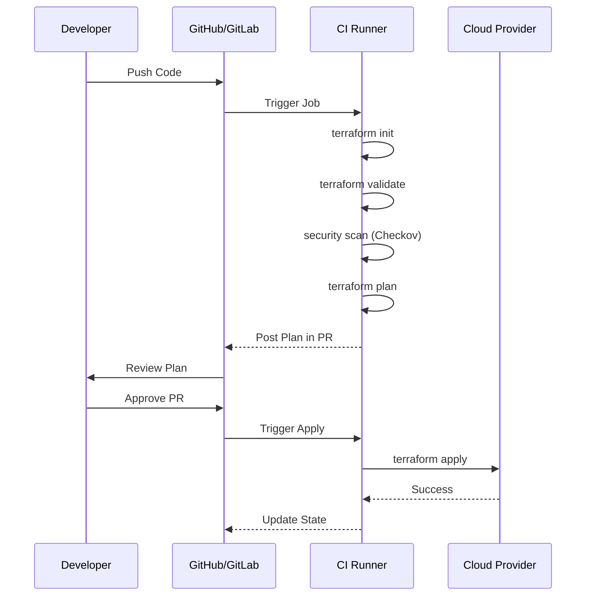
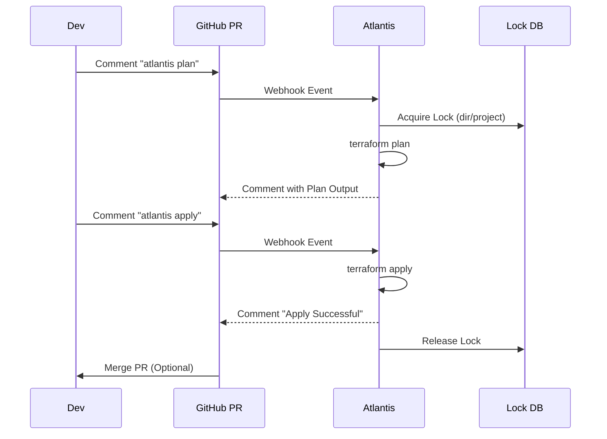

Automating the Terraform lifecycle ensures reliable, repeatable, and audited deployments.
## The Automated Workflow
To achieve "Continuous Deployment" for infrastructure, we typically use a 5-step pipeline:
1.  **Validate**: Ensures the code is syntactically correct.
    *   Command: `terraform validate`
2.  **Lint & Security Scan**: Checks for best practices and security holes.
    *   Command: `tflint`, `checkov -d .`
3.  **Cost Estimate**: Calculates how much the new resources will cost.
    *   Command: `infracost breakdown --path .`
4.  **Plan**: Generates the execution plan and saves it. Use `-out` to ensure the Apply phase uses *exactly* this plan.
    *   Command: `terraform plan -out=tfplan`
5.  **Apply**: Executes the saved plan (only on the `main` branch).
    *   Command: `terraform apply tfplan`

---
## 🚀 Example: GitHub Actions Workflow
Here is a standard pipeline that runs `plan` on Pull Requests and `apply` when merged to `main`.
```yaml
name: Terraform Pipeline

on:
  push:
    branches: [ "main" ]
  pull_request:

jobs:
  terraform:
    name: "Terraform"
    runs-on: ubuntu-latest
    env:
      AWS_ACCESS_KEY_ID: ${{ secrets.AWS_ACCESS_KEY_ID }}
      AWS_SECRET_ACCESS_KEY: ${{ secrets.AWS_SECRET_ACCESS_KEY }}

    steps:
      - name: Checkout Code
        uses: actions/checkout@v3

      - name: Setup Terraform
        uses: hashicorp/setup-terraform@v2
        with:
          terraform_version: 1.5.0

      - name: Terraform Init
        run: terraform init

      - name: Security Scan (Checkov)
        uses: bridgecrewio/checkov-action@master
        with:
          directory: .

      - name: Terraform Plan
        id: plan
        if: github.event_name == 'pull_request'
        run: terraform plan -no-color -out=tfplan
        continue-on-error: true

      - name: Terraform Apply
        if: github.ref == 'refs/heads/main' && github.event_name == 'push'
        run: terraform apply -auto-approve
```

## Mermaid Diagram: CI/CD Pipeline



---

## 🛠️ Tooling Ecosystem

### 1. Static Analysis & Security
**Checkov**: Scans for security misconfigurations.
```bash
checkov -d .
# Output:
# Failed checks:
# CKV_AWS_20: "S3 Bucket has an ACL defined which allows public access."
```
**TFLint**: Finds provider-specific errors that `terraform validate` misses (like invalid instance types).
```bash
tflint --init
tflint
# Output:
# Error: "t2.nanoo" is an invalid instance type (aws_instance_invalid_type)
```
### 2. Cost Estimation
**Infracost**: Generates a bill estimate from your plan file.
```bash
infracost breakdown --path .
# Output:
# OVERALL TOTAL: +$152.00
# ──────────────────────────────────
# aws_instance.web_app
# ├─ Instance usage (Linux/UNIX, t3.medium)    +$30.00
# └─ Storage (EBS, 100GB)                      +$10.00
```
### 3. Pull Request Automation (Atlantis)
**Atlantis** is a server that listens to webhooks from GitHub/GitLab. It runs Terraform commands inside your PRs.

**Workflow**:
1.  **Locking**: Atlantis locks the directory so no one else can modify it.
2.  **Plan**: Run `atlantis plan` in a comment to see the diff.
3.  **Apply**: Run `atlantis apply` in a comment to deploy.



---
## 🏗️ Real-Life Scenarios

### Scenario 1: The Broken Main Branch
**Problem**: A change was merged to `main`, but it failed during `apply` because of an AWS quota limit. Now the production state is locked, and the pipeline is red.
**Solution**:
1.  **Immediate Fix**: Revert the Merge Commit in Git. The pipeline runs again and applies the *previous* state, fixing production.
2.  **Long-term Fix**: Update the pipeline to use the saved plan strategy (`-out=tfplan`). The Apply phase should strictly execute what was planned in the PR phase.
### Scenario 2: The Silent Access Violation
**Problem**: A developer added an S3 bucket with a public-read ACL to their configuration. The `terraform plan` completed successfully, and the change was merged. 24 hours later, sensitive data was exposed.
**Solution**: Integrate **Security Scanning** (like Checkov, Tfsec, or Terrascan) into the CI pipeline. The pipeline should automatically fail if high-severity security violations (like public S3 buckets) are detected, preventing the code from ever being merged.
### Scenario 3: The Expensive Mistake
**Problem**: A team member accidentally changed a database instance type from `t3.micro` to `m5.large` in a dev environment. They didn't realize this would increase the monthly cost by $400 until the AWS bill arrived.
**Solution**: Implement **Infracost** in the PR pipeline. Infracost automatically calculates the price difference of every infrastructure change and posts it as a comment on the PR, allowing reviewers to catch expensive mistakes before they are applied.

---
## ❓ Interview Questions

1.  **What is Atlantis and how does it improve the Terraform workflow?**
    - *Answer*: Atlantis is a self-hosted server that automates Terraform via Pull Request comments. It provides visibility (everyone can see the plan in GitHub), auditability, and prevents state conflicts by locking directories while a PR is open.
2.  **How do you handle sensitive credentials in a CI/CD pipeline?**
    - *Answer*: Store credentials as "Secret Variables" in the CI tool (e.g., GitHub Actions Secrets). Pass them to Terraform via environment variables (like `AWS_ACCESS_KEY_ID`) or as Terraform variables (`TF_VAR_name`). Never hardcode secrets in HCL.
3.  **Why should you use `terraform plan -out=tfplan` in CI?**
    - *Answer*: It ensures that the `apply` command executes *exactly* the same changes that were approved during the `plan` phase. Without this, the state of the cloud could change between the plan and apply, leading to unpredictable results.
4.  **What is the difference between `terraform validate`, `tflint`, and `checkov`?**
    - *Answer*: `validate` checks HCL syntax. `tflint` finds provider-specific errors (like invalid region names). `checkov` scans for security misconfigurations (like open firewall ports).
5.  **How do you implement "Least Privilege" for a CI/CD runner?**
    - *Answer*: Use an IAM Role (for AWS) or Service Principal (for Azure) with a scoped policy. Instead of `AdministratorAccess`, provide only the permissions needed for the specific resources being managed by that pipeline.
6.  **What is a "Pipeline manual approval" step?**
    - *Answer*: A gate in the CD pipeline that pauses execution after the Plan phase. A human must review the plan and manually click "Approve" before the Apply phase begins, especially in production.

---

## 🧠 Comprehensive Quiz (25 Questions)

<b>1. Which command ensures HCL syntax is correct in a CI pipeline?</b>
<details>
<summary>Show Answer</summary>
Answer: B** - `validate` checks syntax and internal consistency.
</details>


<b>2. What is the purpose of `checkov` or `tfsec`?</b>
<details>
<summary>Show Answer</summary>
Answer: B
</details>


<b>3. Which tool posts cost estimates as PR comments?</b>
<details>
<summary>Show Answer</summary>
Answer: C
</details>


<b>4. Why is `-auto-approve` used in CD pipelines but NOT on local machines?</b>
<details>
<summary>Show Answer</summary>
Answer: B
</details>


<b>5. Atlantis automates Terraform via:</b>
<details>
<summary>Show Answer</summary>
Answer: B
</details>


<b>6. What is the risk of not using a saved plan file (`-out=tfplan`) in CI?</b>
<details>
<summary>Show Answer</summary>
Answer: A
</details>


<b>7. "Least Privilege" in CI means:</b>
<details>
<summary>Show Answer</summary>
Answer: B
</details>


<b>8. Which tool finds provider-specific errors (like an invalid EC2 instance type)?</b>
<details>
<summary>Show Answer</summary>
Answer: B
</details>


<b>9. How should you pass sensitive database passwords to Terraform in CI?</b>
<details>
<summary>Show Answer</summary>
Answer: B
</details>


<b>10. What does "Red-Green-Refactor" mean for IaC pipelines?</b>
<details>
<summary>Show Answer</summary>
Answer: B
</details>


<b>11. Which stage follows `terraform init` in a typical CI pipeline?</b>
<details>
<summary>Show Answer</summary>
Answer: B
</details>


<b>12. "Drift Detection" is best achieved by:</b>
<details>
<summary>Show Answer</summary>
Answer: A
</details>


<b>13. What is the benefit of a "Manual Gate" before Production Apply?</b>
<details>
<summary>Show Answer</summary>
Answer: B
</details>


<b>14. Atlantis uses "Locking" to prevent:</b>
<details>
<summary>Show Answer</summary>
Answer: B
</details>


<b>15. "Infrastructure as Code" enables CI/CD by:</b>
<details>
<summary>Show Answer</summary>
Answer: A
</details>


<b>16. Which CI tool is natively integrated with GitHub?</b>
<details>
<summary>Show Answer</summary>
Answer: B
</details>


<b>17. What does the `continue-on-error: true` flag do in a GitHub Action step?</b>
<details>
<summary>Show Answer</summary>
Answer: B
</details>


<b>18. Why use `terraform init` in every CI run?</b>
<details>
<summary>Show Answer</summary>
Answer: B
</details>


<b>19. What is a "Runner" in the context of GitHub Actions or GitLab?</b>
<details>
<summary>Show Answer</summary>
Answer: B
</details>


<b>20. "Idempotency" check in CI verifies that:</b>
<details>
<summary>Show Answer</summary>
Answer: B
</details>


<b>21. Which tool provides a "Terraform Cloud" alternative for CI/CD?</b>
<details>
<summary>Show Answer</summary>
Answer: A
</details>


<b>22. "Compliance as Code" in pipelines uses tools like:</b>
<details>
<summary>Show Answer</summary>
Answer: B
</details>


<b>23. What is the output format of `terraform plan` when using `-out`?</b>
<details>
<summary>Show Answer</summary>
Answer: B
</details>


<b>24. "Gated Deployments" refer to:</b>
<details>
<summary>Show Answer</summary>
Answer: B
</details>


<b>25. A "Pipeline failure" should ideally:</b>
<details>
<summary>Show Answer</summary>
Answer: B
</details>


