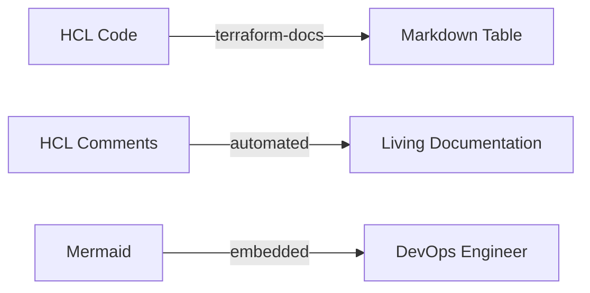

High-quality documentation is the foundation of a manageable infrastructure.

## Documentation Requirements

### 1. The `README.md` (Docs as Code)
Treat documentation like code. It lives in the repo, evolves with PRs, and is automated.
Every module must have a README describing:
-   **Purpose**: What problem does this solve?
-   **Usage**: Minimum viable example.
-   **Inputs/Outputs**: Generated automatically.

### 2. Variable Descriptions (The "Why")
Descriptions shouldn't just repeat the name. They should explain *constraints* and *expected formats*.

**Bad**:
```hcl
variable "vpc_cidr" { description = "VPC CIDR" }
```

**Good**:
```hcl
variable "vpc_cidr" {
  type        = string
  description = "The IPv4 CIDR block for the VPC. Must be a /16 or smaller (e.g., 10.0.0.0/16)."
  default     = "10.0.0.0/16"
}
```

### 3. Automated Documentation (`terraform-docs`)
Manual tables get stale. Use `terraform-docs` to read your HCL and generate the README.

**Configuration**: Create a `.terraform-docs.yml` in your root.
```yaml
formatter: "markdown table"

output:
  file: "README.md"
  mode: "inject"
  template: "<!-- BEGIN_TF_DOCS -->\n{{ .Content }}\n<!-- END_TF_DOCS -->"

sort:
  enabled: true
  by: required

content:
  - inputs
  - outputs
  - providers
  - requirements
```

**Usage**:
```bash
terraform-docs .
```

---
## 📂 Supporting Files
Beyond `README.md`, expansive projects benefit from:

1.  **`EXAMPLES.md`**: Dedicated file for copy-pasteable usage examples (Basic vs Advanced configurations).
2.  **`CONTRIBUTING.md`**: Guide for developers (how to run tests, formatting rules).
3.  **`CHANGELOG.md`**: Version history (if not using GitHub Releases).

## Documentation Lifecycle



---

## 🏗️ Real-Life Scenarios

### Scenario 1: The Tribal Knowledge Bottleneck
**Problem**: Only one engineer knows how to deploy the core networking stack. When they go on vacation, the project stalls because the variables are undocumented.
**Solution**: Use **terraform-docs** and mandatory variable descriptions. Now, any engineer can read the generated README and understand the inputs required.

### Scenario 2: The Stale Documentation Disaster
**Problem**: An engineer updated a module to add a new mandatory variable `kms_key_id`. They forgot to update the manual markdown table in the README. Several sub-teams broke their pipelines because they were following outdated documentation.
**Solution**: Automate documentation with a **pre-commit hook**. Integrate `terraform-docs` into the Git workflow so that the README is automatically updated *before* any code can be committed, ensuring the docs always reflect the current code.

### Scenario 3: The Architecture Mystery
**Problem**: A security audit team requested a diagram of the cloud perimeter. The DevOps team had no current diagrams; they had to manually explore the AWS console for 3 days to draw one in Visio.
**Solution**: Use **Mermaid.js** embedded directly in the `README.md`. Since Mermaid is text-based, the diagram lives alongside the code. When a developer adds a new Load Balancer, they update a few lines of Mermaid text, and the architecture diagram is instantly updated for the next reader.

---

## ❓ Interview Questions

1.  **What is "Documentation as Code"?**
    - *Answer*: It's the practice of treating documentation with the same rigor as source code. It lives in the same repository, follows the same review process (PRs), and use automation tools for generation.
2.  **Why is the `description` field in a variable important for automation?**
    - *Answer*: Tools like `terraform-docs` extract these descriptions to build automated tables. This ensures that users see help text directly in the README without looking at the source code.
3.  **How do you document complex variables (like objects) in Terraform?**
    - *Answer*: Provide a clear description and, ideally, a commented-out example in an `EXAMPLES.md` file. You should also define the `type` precisely to act as "self-documentation."
4.  **What are the benefits of using `terraform-docs` over manual README tables?**
    - *Answer*: It eliminates human error, prevents documentation from becoming stale/outdated, and saves time by automatically detecting all inputs, outputs, and requirements.
5.  **What is a "Self-Documenting" module?**
    - *Answer*: A module that uses clear naming conventions, explicit types, and descriptive variable names so that its purpose is obvious even without extensive external documentation.
6.  **How does Mermaid.js help in documentation?**
    - *Answer*: It allows you to create diagrams (flowcharts, sequence diagrams) using simple text syntax. This is better for Git because diagrams can be peer-reviewed and versioned just like code.

---

## 🧠 Comprehensive Quiz (25 Questions)

<b>1. Which tool is frequently used to generate README tables from HCL code?</b>
<details>
<summary>Show Answer</summary>
Answer: B** - `terraform-docs` is the industry standard for auto-generating TF documentation.
</details>


<b>2. True/False: Comments in HCL code are ignored by the Terraform engine.</b>
<details>
<summary>Show Answer</summary>
Answer: A** - Comments are for human readers only.
</details>


<b>3. Where should Terraform documentation primarily live according to "Docs as Code"?</b>
<details>
<summary>Show Answer</summary>
Answer: B
</details>


<b>4. What is the purpose of the `description` attribute in a variable?</b>
<details>
<summary>Show Answer</summary>
Answer: B
</details>


<b>5. Which file format is standard for Terraform READMEs?</b>
<details>
<summary>Show Answer</summary>
Answer: B
</details>


<b>6. What does `terraform-docs` do with HCL comments?</b>
<details>
<summary>Show Answer</summary>
Answer: B
</details>


<b>7. "Stale Documentation" refers to:</b>
<details>
<summary>Show Answer</summary>
Answer: B
</details>


<b>8. Which language is used to create text-based diagrams in Markdown?</b>
<details>
<summary>Show Answer</summary>
Answer: B
</details>


<b>9. The `README.md` file should ideally contain:</b>
<details>
<summary>Show Answer</summary>
Answer: B
</details>


<b>10. What is a "Living Document"?</b>
<details>
<summary>Show Answer</summary>
Answer: B
</details>


<b>11. Which block in `variables.tf` identifies what a variable is for?</b>
<details>
<summary>Show Answer</summary>
Answer: B
</details>


<b>12. Why put diagrams in the `README.md`?</b>
<details>
<summary>Show Answer</summary>
Answer: B
</details>


<b>13. What is the benefit of automating documentation in a PR pipeline?</b>
<details>
<summary>Show Answer</summary>
Answer: B
</details>


<b>14. A `CONTRIBUTING.md` file describes:</b>
<details>
<summary>Show Answer</summary>
Answer: B
</details>


<b>15. "Self-documenting code" values:</b>
<details>
<summary>Show Answer</summary>
Answer: B
</details>


<b>16. Which tool can enforce that all variables have a description?</b>
<details>
<summary>Show Answer</summary>
Answer: B** - TFLint has rules to enforce descriptions.
</details>


<b>17. What is `terraform-docs .` used for?</b>
<details>
<summary>Show Answer</summary>
Answer: B
</details>


<b>18. Why use `EXAMPLES.md`?</b>
<details>
<summary>Show Answer</summary>
Answer: B
</details>


<b>19. What is the purpose of a `CHANGELOG.md`?</b>
<details>
<summary>Show Answer</summary>
Answer: B
</details>


<b>20. Metadata in a module (like version and author) is best kept in:</b>
<details>
<summary>Show Answer</summary>
Answer: B
</details>


<b>21. "Documentation Drift" happens when:</b>
<details>
<summary>Show Answer</summary>
Answer: B
</details>


<b>22. Mermaid diagrams are better than Visio files in Git because:</b>
<details>
<summary>Show Answer</summary>
Answer: B
</details>


<b>23. Which attribute provides return value details in `outputs.tf`?</b>
<details>
<summary>Show Answer</summary>
Answer: B
</details>


<b>24. "Docs as Code" encourages which tool for reviews?</b>
<details>
<summary>Show Answer</summary>
Answer: B
</details>


<b>25. A good variable description should include:</b>
<details>
<summary>Show Answer</summary>
Answer: B
</details>


