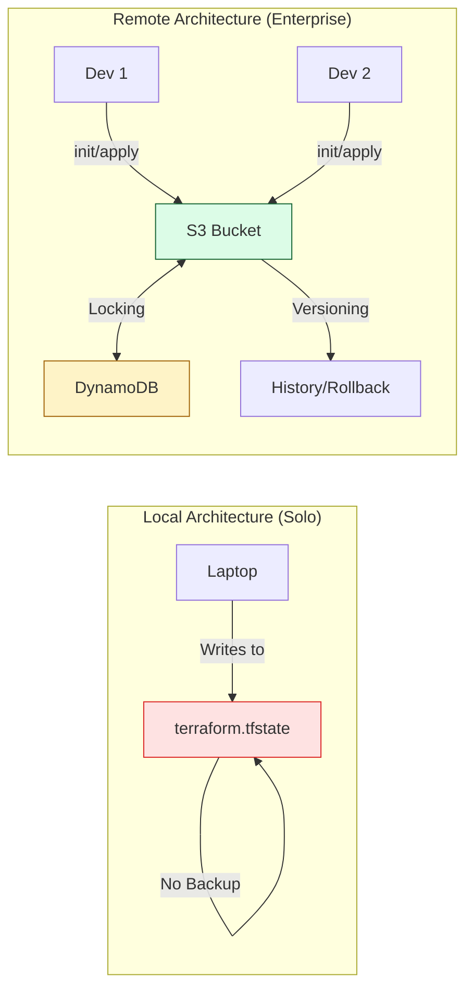

# 🌐 Local vs. Remote State: Choosing Your Architecture

> **"Solo work stays local. Teamwork goes remote. In a production environment, your laptop is a liability; the Cloud is your vault."**

Welcome to a critical architectural crossroad: **State Storage**. Deciding where your state file lives determines how your team collaborates, how your secrets are protected, and how your infrastructure survives a hardware failure. For a Junior DevOps Engineer, moving from "Local" to "Remote" state is your first real step into **Production Engineering**.

**Why This Matters for Junior DevOps Engineers:**
- 🚨 **The "Lost Laptop" Risk**: If your state is local and your machine dies, you lose control of your cloud infrastructure.
- 🤝 **The Race Condition**: Remote state with locking prevents two people from accidentally destroying the same resource simultaneously.
- 🔐 **Compliance**: Storing secrets in plain text on a local disk is a security violation in 99% of enterprises.
- 🚀 **Automation (CI/CD)**: Pipelines cannot access your laptop; they need a shared cloud location to run `apply`.

---

## 📚 Table of Contents

1. [Architecture Comparison](#-architecture-comparison)
2. [The Remote State Workflow](#-the-remote-state-workflow)
3. [Deep-Dive: S3 + DynamoDB (The Gold Standard)](#-deep-dive-s3--dynamodb-the-gold-standard)
4. [Real-World DevOps Scenarios](#-real-world-devops-scenarios)
5. [Professional Configuration (Boilerplate)](#-professional-configuration-boilerplate)
6. [Common Pitfalls & Solutions](#-common-pitfalls--solutions)
7. [Hands-On Exercises](#-hands-on-exercises)
8. [Interview Preparation](#-interview-preparation)
9. [Knowledge Check](#-knowledge-check)

---

## 🏗️ Architecture Comparison

Choosing the right backend is about balancing simplicity vs. durability.



### The Truth Table: Local vs. Remote

| Feature | **Local State** (Default) | **Remote State** (Standard) |
|:---|:---|:---|
| **Storage** | Local Disk (`./terraform.tfstate`) | Cloud Vault (S3, GCS, TFC) |
| **Concurrency** | ❌ None (Race Conditions) | ✅ Mandatory Locking |
| **Durability** | ❌ Fails if SSD fails | ✅ 99.999999999% (S3) |
| **Security** | ❌ Plain-text Secrets | ✅ Encrypted (KMS / AES-256) |
| **CI/CD** | ❌ Incompatible | ✅ Native Support |
| **History** | ❌ Not Automated | ✅ Built-in Versioning |

---

## 🔐 The Remote State Workflow

Moving from Local to Remote is a one-way migration that Terraform handles gracefully.

**1. Define the Backend**
You add a `terraform {}` block to your code specifying where the state should live.

**2. The Handshake (`terraform init`)**
When you run `init`, Terraform detects that your previous state was local but your NEW configuration is remote.

**3. The Migration**
Terraform asks: *"Do you want to copy existing state to the new backend?"*
- **Yes**: Files are uploaded to S3 and deleted locally.
- **No**: A new blank state is created remotely (Dangerous if you already have resources!).

---

## 🧩 Deep-Dive: S3 + DynamoDB (The Gold Standard)

In AWS environments, the combination of **S3 (Storage)** and **DynamoDB (Locking)** is the industry standard.

### 1. S3 for Durability
S3 stores the `.tfstate` file. You should enable **Bucket Versioning** so that if a state file is corrupted, you can roll back to 5 minutes ago.

### 2. DynamoDB for Locking
Terraform writes a small record to DynamoDB when an operation starts.
- **If Alice runs `apply`**: Terraform locks the table.
- **If Bob runs `apply` 10 seconds later**: Terraform sees the lock and tells Bob: `"Error: State is locked by Alice."`

---

## 🎭 Real-World DevOps Scenarios

### 🛡️ Scenario 1: The "Coffee Shop" Catastrophe
**The Incident**: A lead dev stored the production state file locally on their laptop. The laptop was stolen at a coffee shop.
**The Failure**: No one else in the company could update the cloud infrastructure. They had to manually "Reverse Engineer" 200 resources back into a new state file.
**The Impact**: 3 days of downtime to reconstruct the "Source of Truth."
**The Fix**: Use **Remote State** independent of individual machines.

### 🔥 Scenario 2: The "Double Apply" Corruption
**The Incident**: Alice and Bob both ran `terraform apply` on a shared network drive at the exact same time.
**The Failure**: Network drives do not support Terraform's locking logic. Both processes wrote to the JSON file simultaneously.
**The Impact**: The state file became corrupted (malformed JSON). Neither Alice nor Bob could run Terraform until a backup was restored.
**The Fix**: Use **DynamoDB Locking**.

### 🚨 Scenario 3: The Plain-Text Audit Failure
**The Incident**: An auditor found that Terraform was storing RDS root passwords in a local `terraform.tfstate` file on developer workstations.
**The Failure**: Unencrypted secrets on end-user devices violates SOC2 compliance.
**The Impact**: The company failed the security audit; client contracts were delayed.
**The Fix**: Move to **Encrypted S3 Backend** where only the CI/CD pipeline has access.

---

## 💻 Professional Configuration (Boilerplate)

Every professional Terraform project starts with a `backend.tf` file.

```hcl
# backend.tf
# ─────────────────────────────────────────────────────
# Standard Enterprise Backend for AWS
# ─────────────────────────────────────────────────────

terraform {
  required_version = "~> 1.0" # Lock the binary version for the team

  backend "s3" {
    bucket         = "corp-terraform-state-prod" # Create this first!
    key            = "services/web-app/terraform.tfstate"
    region         = "us-east-1"
    
    # 🔐 Security Configuration
    encrypt        = true  # Mandatory: Protects secrets at rest
    
    # 🔏 Concurrency Protection
    # Requires a DynamoDB table with Partition Key: LockID (String)
    dynamodb_table = "terraform-state-locks" 
    
    # Optional: State ownership identity
    external_id    = "SRE-Team-Automation"
  }
}
```

---

## ⚠️ Common Pitfalls & Solutions

### Pitfall 1: Hardcoding IDs
**Problem**: Putting your AWS Access Keys inside the `backend` block.
**The Solution**: NEVER do this. Use IAM Roles, Instance Profiles, or Environment Variables. Terraform will pick them up automatically.

### Pitfall 2: Forgetting to Migrate
**Problem**: Changing the `key` path in your backend config and running `init` but refusing the migration.
**The Solution**: If you refuse, Terraform will try to re-create your resources in the new file, leading to "Duplicate Resource" errors. Always approve migrations.

### Pitfall 3: Deleting the Lock Table
**Problem**: Deleting the DynamoDB table because you "don't see it being used."
**The Result**: All `plans` and `applies` will fail immediately with lock errors.

---

## 🎯 Hands-On Exercises

### Exercise 1: The S3 Migration
1. Start with a project using local state (one `null_resource` is fine).
2. Manually create an S3 bucket (or use a separate TF project to create it).
3. Add the `backend "s3"` block to your project.
4. Run `terraform init` and follow the migration prompts.
5. Verify the `.tfstate` file is gone from your local folder and present in the S3 bucket.

### Exercise 2: Testing the Lock
1. Configure your project with S3 and DynamoDB.
2. Open two terminal windows.
3. In Window 1, run `terraform apply` but **do not type 'yes' yet**. (It is now holding the lock).
4. In Window 2, run `terraform plan`.
5. Observe the error: `"Error acquiring the state lock"`. This proves your protection is working.

---

## 🎙️ Interview Preparation

### Foundation Questions

**1. "What is the primary difference between Local and Remote state?"**
**Answer**: Local state is stored on a single disk and offers no collaboration or protection. Remote state is stored in a shared cloud vault (S3/GCS), supports encryption for secrets, and enables locking to prevent two people from changing the same thing at once.

**2. "Why do you need DynamoDB for an S3 backend but not for Terraform Cloud?"**
**Answer**: S3 is an object store and doesn't natively support the locking protocol Terraform requires. DynamoDB provides that fast, consistent locking layer. Terraform Cloud is a purpose-built platform that handles storage and locking in a single, unified service.

---

### Advanced Scenario Questions

**3. "How do you provide different backend keys for Dev, Stage, and Prod environments?"**
**Answer**: You should use **Partial Configuration**. Define the backend block with only the region and bucket, then use the `-backend-config` flag during `terraform init` to point to a specific file (e.g., `init -backend-config=prod.hcl`).

**4. "Your S3 bucket doesn't have versioning enabled. A junior SRE corrupts the state. How do you recover?"**
**Answer**: If versioning is off, you are in trouble. You would have to:
1. Re-run `plan` and identify everything that is missing.
2. Manually `import` every cloud resource back into a fresh state file.
3. **Prevention**: This is why SREs enforce **Bucket Versioning** as a mandatory governance policy.

---

## 🧠 Knowledge Check

### Basic Concepts

**1. Which command triggers the migration from local to remote state?**
- [ ] `terraform apply`
- [x] `terraform init`
- [ ] `terraform migrate`
- [ ] `terraform push`

**2. What is the role of the `key` attribute in an S3 backend configuration?**
- [ ] It's the AWS Secret Key.
- [ ] It's the KMS Encryption Key.
- [x] It's the file path within the bucket where the state is saved.
- [ ] It's the partition key for DynamoDB.

**3. True or False: You should use variables (`var.bucket`) in your backend configuration block.**
- [ ] True
- [x] False (Backend is initialized before variables are parsed).

---

## 📖 Additional Resources
- [Terraform Backends: Complete List](https://developer.hashicorp.com/terraform/language/settings/backends)
- [Managing S3 Backends (AWS Guide)](https://repost.aws/knowledge-center/s3-terraform-backend)

---

## 🎯 Next Steps

Now that your state is safely in the cloud, how do you handle secrets that *aren't* in state?

**Proceed to**: [Part 2: Sensitive Data and Secrets →](../../README.md)

---

## 🎓 Self-Assessment Checklist

Before moving to the next module, ensure you can:
- [ ] Explain the "Race Condition" risk of local state.
- [ ] Configure an S3 backend from scratch.
- [ ] Explain why DynamoDB is necessary for locking in AWS.
- [ ] Perform a state migration from local to remote.
- [ ] Explain how S3 Versioning acts as a "Safety Net."
- [ ] Identify which fields in a `backend` block are mandatory for security (`encrypt`).

**Score yourself**: 5+/6 = Ready to advance | <5 = Review the Architecture Comparison table.

---
**Status**: ✅ Enhanced (2026-02-02)
