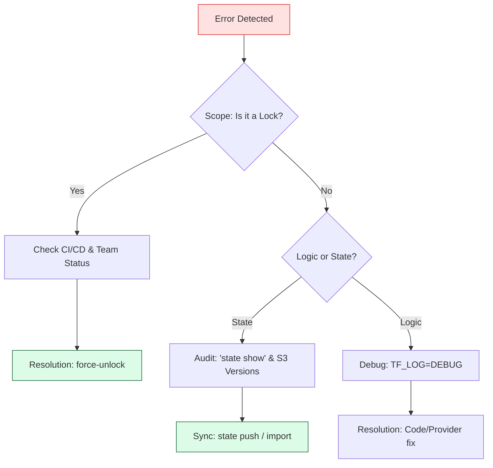

# 👻 Troubleshooting Terraform State: Fixing the "Ghost in the Machine"

> **"A Junior DevOps engineer panics when they see a locking error. A Senior SRE opens the DynamoDB table. A Principal Engineer has already automated the drift detection and knows exactly which S3 version to restore. Troubleshooting is the art of restoring reality when the map and the territory diverge."**

Welcome to the **Safety Net**. In the world of production infrastructure, things *will* go wrong. Network timeouts, "Console Ninjas" making manual changes, and corrupted JSON files are inevitable at scale. This module is your field manual for diagnosing, containing, and repairing state-related incidents.

**Why This Matters for Junior DevOps Engineers:**
- 🚨 **The "Stuck Lock" Blocking**: You will eventually be the person who has to unblock the entire team after a CI/CD runner crashes.
- 🩹 **Drift Recovery**: Manual "emergency" fixes in the AWS console create drift. You must know how to safely sync Terraform back to reality.
- 🔬 **Deeper Diagnostics**: Learning to use `TF_LOG` and `state show` separates the button-pushers from the systems engineers.
- 🛡️ **Blast Radius Containment**: You'll learn how to identify when one small state error is isolated or if it's systemic across the environment.

---

## 📚 Table of Contents

1. [The Troubleshooting Flow](#-the-troubleshooting-flow)
2. [Critical Incident: Acquisition & Locking](#-critical-incident-acquisition--locking)
3. [The "Console Ninja" Syndrome (Drift Detection)](#-the-console-ninja-syndrome-drift-detection)
4. [Corruption & Malformed JSON Recovery](#-corruption--malformed-json-recovery)
5. [Real-World DevOps Scenarios](#-real-world-devops-scenarios)
6. [Advanced Debugging: TF_LOG & The Audit Trail](#-advanced-debugging-tf_log--the-audit-trail)
7. [Hands-On Exercises](#-hands-on-exercises)
8. [Interview Preparation](#-interview-preparation)
9. [Knowledge Check](#-knowledge-check)

---

## 🏗️ The Troubleshooting Flow

When an error occurs, follow the **S.O.S.** pattern: **Scope, Observe, Synchronize**.



---

## 🔐 Critical Incident: Acquisition & Locking

### The "Stuck Lock" (Stale Lock)
**The Symptom**: `Error: Error acquiring the state lock`
**The Context**: This happens when a previous Terraform process (like a laptop or a CI job) dies mid-execution and never tells the backend "I'm done."

### The 3-Step Recovery Protocol:
1. **Identify**: Read the error message. Find the `Lock Info` (who has it) and the `ID`.
2. **Verify**: Check Slack/Discord or the CI dashboard. Is that person/job actually running?
3. **Surgical Strike**:
   ```bash
   terraform force-unlock <LOCK_ID>
   ```
**Staff Warning**: Never use `force-unlock` just to "move faster." If another process is actually writing to state, you will corrupt the entire file.

---

## 🏎️ The "Console Ninja" Syndrome (Drift Detection)

### What is Drift?
Drift is when the **Cloud Reality** changes but the **State File** doesn't know about it. This happens when an engineer makes a "Quick Fix" in the AWS Console.

### The Repair Pattern:
1. **Detect**: Run `terraform plan`.
2. **Analyze**: See what Terraform wants to "undo." If the manual change was correct (e.g., upgrading a database size), do NOT apply yet.
3. **Synchronize**: 
   - Update your HCL code to match the new size.
   - Run `terraform plan` again. It should show **0 changes**.
   - Your code, state, and cloud are now in sync.

---

## 🩹 Corruption & Malformed JSON Recovery

### How State Corrupts:
- Interrupted network during an unprotected local `apply`.
- Manual search-and-replace in the `.tfstate` file.
- Git merge conflicts (if you ignored the rule about not putting state in Git).

### The "Undo Button" (S3 Versioning)
If your state is corrupted, do not panic. Use the **Point-in-Time Recovery**:
1. Go to S3 -> Bucket -> Versioning.
2. Download the version from 10 minutes ago.
3. Verify it is valid JSON.
4. Restore: `terraform state push healthy_backup.tfstate`.

---

## 🎭 Real-World DevOps Scenarios

### 🛡️ Scenario 1: The "Ghost Lock" Deadlock
**The Incident**: A Senior Dev's laptop battery died exactly 30 seconds into a `terraform apply` for a production VPC move.
**The Crisis**: For two hours, the entire team was blocked. Because the dev was on a plane, no one knew if the process was "actually" running or just a ghost lock.
**The Fix**: The SRE Lead checked the DynamoDB table, saw the `created` timestamp was 2 hours old, and ran `force-unlock`.
**The Lesson**: Always check the **Timestamp** of a lock. If it's hours old and the CI pipeline is idle, it's a ghost.

### 🔥 Scenario 2: The Emergency Downgrade
**The Incident**: A console ninja upgraded an EKS cluster's node size to handle a traffic spike.
**The Failure**: A junior engineer ran a routine deployment for a different app. Terraform tried to **downgrade** the EKS nodes back to the smaller size.
**The Impact**: The traffic spike was still active; the downgrade caused a 15-minute outage.
**The Lesson**: Treat `terraform plan` output as **Gospel**. If it says it's going to change something you didn't expect, **STOP**.

### 🚨 Scenario 3: The "Malformed JSON" Nightmare
**The Incident**: A developer tried to fix a "Resource Already Exists" error by manually editing the JSON state file to add a resource ID. They missed a comma.
**The Failure**: Every single command (`plan`, `list`, `show`) failed with a JSON syntax error.
**The Fix**: Reverted to the last healthy S3 version. 
**The Lesson**: The state file is a machine-generated binary-like record. **Hands off the JSON.**

---

## 🔬 Advanced Debugging: TF_LOG & The Audit Trail

When the error message is vague (e.g., `Error: Provider produced invalid plan`), you need the "Black Box" data.

### 1. Enabling Debug Logs
```bash
export TF_LOG=TRACE # The most detailed level
export TF_LOG_PATH=./crash_diag.log
terraform apply
```
This will show you the **Exact API calls** sent to AWS and the **Exact JSON response** returned. Often, the real error is buried in the API response but masked by Terraform.

### 2. The CloudTrail Audit
If state drift occurred and you don't know who did it, go to **AWS CloudTrail**. Filter by the resource name. You will find the IAM user who made the manual console change.

---

## 🎯 Hands-On Exercises

### Exercise 1: The Lock Jam Simulation
1. Run `terraform apply` in Window 1. At the "yes/no" prompt, just stop.
2. In Window 2, run `terraform plan`. Observe the lock error.
3. Use the ID from Window 2 to run `force-unlock`.
4. Return to Window 1 and try to type 'yes'. Observe that it now fails because its lock was "stolen."

### Exercise 2: The Drift Dance
1. Provision a single S3 bucket.
2. Go to the AWS Console and change a Tag on that bucket manually.
3. Run `terraform plan`. Observe that Terraform wants to "remove" your manual tag.
4. Update your code to include the new tag. Run `plan` again. Verify it now shows **0 changes**.

---

## 🎙️ Interview Preparation

### Foundation Questions

**1. "What is the first thing you do when you see a 'State Lock' error?"**
- **Answer**: I verify if anyone on the team or any CI/CD pipeline is currently running an operation. I check the error message for the **Lock ID** and the **Created Timestamp**. If confirmed stale, I use `terraform force-unlock`.

**2. "How does Terraform detect drift?"**
- **Answer**: During the "Refresh" phase of a `plan` or `apply`, Terraform queries the Cloud Provider's API for every resource in its state file. It then compares the API results to the State File. Any difference is "Drift."

---

### Advanced Scenario Questions

**3. "An engineer manually deleted an ELB in the console. How do you fix the state?"**
- **Answer**: I have two choices. 1. Run `terraform apply`. Terraform will realize the resource is missing from the cloud and recreate it. 2. If I don't want it recreated, I run `terraform state rm` to forget it and then delete the code.

**4. "What do you do if your state file is corrupted and you have no local backups?"**
- **Answer**: I rely on **S3 Bucket Versioning**. I would identify the last healthy version of the state file in S3, download it, and use `terraform state push` to restore it as the current version. This is why Versioning is a mandatory best practice for Terraform backends.

---

## 🧠 Knowledge Check

1. **Which command is used to clear a stuck lock from a crashed process?**
   - [ ] `terraform unlock`
   - [x] `terraform force-unlock`
   - [ ] `terraform state clean`
   - [ ] `terraform refresh`

2. **True or False: `TF_LOG=DEBUG` can show sensitive data in your terminal.**
   - [x] True (It shows raw API payloads).
   - [ ] False.

3. **What happens if you run `terraform plan -refresh=false`?**
   - [x] Terraform assumes the state file is perfect and doesn't check the cloud. It's faster but risks ignoring drift.

---
## 🎓 Self-Assessment Checklist

Before moving to the next module, ensure you can:
- [ ] Identify and resolve a stuck lock.
- [ ] Explain how to find the "Operator" of a lock.
- [ ] Perform a drift-sync operation (Code -> State -> Cloud).
- [ ] Use `TF_LOG` to debug a provider crash.
- [ ] Restore a corrupted state from S3 Versioning.
- [ ] Explain why manual state editing is forbidden.

**Score yourself**: 5+/6 = Ready to advance | <5 = Practice Exercise 2 (Drift Dance).

---
**Status**: ✅ Enhanced (2026-02-03)
