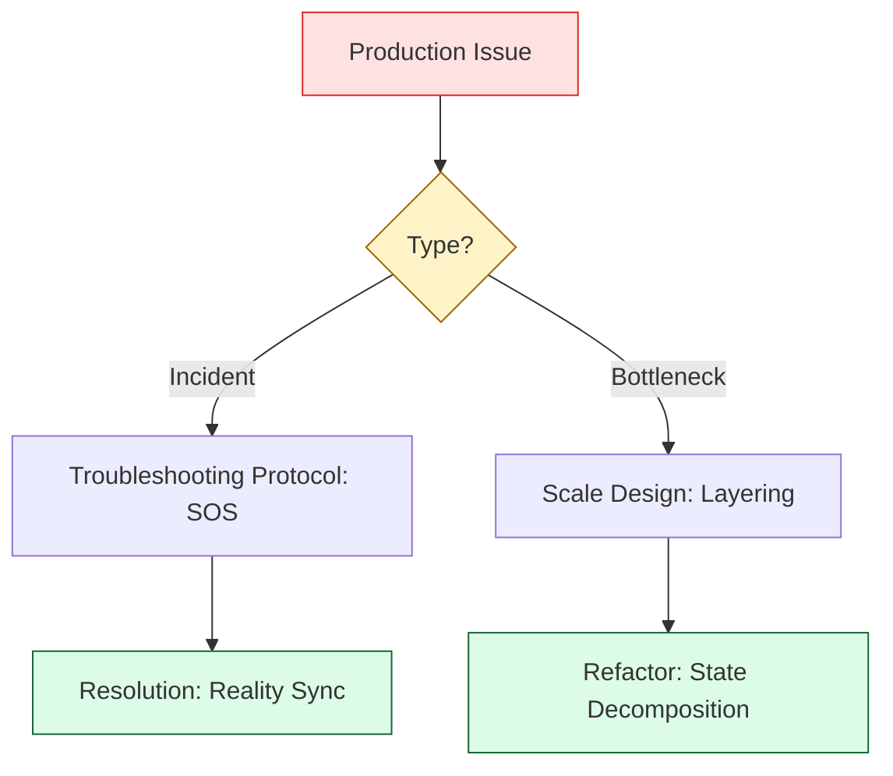

# 👻 Part 4: The Safety Net (Security, Governance & Scaling)

> **"A production system is only as good as its failure recovery plan. The Safety Net is the final layer of your State Management education: learning how to diagnose the 'impossible' errors and how to architect for global scale without losing control."**

Welcome to **Part 4**. This is the "Staff Level" finale of the State Management curriculum. By now, you know how state works, where to store it, and how to migrate it. In this final phase, we focus on **Resilience** and **Architecture**. You will learn how to debug production incidents and how to design complex, multi-layered infrastructures that can support hundreds of engineers.

## 🛣️ The Curriculum

### [01-Troubleshooting](README.md)
**The Objective**: Mastering the art of the fix.
*   **Key Concepts**: Stuck locks, drift detection, recovery from corruption, and using the `TF_LOG` "Black Box" to see inside the engine.

### [02-Advanced-Patterns](README.md)
**The Objective**: Architecting for 100x scale.
*   **Key Concepts**: Multi-layer state (Foundation/Platform/App), Directory vs. Workspace strategies, and secure cross-account state handshakes.

---

## 🚀 The Reliability Mindset: Junior vs. Senior

| Feature | Junior Approach | Principal approach |
|:---|:---|:---|
| **Lock Errors** | Panics or re-runs the command repeatedly. | Reads the Lock ID, verifies the CI runner, and surgically unlocks. |
| **Manual Changes** | Overwrites them or ignores them. | Detects the Drift, syncs the code, and preserves the emergency fix. |
| **Complexity** | Puts 1,000 resources in one state file. | Splits into isolated layers with unidirectional data flow. |
| **Failure** | Restarts from scratch. | Restores a point-in-time version from S3 history in minutes. |

---

## 🏗️ The Safety Net Workflow

---

## 🎓 Graduation Requirement
Before completing this module, you should be able to look at a 10MB state file and explain exactly why and where it should be split to prevent the next enterprise-scale outage.

---
**Status**: ✅ Organized & Enhanced (2026-02-03)
