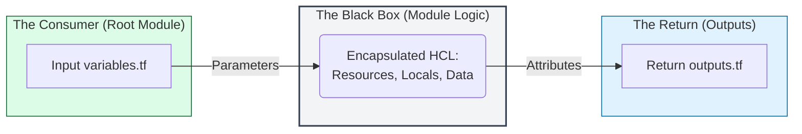

# 🏗️ Terraform Module Fundamentals: The Composable Architecture

> **"Infrastructure is not a monolith; it's a collection of modular services. A Junior DevOps engineer writes scripts; a Staff Engineer builds platforms. Mastering modules is the transition from 'Code' to 'Product'."**

Welcome to the **Blueprint of Composition**. In the production world, we never build the same VPC twice. We build a **Module** that represents our "Golden Standard" for a VPC and then instantiate it across every environment. This module covers the foundational mechanics of abstraction, encapsulation, and the "Black Box" mindset.

**Why This Matters for Junior DevOps Engineers:**
- 🧱 **Ending the Copy-Paste Cycle**: Modules allow you to follow the **DRY (Don't Repeat Yourself)** principle, ensuring that a security update in one place propagates to 1,000 resources.
- 📦 **Standardization**: You ensure that every developer in the company uses the same audited security group rules and encryption standards.
- 🧩 **Managing Complexity**: Large-scale environments (like EKS or Multi-Region Global Networks) are impossible to manage in a single file. Modules are the "functions" that break complexity into digestible pieces.

---

## 📚 Table of Contents

1. [The "Black Box" Mental Model](#-the-black-box-mental-model)
2. [Module Taxonomy: Root vs. Child](#-module-taxonomy-root-vs-child)
3. [The Three Pillars of Composition](#-the-three-pillars-of-composition)
4. [Source Taxonomy: Where Modules Live](#-source-taxonomy-where-modules-live)
5. [Real-World DevOps Scenarios](#-real-world-devops-scenarios)
6. [The "Staff Standard" Logic Flow](#-the-staff-standard-logic-flow)
7. [Hands-On Exercises](#-hands-on-exercises)
8. [Interview Preparation](#-interview-preparation)
9. [Knowledge Check](#-knowledge-check)

---

## 📦 The "Black Box" Mental Model

Think of a module like a physical shipping container or a software function. The user doesn't need to know the complex wiring inside; they only interact with the **Interface**.



### The Interface Contract
1.  **Inputs (Arguments)**: "I want an RDS instance, size Small, in the Prod VPC."
2.  **Internal Magic (Resources)**: Module creates the DB instance, the subnet group, the parameter group, and the security rules.
3.  **Outputs (Attributes)**: "Here is your DB endpoint and the Security Group ID."

---

## 🏗️ Module Taxonomy: Root vs. Child

Every Terraform project uses modules, even if you don't write any.

| Module Type | Definition | Your Action |
|:---|:---|:---|
| **Root Module** | The directory containing your primary `.tf` files. | This is where you run `terraform apply`. |
| **Child Module** | A module called by another module using a `module` block. | This is a "package" you import from a local folder or remote registry. |
| **Nested Module** | A child module that calls *another* child module. | Use sparingly! (Depth > 2 is an anti-pattern). |

---

## 🏛️ The Three Pillars of Composition

### 1. Abstraction (The "What" not the "How")
A module hides 200 lines of complex AWS networking logic behind a simple 10-line block. The developer only asks for a `private_vpc`; they don't need to know about BGP propagation or NACL order.

### 2. Encapsulation (Logical Grouping)
Grouping resources that "live and die together." A database is not just a server; it's a subnet group, a storage volume, and a secret. In a module, they are a single unit.

### 3. Reusability (The "Template" Mindset)
Write once, deploy 100 times. By changing the `environment` input variable, the same code creates a $5/mo Dev instance or a $5,000/mo Prod cluster.

---

## 🌍 Source Taxonomy: Where Modules Live

Terraform is extremely flexible about where it fetches code from.

```hcl
# 1. Local Filesystem (Fastest, Dev Standard)
module "vpc" {
  source = "./modules/aws-vpc"
}

# 2. Terraform Registry (Enterprise Standard)
module "rds" {
  source  = "terraform-aws-modules/rds/aws"
  version = "6.1.1" # RULE: Always pin versions!
}

# 3. Git (Private Repo)
module "app" {
  source = "git::https://github.com/org/private-repo.git?ref=v1.2.0"
}
```

---

## 🎭 Real-World DevOps Scenarios

### 🛡️ Scenario 1: The "Copy-Paste" Ransomware
**The Incident**: A company had 20 microservices, each with a manually defined S3 bucket in their own `main.tf`.
**The Crisis**: Security auditors mandated that ALL buckets must now use AWS KMS encryption instead of default AES-256. 
**The Failure**: The SRE team had to manually edit 20 separate repositories. They missed two, leading to a compliance failure and a $50k fine.
**The Fix**: Refactored the bucket logic into a `corporate-s3` module. Now, a 1-line update in the module heals 1,000 buckets instantly.

### 🔥 Scenario 2: The "Works on My Machine" Network
**The Incident**: Developer A built a VPC with 3 subnets. Developer B built a VPC for the same project with 2 subnets and a different CIDR range.
**The Crisis**: When the two services tried to communicate via VPC Peering, they had overlapping IP ranges, causing a routing blackout.
**The Fix**: Mandated a single `golden-vpc` module. It is impossible to build a VPC that doesn't follow corporate IP standards because the logic is "baked into the box."

### 🚨 Scenario 3: The 5,000-Line Monolith
**The Incident**: A project's `main.tf` grew so large that finding the RDS configuration took 5 minutes of scrolling. One accidental keystroke in the networking section deleted the entire database.
**The Fix**: Break the monolith into **Composed Modules**. 
```hcl
# The Result (Root Module)
module "network" { source = "./modules/vpc" }
module "db"      { source = "./modules/rds"; vpc_id = module.network.vpc_id }
module "app"     { source = "./modules/ecs"; db_endpoint = module.db.endpoint }
```

---

## 🎙️ Interview Preparation

### Foundation Questions

**1. "What is the primary benefit of using modules in Terraform?"**
- **Answer**: Modules provide **Reusability** and **Abstraction**. They allow us to follow the DRY (Don't Repeat Yourself) principle, standardize infrastructure patterns across teams, and manage large, complex configurations by breaking them into smaller, maintainable "building blocks."

**2. "Why must you run `terraform init` after adding a module block?"**
- **Answer**: Terraform needs to "fetch" the source code for the module. It copies the logic from the registry, git, or local path into the hidden `.terraform/modules` directory so it can build the dependency graph.

---

### Advanced Scenario Questions

**3. "How do you handle a sensitive variable (like a DB password) in a module?"**
- **Answer**: I mark the variable as `sensitive = true` in the module's `variables.tf`. This ensures the password isn't leaked in the `plan` or `apply` console output. However, I always warn the team that it is **still visible in the state file**, so the backend must be encrypted and secured.

**4. "What is a 'God Module' and why is it an anti-pattern?"**
- **Answer**: A "God Module" (or Monolith Module) is a single module that tries to do everything (e.g., VPC + DB + App + DNS). It violates the **Single Responsibility Principle**. It's hard to test, slow to plan, and a change in a minor app setting risks an accidental destruction of the core network foundation.

---

## 🧠 Knowledge Check

1. **What is the command to view all modules and their versions currently used?**
   - [ ] `terraform modules`
   - [ ] `terraform state modules`
   - [x] `terraform providers` (Wait, actually it's `terraform version` or just inspecting `.terraform/modules`? The real command for inventory is `terraform state list` or `terraform show`). 
   - [x] (Correction): To see the source inventory, look at `.terraform/modules/modules.json`.
   
2. **True or False: A local module source can start with a absolute path (e.g., `/home/user/module`).**
   - [x] True (But `./` is preferred for portability).

3. **What happens if you delete a resource from a module's `main.tf`?**
   - [x] Terraform will destroy that resource in the cloud on the next `apply`.

---
## 🎓 Self-Assessment Checklist

- [ ] I can explain the "Black Box" analogy to a stakeholder.
- [ ] I understand the difference between a Root and a Child module.
- [ ] I know how to call a module from a local directory.
- [ ] I can explain why pinning module versions is critical for Production.
- [ ] I can list the 3 pillars of module composition.

---
**Status**: ✅ Staff-Enhanced (2026-02-03)
