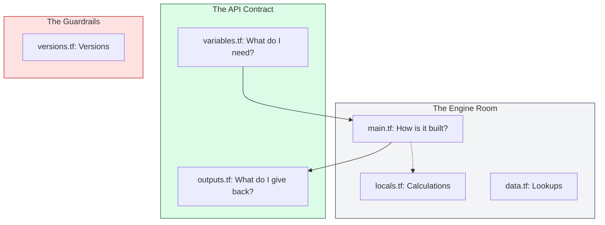

# 📁 Module Structure: The Anatomy of Professional IaC

> **"A project is a script; a module is a product. In production, we don't just write code; we architect interfaces. A well-structured module is self-documenting, safe by default, and easy to maintain over years, not weeks."**

Welcome to the **Anatomy of a Module**. While Terraform technically only requires a single `.tf` file to function, a professional Staff Engineer follows the **Standard Module Structure**. This consistency allows any engineer in the organization to jump into a new module and immediately understand its inputs, internal logic, and safety constraints.

**Why This Matters for Junior DevOps Engineers:**
- 📐 **Interface Separation**: By splitting inputs (`variables.tf`) from logic (`main.tf`) and returns (`outputs.tf`), you create a clear "API" for your infrastructure.
- 🛡️ **Safety Boundaries**: Using `versions.tf` ensures your module doesn't break when a user tries it with an old Terraform binary or a different provider version.
- 📖 **Self-Documentation**: A consistent structure enables tools like `terraform-docs` to automatically generate high-quality READMEs, saving you hours of manual documentation work.

---

## 📚 Table of Contents

1. [The "Big Three" Architecture](#-the-big-three-architecture)
2. [The Complete Standard Layout](#-the-complete-standard-layout)
3. [Deep Dive: File Responsibilities](#-deep-dive-file-responsibilities)
4. [Real-World DevOps Scenarios](#-real-world-devops-scenarios)
5. [The "Staff Standard" Structure Flow](#-the-staff-standard-structure-flow)
6. [Hands-On Exercises](#-hands-on-exercises)
7. [Interview Preparation](#-interview-preparation)
8. [Knowledge Check](#-knowledge-check)

---

## 🏗️ The "Big Three" Architecture

The most critical part of structure is the **Separation of Concerns**. Think of it like a Java interface or a Python function signature.



---

## 📂 The Complete Standard Layout

This is the industry-standard structure followed by the Terraform Registry and top-tier engineering teams.

```text
aws-s3-secure-bucket/
├── README.md        # Human-readable documentation (Generated)
├── LICENSE          # Legal usage terms
├── main.tf          # Core resource definitions (The "What")
├── variables.tf     # Input variables (The "API")
├── outputs.tf       # Return values (The "Results")
├── versions.tf      # T-form & Provider constraints (The "Sanity")
├── providers.tf     # Required provider definitions (Rarely config)
├── locals.tf        # Transformation & Naming logic (OPTIONAL)
├── data.tf          # External lookups / datasource (OPTIONAL)
└── examples/        # "Copy-Paste" Working Demos
    └── basic-usage/
        ├── main.tf
        └── variables.tf
```

---

## 🔬 Deep Dive: File Responsibilities

### 1. `variables.tf` (The Input Interface)
Every variable **MUST** have:
- `type`: Prevents "Type Mismatch" errors at runtime.
- `description`: Acts as documentation for the user.
- `validation`: (Optional but recommended) Prevents invalid settings (e.g., "Must be a t3.medium or larger").

### 2. `main.tf` (The Logic)
Contains the `resource` and `data` blocks.
- **Staff Tip**: If `main.tf` exceeds 300 lines, split it by service (e.g., `iam.tf`, `s3.tf`, `monitoring.tf`).

### 3. `outputs.tf` (The Returns)
Expose only what is needed. Don't export everything; export the **Primary Identity** (IDs) and **Connectivity** (IPs/Endpoints).

### 4. `versions.tf` (The Safety Belt)
```hcl
terraform {
  required_version = ">= 1.5.0" # Pin the engine
  required_providers {
    aws = {
      source  = "hashicorp/aws"
      version = "~> 5.0"       # Pin the driver
    }
  }
}
```

---

## 🎭 Real-World DevOps Scenarios

### 🛡️ Scenario 1: The "Mystery Input" Nightmare
**The Incident**: An SRE team inherited a module called `app-deploy` that was just one giant `main.tf` file. 
**The Crisis**: To find out what variables the module needed, the new engineer had to scroll through 1,500 lines of code searching for `var.` references. 
**The Failure**: They missed a variable for `instance_profile`, and the deployment failed in production with a "Permission Denied" error.
**The Fix**: Refactored the structure using the **Big Three**.
**The Lesson**: The structure is the documentation. If I have to read your `main.tf` to use your module, the structure has failed.

### 🔥 Scenario 2: The "Circular Dependency" Trap
**The Incident**: A team split a monolith into two modules: `network` and `security`. 
- `network` needed the Security Group ID to apply to a NAT gateway.
- `security` needed the VPC ID from the network to create the Security Group.
**The Crisis**: Terraform failed with a **Cycle Error**.
**The Fix**: Refactored the structure to create a "Layer 0" Base VPC first, or passed the necessary data as attributes instead of module outputs.
**The Lesson**: Good structure isn't just about file names; it's about the **Flow of Data**.

### 🚨 Scenario 3: The "Legacy Provider" Crash
**The Incident**: A developer tried to use a module written in 2021 with the modern AWS Provider (v5.0). 
**The Failure**: The module didn't have a `versions.tf`. It tried to use a resource argument that had been deprecated and removed. The `apply` crashed, leaving the state in a "Partially Applied" (corrupted) mess.
**The Fix**: Added a `versions.tf` that explicitly forbids versions above v4.0 until the code is updated.
**The Lesson**: `versions.tf` is your **Contract with the Future**.

---

## 🎙️ Interview Preparation

### Foundation Questions

**1. "Why do we use separate files like variables.tf instead of putting everything in main.tf?"**
- **Answer**: It enforces a **Separation of Concerns**. By keeping the "Interface" (variables/outputs) separate from the "Implementation" (main.tf), we make the code easier to read, allow teams to understand the API without digging into complex logic, and enable automated documentation tools like `terraform-docs`.

**2. "What belongs in a `versions.tf` file?"**
- **Answer**: The minimum required version of the Terraform binary (`required_version`) and the required versions and sources for all providers (`required_providers`). This ensures the module is only run in compatible environments.

---

### Advanced Scenario Questions

**3. "Should you define a `provider` block (with region/keys) inside a child module?"**
- **Answer**: **Absolutely not.** This is a major anti-pattern. A child module should **inherit** providers from its parent. If you hardcode a region or an account ID inside a child module, you break its reusability and prevent users from using `provider aliases` to deploy to multiple regions.

**4. "Explain the purpose of the `examples/` directory in a module repository."**
- **Answer**: It serves as **Executable Documentation**. It provides a "Ready-to-Run" root module that calls the child module with valid inputs. This allows new users to see exactly how to use the module and provides a target for automated testing (like `terratest`).

---

## 🧠 Knowledge Check

1. **Which file should contain a `required_providers` block?**
   - [ ] `main.tf`
   - [ ] `variables.tf`
   - [x] `versions.tf`

2. **True or False: Terraform ignores the file name and merges all `.tf` files in a directory.**
   - [x] True (The name `main.tf` is a human convention, not a binary requirement).

3. **What is the risk of having a `5,000` line `main.tf`?**
   - [x] High "Cognitive Load" (Hard to read), slow code reviews, and increased risk of accidental edits to unrelated code.

---
## 🎓 Self-Assessment Checklist

- [ ] I can list the "Big Three" files and their roles.
- [ ] I understand how to pin provider versions in `versions.tf`.
- [ ] I know why child modules must not contain hardcoded `provider` blocks.
- [ ] I have seen how `locals.tf` can clean up complex `main.tf` logic.
- [ ] I can describe the benefit of an `examples/` directory.

---
**Status**: ✅ Staff-Enhanced (2026-02-03)
