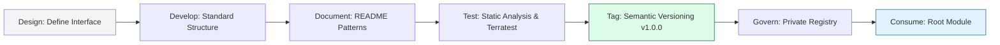

# 🏆 Terraform Module Best Practices: The Governance Hub

> **"A Junior writes clean code. A Senior manages safe state. A Principal Engineer designs composable systems. Best practices are the 'Gravity' that keeps your architectural planetary system from flying apart as you scale."**

Welcome to the **Governance Hub** for Modules and Composition. Writing HCL is the easy part; building **Maintainable**, **Scalable**, and **Secure** modular systems is where true Infrastructure Engineering happens. This guide applies software engineering principles (SOLID, DRY) to the world of Terraform.

## 🏗️ Path to Mastery

This section covers the strategic "Why" behind modular design choices:

1.  [**SOLID Principles for IaC**](#-solid-principles-for-iac)
2.  [**Naming & Standard Taxonomy**](#-naming--standard-taxonomy)
3.  [**The Module Lifecycle (Release Management)**](#-the-module-lifecycle-release-management)
4.  [**Security & Safety Hardening**](#-security--safety-hardening)
5.  [**Real-World DevOps Governance Scenarios**](#-real-world-devops-governance-scenarios)

---

## 🏛️ SOLID Principles for IaC

Software architectural rules apply directly to Terraform. If your module feels "painful" to use, it's likely violating one of these.

### 1. Single Responsibility Principle (SRP)
**The Rule**: A module should do one thing and do it perfectly.
- ✅ **Good**: `aws-s3-bucket`, `aws-rds-postgres`, `aws-vpc-networking`.
- ❌ **Bad**: `aws-production-stack` (Builds VPC + DB + EKS + S3 + IAM).
- **Why**: "God Modules" are impossible to test, update, or reuse for a different project.

### 2. Open/Closed Principle
**The Rule**: Modules should be **Open for Extension** (via variables) but **Closed for Modification** (don't force users to edit your HCL).
- **Implementation**: Avoid hardcoding values. Use `dynamic` blocks to allow users to pass in variable lists of rules/tags.

### 3. Dependency Inversion
**The Rule**: Dependence should be on abstractions, not concrete IDs.
- ✅ **Good**: Passing `var.vpc_id`.
- ❌ **Bad**: Hardcoding `vpc-0abcdef123456`.

---

## 🏷️ Naming & Standard Taxonomy

Consistency is the antidote to technical debt.

### 1. The "This" Naming Pattern
Inside a module, name the primary resource `this` or `main`.
```hcl
# GOOD
resource "aws_db_instance" "this" { ... }

# AVOID (Inside a module)
resource "aws_db_instance" "production_postgres_database" { ... }
```
- **Reason**: It makes refactoring easier. If you change the resource type, you don't have to rename 20 references to its ID.

### 2. Output & Variable Matching
Use names that match the underlying resource attributes.
- Variable: `vpc_id` (not `the_network_identity`).
- Output: `db_endpoint` (not `database_connection_string_result`).

---

## 🚀 The Module Lifecycle

Professional teams treat modules like software libraries.



---

## 🛡️ Security & Safety Hardening

### 1. Secret Management
**NEVER** hardcode secrets. Mark variables as `sensitive = true`.
```hcl
variable "db_password" {
  type      = string
  sensitive = true
  description = "Primary password for RDS. Avoid storing in plain text tfvars."
}
```

### 2. Resource Protection
Use `lifecycle { prevent_destroy = true }` for foundational resources (VPCs, Databases) inside modules to prevent accidental "Fat Finger" deletions.

### 3. Automated Guardrails (The CI/CD Bar)
Every module PR should pass:
- `terraform fmt -check` (Style)
- `tflint` (Best Practices)
- `checkov` or `tfsec` (Security Scans)

---

## 🎭 Real-World DevOps Governance Scenarios

### 🛡️ Scenario 1: The "Version Drift" Chaos
**The Incident**: A company updated their "Golden VPC" module to v2.0, which changed some naming conventions. Five different teams updated their code at different times.
**The Crisis**: Because they didn't pin versions (`version = "~> 1.0"`), some teams' infrastructure broke during routine CI/CD runs.
**The Fix**: Mandated **Semantic Versioning** and required version pinning in all Root modules.
**The Lesson**: In production, "Latest" is your enemy. **Stability > New Features.**

### 🔥 Scenario 2: The "Naming War"
**The Incident**: Team A named resources `env-app-resource`, Team B used `app_resource_env`.
**The Crisis**: High-level FinOps (Cost) dashboards couldn't aggregate costs because tags and names were a "Wild West" of styles.
**The Fix**: Created a `null_label` module that enforced a standard naming schema across the entire organization.
**The Lesson**: Consistency in a module is nice; consistency across **All Modules** is a requirement for growth.

### 🚨 Scenario 3: The "Tightly Coupled" Trap
**The Incident**: A module for an "App Server" was written to directly query the "VPC" state file of another project using `remote_state`.
**The Crisis**: When the networking team moved their state file to a different S3 bucket, 50 different app modules crashed simultaneously.
**The Fix**: Decoupled the modules. The Networking team now publishes VPC IDs to **AWS SSM Parameter Store**, and the app modules read from SSM.
**The Lesson**: Avoid building "Rigid Dependencies." Use independent data stores as the "Interface" between teams.

---

## 🎙️ Interview Preparation

### Foundation Questions

**1. "What is the most important best practice for module variables?"**
- **Answer**: Typing and Descriptions. Every variable should have an explicit `type` to prevent runtime errors and a `description` to act as self-documentation. Additionally, using `sensitive = true` for secrets is a mandatory security standard.

**2. "Explain the DRY principle in Terraform."**
- **Answer**: DRY stands for **Don't Repeat Yourself**. Instead of copy-pasting resource blocks (like an S3 bucket configuration) across multiple environments, we encapsulate that logic in a module. This creates a single "Source of Truth" that can be updated in one place to affect all consumers.

---

### Advanced Scenario Questions

**3. "How do you enforce corporate security standards within a module?"**
- **Answer**: I use three layers: 1. **Default Logic** (hardcode encryption in the module). 2. **Variable Validation** (use regex to ensure tags match corporate standards). 3. **OCI Guardrails** (integrate `checkov` or `tfsec` into the CI/CD pipeline that builds the module to catch misconfigurations before they are published).

**4. "When should a resource NOT be modularized?"**
- **Answer**: If a resource is truly unique and has zero probability of being reused (e.g., a one-off legacy TGW peering connection), modularizing it might add unnecessary abstraction and "Indirection" without providing a benefit. Modules should solve a problem of **Scale** or **Standardization**.

---

## 🧠 Knowledge Check

1. **What is the recommended tool for generating markdown tables of Inputs/Outputs?**
   - [ ] Terraform Plan
   - [ ] Jenkins
   - [x] `terraform-docs`

2. **True or False: A module should contain its own `provider` block.**
   - [ ] True.
   - [x] False (It should inherit from the caller).

3. **What is 'Blast Radius' and how do modules affect it?**
   - [x] It's the scope of potential damage if something fails. Modularizing helps **reduce** blast radius by isolating resources into separate state files and decoupled logic.

---
## 🎓 Self-Assessment Checklist

- [ ] I apply the Single Responsibility Principle to my module design.
- [ ] I always use `this` or `main` for primary resource names.
- [ ] I mark secrets as `sensitive = true`.
- [ ] I follow Semantic Versioning for my module releases.
- [ ] I generate documentation automatically using tooling.
- [ ] I understand why circular dependencies must be avoided.

---
**Status**: 🏆 Staff-Enhanced (2026-02-03)