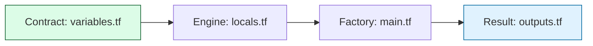

# 🏗️ Creating Modules: The Variable-Logic-Output Lifecycle

> **"Building a module is not just moving code into a folder; it is architecting an API. If your module doesn't validate its inputs, it isn't a tool—it's a liability."**

Welcome to the **Implementation Deep-Dive**. In this module, we move beyond the "File Layout" and into the internal mechanics of building a self-healing, self-validating infrastructure unit. We adopt the **Shift Left** mindset: catching expensive configuration errors during `terraform plan`, not after a failed deployment.

---

## 🏗️ The Implementation Cycle

A professional module follows the **Contract → Engine → Factory** pattern.



---

## 🛡️ 1. The Contract: Defensive Variable Design

Variables are your module's front door. If you don't use `type` constraints and `validation` blocks, you are inviting "ClickOps" chaos into your code.

| Keyword | Purpose | Staff Tip |
|:---|:---|:---|
| `type` | Enforces data structure. | **NEVER** use `type = any`. Be explicit (list, map, object). |
| `default` | Makes arguments optional. | Set to `null` if the resource itself should be optional. |
| `validation` | Logic-gate for values. | Catch typos in instance sizes or CIDR ranges here. |
| `sensitive` | Hides from CLI. | Essential for passwords/tokens (Note: Still in state!). |

### 🚀 Staff Pattern: The "Shift Left" Validator
```hcl
variable "instance_type" {
  type        = string
  description = "Allowed SKU for the cluster"

  validation {
    # Fail if the type doesn't start with t3 or m5
    condition     = can(regex("^(t3|m5)", var.instance_type))
    error_message = "Operating standard requires t3 (Burstable) or m5 (General) families."
  }
}
```

---

## ⚡ 2. The Engine: Centralized internal Logic (`locals`)

`locals` are the internal brain of your module. Use them to calculate tags, merge environment settings, or determine resource naming without cluttering your `resource` blocks.

### 🚀 Staff Pattern: The Multi-Layer Tag Merge
```hcl
locals {
  # 1. Base Organizational Tags
  org_tags = {
    ManagedBy = "Terraform-Modules"
    Owner     = "SRE-Core"
  }

  # 2. Calculated Logic
  name_prefix = "${var.project}-${var.environment}"

  # 3. Final Merge (Org + User + Logic)
  final_tags = merge(local.org_tags, var.custom_tags, { "Name" = local.name_prefix })
}
```

---

## 🏭 3. The Factory: Resilient Resource Growth

When creating multiple resources inside a module, your choice of "Meta-Argument" determines how hard you crash during an update.

### `count` vs `for_each`
- **Avoid `count` for lists**: If `list[0]` is deleted, items `1, 2, 3` all shift down, causing Terraform to recreate every resource in the list.
- **Always use `for_each`**: Maps and Sets use **Stable Keys**. Deleting "User A" doesn't affect "User B," even if they share the same module.

---

## 🎭 Real-World DevOps Scenarios

### 🛡️ Scenario 1: The "Typo" That Cost $1,000
**The Incident**: A module for EC2 allowed any string for `instance_type`. A junior engineer typo'd `t3.large` as `m5.metal`.
**The Crisis**: The plan passed logic checks. AWS launched a bare-metal server costing $5/hour. The error wasn't caught for 4 days.
**The Fix**: Implemented a `validation` block with a regex whitelist of approved families.
**The Lesson**: The Cloud API only checks if your value is **Valid**; your module must check if it is **Allowed**.

### 🔥 Scenario 2: The "Duplicate Name" Conflict
**The Incident**: A module hardcoded `name = "prod-db"`. 
**The Crisis**: A second project tried to use the same module in the same AWS account. The apply failed because RDS names must be globally unique per account/region.
**The Fix**: Switched to `name_prefix` or used a `random_id` suffix inside the module.
**The Lesson**: Reusable code must never use hardcoded, non-unique IDs.

---

## 🎙️ Interview Preparation

### Foundation Questions

**1. "What is the benefit of using locals inside a module?"**
- **Answer**: Locals allow you to centralize complex logic, calculations, and naming strategies in one place. This keeps your `resource` blocks clean (readable) and ensures that if a tag logic changes, you only update it in one local block rather than 50 resource blocks.

**2. "Explain the difference between `variable` and `local` availability."**
- **Answer**: `Variables` are the input API; they are passed in by the user who calls the module. `Locals` are internal; they can only be seen and used inside the module directory. Users cannot "pass in" a value to a local directly.

---

### Advanced Scenario Questions

**3. "How do you handle 'Toggle-able' resources inside a module?"**
- **Answer**: I use a boolean variable (e.g., `enable_monitoring`) and then use the ternary operator in the resource's `count` argument: `count = var.enable_monitoring ? 1 : 0`. This allows users to "turn off" specific parts of the module without changing the HCL.

**4. "Why is `for_each` preferred over `count` for iterating over lists of resources?"**
- **Answer**: `for_each` uses stable keys (like a username or a project ID) rather than a numeric index. If an item is removed from the middle of a list, `count` will cause every subsequent resource to be recreated due to index shifting. `for_each` is surgically precise—it only affects the resource being added or removed.

---

## 🧠 Knowledge Check

1. **Which block allows you to reject a variable during the 'plan' phase?**
   - [ ] `defaults`
   - [ ] `type`
   - [x] `validation`

2. **True or False: `variables.tf` can reference `locals.tf` values.**
   - [ ] True.
   - [x] False (Variables are evaluated before Locals).

3. **What is the result of `merge({a=1}, {b=2}, {a=3})`?**
   - [x] `{a=3, b=2}` (Last value wins for duplicate keys).

---
## 🎓 Self-Assessment Checklist

- [ ] I always define explicit `type` constraints for my variables.
- [ ] I use `validation` blocks to protect against "SKU Overspend."
- [ ] I can use `merge()` to combine corporate tags with user tags.
- [ ] I understand why `for_each` is the safest way to iterate.
- [ ] I can describe the lifecycle: **Contract → Engine → Factory**.

---
**Status**: ✅ Enhanced (2026-02-03)
