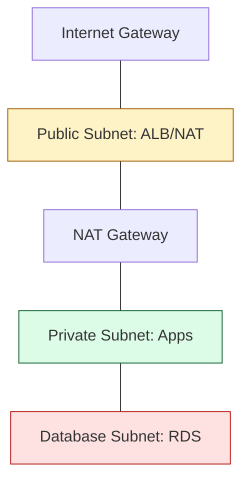

# 🌍 Real-World Module Patterns: The Operational Blueprint

> **"Theory is great for interviews, but production is where the architectural debt is paid. These are the 'Golden Path' blueprints for the most common infrastructure patterns used by elite SRE teams globally."**

Welcome to the **Battlefield Gallery**. In this module, we move beyond "How to write a module" and look at "What modules to write." We study the **3-Tier Stack**, the **Kubernetes Foundation**, and the **FinOps-Aware VPC**—the recurring patterns that form the backbone of modern cloud engineering.

---

## 🏗️ 1. The "Standard VPC" Blueprint (The Foundation)

Almost every AWS environment starts with a VPC. A "Junior" VPC is just a network; a "Staff Level" VPC is a multi-AZ, partitioned, and tagged entity ready for compliance.

### The Architecture
- **Public Subnets**: Ingress only (Load Balancers, NAT Gateways).
- **Private Subnets**: The "Safe Room" (EKS Workers, EC2 Apps).
- **DB Subnets**: The "Vault" (No direct path to internet, even via NAT).



---

## 🚀 2. The "3-Tier Web App" (Business Logic)

The classic "Load Balancer -> App Server -> Database" stack. This is where you practice **Implicit Dependency Handshakes**.

### The Composition Logic
```hcl
module "alb" {
  source  = "./modules/alb"
  subnets = module.vpc.public_subnets
}

module "app" {
  source            = "./modules/asg"
  vpc_id            = module.vpc.vpc_id
  target_group_arn  = module.alb.target_group_arn
  private_subnets   = module.vpc.private_subnets
}

module "db" {
  source  = "./modules/rds"
  # LEAST PRIVILEGE: Only allow the App's SG, not the whole VPC
  allowed_security_groups = [module.app.security_group_id]
}
```

---

## ☸️ 3. The "Kubernetes Platform" (EKS)

Modern applications are "Platform-First." An EKS module is complex because it requires tight integration between Identity (IAM) and Infrastructure (VPC).

### 🚀 Staff Tip: Use the Registry
Unless you are a deep specialist, **DO NOT** build EKS from scratch resources. Use the verified community module from `terraform-aws-modules/eks/aws`. It handles 400+ lines of IAM-to-K8s mapping automatically.

---

## 🎭 Real-World DevOps Scenarios

### 🛡️ Scenario 1: The "Spaghetti VPC" Refactor
**The Incident**: A startup had one 3,000-line `main.tf` file creating a VPC, 50 subnets, route tables, and instances.
**The Crisis**: Adding a single CIDR range took 4 hours of code review because the file was so tangled that one change shifted thousands of line references.
**The Fix**: Replaced the entire network block with a single call to the community `vpc` module. Deleted 1,200 lines of custom code.
**The Lesson**: Code you didn't write is code you don't have to maintain. Use verified patterns for standard services.

### 🔥 Scenario 2: The "Database Drift" Disaster
**The Incident**: A DBA manually upgraded an RDS instance from `t3.medium` to `m5.large` in the AWS Console during an emergency performance spike.
**The Crisis**: On Monday morning, a developer ran `terraform apply`. Terraform saw that the code still said `t3.medium` and tried to "Force Replacement" (Delete the DB and recreate it) to match the code.
**The Fix**: Before apply, the SRE updated the module code to match the new reality and used `terraform refresh` to sync the state.
**The Lesson**: Always use **Drift Detection** before applying changes to "Stateful" (DB) modules.

---

## 🎙️ Interview Preparation

### Foundation Questions

**1. "In a standard 3-tier architecture, what is the best practice for Database Security Groups?"**
- **Answer**: I use **Identity-Based Firewalling**. Instead of allowing a CIDR block (IP range), I pass the Security Group ID of the Application servers into the Database module. This ensures that ONLY the application servers can talk to the database on port 5432/3306, regardless of which IP address they have.

**2. "Why use 'Single NAT Gateway' in a Dev environment?"**
- **Answer**: Cost optimization (FinOps). In production, you need a NAT Gateway per Availability Zone for High Availability. In Dev, one NAT Gateway is enough to provide internet access for the whole VPC, saving ~$60/month per environment.

---

### Advanced Scenario Questions

**3. "How do you handle 'Stateful' (RDS) vs 'Stateless' (EC2) resource lifecycles in modules?"**
- **Answer**: I prefer to separate them either into different modules or completely different Terraform "Stacks" (state files). We change application servers daily; we change databases once a year. By separating them, we reduce the **Blast Radius**—a mistake in an app deployment cannot accidentally trigger a database recreation.

**4. "Why is a 'Verified Registry Module' preferred for complex services like EKS or VPC?"**
- **Answer**: Security and "Feature Parity." These modules are maintained by hundreds of contributors and handle edge cases that I might miss (like IAM OIDC providers or VPC tags for ELB discovery). It follows the "Standardized Platform" approach rather than building "Special Snowflakes."

---

## 🧠 Knowledge Check

1. **Where should a NAT Gateway be placed?**
   - [ ] Private Subnet.
   - [x] Public Subnet (to reach the Internet Gateway).
   - [ ] Database Subnet.

2. **True or False: If you delete a module block, its resources are preserved.**
   - [ ] True.
   - [x] False (Terraform will destroy them).

3. **What is 'Least Privilege' in the context of module composition?**
   - [x] Ensuring that a child module only receives the specific data (variables) and permissions it needs to perform its task—nothing more.

---
## 🎓 Self-Assessment Checklist

- [ ] I can diagram a 3-tier VPC with partitioned subnets.
- [ ] I know why DB subnets must never have a NAT gateway route.
- [ ] I can describe the "Least Privilege" SG handshake between modules.
- [ ] I understand the cost/reliability trade-off of NAT Gateways.
- [ ] I can explain why certain modules should be in separate state files.

---
**Status**: ✅ Staff-Enhanced (2026-02-03)