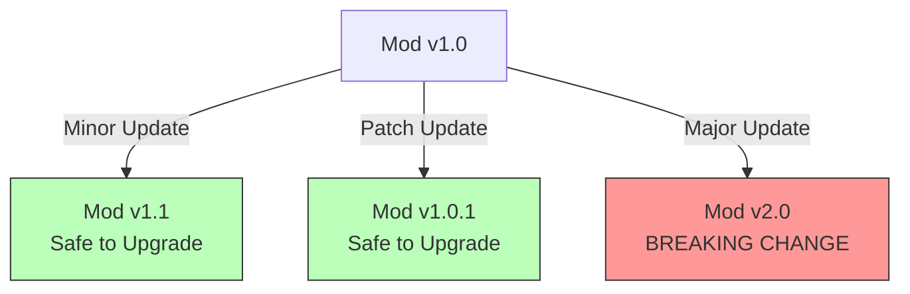

# Versioning Strategy

Versioning is what makes a module "Safe" for production. It transforms your infrastructure from a fragile house of cards into a stable, reproducible product.

## 1. Semantic Versioning (SemVer)

Terraform modules typically follow the `MAJOR.MINOR.PATCH` format (e.g., `1.2.3`).

| Component | Example | Change Type | Description |
| :--- | :--- | :--- | :--- |
| **MAJOR** | `1.0` -> `2.0` | **Breaking** | Incompatible API changes. Inputs removed/renamed. Resources replaced. |
| **MINOR** | `1.0` -> `1.1` | **Features** | Backwards-compatible functionality added. |
| **PATCH** | `1.0.0` -> `1.0.1` | **Bug Fixes** | Backwards-compatible bug fixes. |

---

## 2. Version Constraints

When calling a module, you define a **Version Constraint** string.

| Constraint | Syntax | Meaning | Use Case |
| :--- | :--- | :--- | :--- |
| **Exact** | `version = "1.2.0"` | Only install 1.2.0. | **Production**. Maximum stability. |
| **Pessimistic** | `version = "~> 1.2"` | `>= 1.2.0` and `< 2.0.0`. | **Dev/Test**. Get features, avoid breaking changes. |
| **Pessimistic (Patch)** | `version = "~> 1.2.0"` | `>= 1.2.0` and `< 1.3.0`. | **Staging**. Get bug fixes only. |
| **Greater Than** | `version = ">= 1.0"` | Any version above 1.0. | **Dangerous**. Avoid in production. |

---

## 3. Dependency Locking

### `.terraform.lock.hcl`
This file is generated by `terraform init`. It locks the **Provider** versions (e.g., AWS v5.1.0) for the root module.
*   **Best Practice**: Commit this file to Git. It ensures every team member uses the exact same provider binary.

### Module Locking
Terraform *does not* have a lock file for *modules* in the same way it does for providers.
*   **Mechanism**: Module versions are locked purely by the `version` constraint in your `.tf` files.
*   **Best Practice**: This is why **Exact Pinning** (`version = "1.2.3"`) is so critical for modules.

---

## 4. Real-Life Scenarios

### Scenario 1: The "Friday Afternoon" Disaster (Automated Drift)
**Problem**: Team uses `version = ">= 1.0"`. Everything works fine on Thursday.
**Event**: Friday 4 PM, module author publishes `v2.0` (Breaking: renames `bucket_name` to `name`).
**Result**: Deployment pipeline runs `terraform init`, downloads `v2.0`, and fails because the input `bucket_name` is no longer valid.
**Fix**: Change to `version = "1.5.2"`. The pipeline now ignores v2.0 until someone manually upgrades.

### Scenario 2: The "Diamond Dependency" Problem
**Problem**:
- Root calls Module A and Module B.
- Module A uses `module "utils" { version = "1.0" }`.
- Module B uses `module "utils" { version = "2.0" }`.
**Result**: Terraform allows this! Each module instance gets its own copy of the child module.
**Caveat**: If `utils` manages a global resource (like an IAM Role), you might get a conflict.

### Scenario 3: The "Unpinned" Drift
**Problem**: Developer A runs `init` and gets Module v1.0. Developer B runs `init` a week later and gets Module v1.1.
**Result**: B's `terraform plan` shows changes that A doesn't see. They spend hours arguing about why the plan is different.
**Fix**: Pin variables. Everyone gets the same code.

---

## 5. ❓ Interview Questions

1.  **What is the difference between `~> 1.2` and `~> 1.2.0`?**
    *   **Answer**: `~> 1.2` allows upgrades to `1.9.9` (any Minor version). `~> 1.2.0` only allows upgrades to `1.2.9` (any Patch version). The second is stricter.

2.  **Why doesn't Terraform have a module lock file like `package-lock.json`?**
    *   **Answer**: Because modules are source code included directly into the graph, not compiled binaries. The `version` argument in the configuration acts as the definitive lock.

3.  **If I change the `version` constraint, what command must I run?**
    *   **Answer**: `terraform init -upgrade`. Just running `terraform init` might use the cached version if it still satisfies the new constraint.

4.  **Can you use version constraints with Git sources?**
    *   **Answer**: Not with the `version` argument. You must use the `ref` query parameter in the source URL (e.g., `git::...ref=v1.0.0`).

5.  **When should you issue a Major version bump (e.g., 2.0.0)?**
    *   **Answer**: When you make *any* change that would require existing users to modify their code to use the new version (e.g., removing a variable, changing an output name).

6.  **What happens if you use a "prerelease" version like `1.0.0-beta`?**
    *   **Answer**: Regular constraints like `~> 1.0` will *exclude* prereleases. You must request them explicitly usually.

7.  **Is it possible to pin a module to a specific Git commit hash?**
    *   **Answer**: Yes, `ref=a1b2c3d...`. This is the ultimate "Immutable" pin, as tags can theoretically be moved (though they shouldn't be).

8.  **Why is `version = ">= 0.0"` bad practice?**
    *   **Answer**: It acts as "Latest" and offers zero protection against breaking changes.

9.  **How do you handle deprecating a variable without breaking users (Minor Update)?**
    *   **Answer**: Keep the old variable, mark it as deprecated (using description or 1.9+ `validation` warnings), add the new variable, and map the old one to the new one in `locals`.

10. **Does `.terraform.lock.hcl` ever track module checksums?**
    *   **Answer**: No, currently it only tracks Provider checksums.

---

## 6. 🧠 Knowledge Check (Quiz)

### Syntax & Operators
1.  **Which operator is "Pessimistic"?**
    *   [ ] `>=`
    *   [ ] `=`
    *   [x] `~>`
    *   [ ] `!=`

2.  **`version = "1.2.3"` mimics:**
    *   [x] Exact Pinning.
    *   [ ] Floating Version.
    *   [ ] Range.

3.  **In SemVer `X.Y.Z`, what is `Y`?**
    *   [ ] Major.
    *   [x] Minor.
    *   [ ] Patch.

4.  **To allow any version 2.x, use:**
    *   [ ] `~> 2.0.0`
    *   [x] `~> 2.0`
    *   [ ] `>= 2.0`

5.  **The `version` argument belongs in:**
    *   [x] The `module` block.
    *   [ ] The `resource` block.
    *   [ ] The `provider` block.

### Logic & Behavior
6.  **Breaking changes require which version bump?**
    *   [x] Major.
    *   [ ] Minor.
    *   [ ] Patch.

7.  **Adding a new optional variable is a:**
    *   [ ] Major Change.
    *   [x] Minor Change.
    *   [ ] Breaking Change.

8.  **Removing an output is a:**
    *   [x] Major Change (Breaking).
    *   [ ] Minor Change.

9.  **Does `terraform init -upgrade` upgrade providers AND modules?**
    *   [x] Yes.
    *   [ ] No, only providers.

10. **If you use local file source `./modules/vpc`, can you use `version`?**
    *   [x] No, referencing local paths bypasses versioning.
    *   [ ] Yes.

### Git & Scenarios
11. **How to pin a Git source?**
    *   [ ] `version = "..."`
    *   [x] `?ref=v1.0` in the URL.
    *   [ ] `branch = "..."`

12. **Why commit `.terraform.lock.hcl`?**
    *   [ ] To save state.
    *   [x] To enforce provider consistency across the team.
    *   [ ] To lock modules.

13. **You deleted a tag `v1.0` on GitHub. What happens?**
    *   [x] Builds referencing `v1.0` will fail.
    *   [ ] Terraform finds a backup.

14. **Your module creates an RDS instance. You change the default storage size. Is this breaking?**
    *   [ ] No.
    *   [x] Potentially Yes (it forces a resource modification/replacement in prod). Treat with caution.

15. **Can you specify multiple version constraints?**
    *   [x] Yes, e.g., `">= 1.2, < 2.0"`.
    *   [ ] No.

### General
16. **Prerelease versions usually contain a:**
    *   [ ] `+`
    *   [x] `-` (hyphen), e.g., `1.0.0-alpha`.

17. **Which registry allows you to "yank" (hide) a bad version?**
    *   [x] The Terraform Registry.
    *   [ ] Git.

18. **If `module.vpc` has `version = "1.0"` and you change it to `1.1` in code, what happens on `apply`?**
    *   [x] Terraform downloads 1.1 first (during init), then applies differences.
    *   [ ] It skips download.

19. **Is `version` mandatory for Registry modules?**
    *   [ ] Yes.
    *   [x] No, but highly recommended.

20. **Does SemVer apply to providers too?**
    *   [x] Yes (e.g., `aws` provider v5.0).
    *   [ ] No.