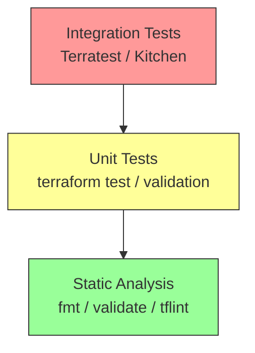

# Testing Modules

Testing ensures your module does exactly what it says on the tin. In the Infrastructure as Code (IaC) world, testing is divided into three layers: Static Analysis, Unit Testing, and Integration Testing.

## 1. The Pyramid of Testing



- **Static Analysis (Fastest)**: Checks syntax and style.
- **Unit Tests (Medium)**: Checks logic and plan outputs without deploying.
- **Integration Tests (Slowest)**: Deploys real resources to the cloud to verify behavior.

---

## 2. Static Analysis Tools
Run these locally or in CI/CD before any test logic.
- **`terraform fmt -recursive`**: Enforces standard indentation/spacing.
- **`terraform validate`**: Checks for syntax errors and valid references.
- **`tflint`**: Finds cloud-specific errors (e.g., *Instance type "t2.microo" does not exist*).
- **`checkov` / `tfsec`**: Scans for security vulnerabilities (e.g., *S3 bucket missing encryption*).

---

## 3. Terraform Native Testing (`terraform test`)
Introduced in Terraform 1.6, this allows you to write tests in HCL. It can run in **Plan Mode** (Unit Test) or **Apply Mode** (Integration Test).

**File**: `tests/website.tftest.hcl`
```hcl
# 1. Setup providers
provider "aws" {
  region = "us-east-1"
}

# 2. Run module and assert expectations
run "verify_bucket_name" {
  command = plan  # Unit Test (no cost)

variables {
    bucket_name = "my-test-bucket-123"
  }

assert {
    condition     = aws_s3_bucket.this.bucket == "my-test-bucket-123"
    error_message = "Bucket name did not match input"
  }
}

run "verify_status_code" {
  command = apply # Integration Test (creates resources)

assert {
    condition     = data.http.website.status_code == 200
    error_message = "Website is not reachable"
  }
}
```

---

## 4. Terratest (Go Library)
The industry standard for powerful integration testing. It allows you to use Go's full programming power to spin up infrastructure, hit APIs, check databases, and then **guarantee destruction** via `defer`.

```go
func TestTerraformAwsHelloWorldExample(t *testing.T) {
	// 1. Configure options
	terraformOptions := terraform.WithDefaultRetryableErrors(t, &terraform.Options{
		TerraformDir: "../examples/hello-world",
	})

// 2. Cleanup when test ends
	defer terraform.Destroy(t, terraformOptions)

// 3. Init and Apply
	terraform.InitAndApply(t, terraformOptions)

// 4. Validate
	output := terraform.Output(t, terraformOptions, "instance_url")
	http_helper.HttpGetWithRetry(t, output, nil, 200, "Hello World", 30, 5*time.Second)
}
```

---

## 5. Real-Life Scenarios

### Scenario 1: The Broken Refactor (Logic Error)
**Problem**: An engineer simplifies a `local` variable for subnet calculation. It passes `terraform validate`.
**Event**: `terraform apply` runs, but the subnets are created in the wrong Availability Zones, crashing the RDS cluster.
**Fix**: A `terraform test` assertion `condition = length(distinct(aws_subnet.this[*].availability_zone)) == 3` would have caught this during the PR check (Plan phase).

### Scenario 2: The "Costly Loop" Bug (Unit Test)
**Problem**: A typo in a `for_each` loop creates 100 Load Balancers instead of 1.
**Detection**: `terraform plan` shows "100 to add".
**Automation**: A Unit Test asserting `condition = length(aws_lb.this) == 1` fails the build instantly, preventing the massive bill.

### Scenario 3: The "Regional Quota" Fail (Integration Test)
**Problem**: Your module works in `us-east-1` but fails in `ap-south-1` because `t2.micro` isn't available in a specific AZ.
**Fix**: `terratest` spins up the module in multiple regions nightly. It catches the error: "Error launching instance: Unsupported". You update the module to enforce supported AZs.

---

## 6. ❓ Interview Questions

1.  **What is the difference between `terraform test` and `terratest`?**
    *   **Answer**: `terraform test` is a native, HCL-based framework built into the Terraform binary. `terratest` is a Go library that requires a separate Go setup but offers far more power (e.g., SSHing into instances, making HTTP requests).

2.  **Why is `terraform validate` not enough?**
    *   **Answer**: It only checks syntax and internal consistency. It does not check if the configuration will actually work against the cloud API (e.g., if an AMI ID is valid or if a name is globally unique).

3.  **What is the "Pyramid of Testing" in IaC?**
    *   **Answer**: Base: Static Analysis (Fast/Cheap). Middle: Unit/Plan Tests. Top: Integration/Apply Tests (Slow/Expensive). You should have many static checks and fewer integration tests.

4.  **How do you test a private module without publishing it?**
    *   **Answer**: By referencing the local path (`source = "../"`) in your test configuration or usage example.

5.  **When using Terratest, how do you handle left-over resources from failed tests?**
    *   **Answer**: Go's `defer terraform.Destroy(...)` ensures cleanup runs even if the function panics or fails. However, if the CI process crashes hard (SIGKILL), resources might leak, requiring a "Cloud Nuke" tool.

6.  **Can `terraform plan` be used as a test?**
    *   **Answer**: Yes. You can output the plan to JSON (`terraform plan -out=tfplan && terraform show -json tfplan`) and use tools like OPA (Open Policy Agent) to assert policies against the JSON structure.

7.  **What is `checkov` used for?**
    *   **Answer**: It is a static code analysis tool specifically for IaC to find security misconfigurations (Compliance Testing).

8.  **Why might you prefer `tflint` over `terraform validate`?**
    *   **Answer**: `tflint` can check provider-specific rules (like valid AWS instance types), while `validate` essentially ignores the logic inside the provider's resource blocks.

9.  **What is "Kitchen-Terraform"?**
    *   **Answer**: An older testing framework using Ruby and Chef InSpec. It is largely being replaced by Terratest and Native Testing.

10. **Does `terraform test` create real resources?**
    *   **Answer**: It depends. If you set `command = plan`, it mocks the resources. If you set `command = apply`, it creates real resources in the State/Cloud.

---

## 7. 🧠 Knowledge Check (Quiz)

### Tools & Commands
1.  **Which native command runs HCL-based tests?**
    *   [ ] `terraform verify`
    *   [x] `terraform test`
    *   [ ] `terraform check`

2.  **Order these from fastest to slowest:**
    *   [ ] Setup -> Teardown -> Run
    *   [x] Static Analysis -> Unit Test -> Integration Test
    *   [ ] Integration Test -> Unit Test -> Static Analysis

3.  **To automatically fix indentation, you run:**
    *   [x] `terraform fmt`
    *   [ ] `terraform fix`
    *   [ ] `terraform lint`

4.  **Which language is Terratest written in?**
    *   [ ] Python.
    *   [x] Go.
    *   [ ] Ruby.

5.  **`tflint` is primarily used for:**
    *   [ ] Authentication.
    *   [x] Finding cloud-specific errors and best practice violations.
    *   [ ] Running Go tests.

### Logic & Scenarios
6.  **True/False: `terraform plan` guarantees acceptance by the AWS API.**
    *   [ ] True.
    *   [x] False (Plan checks state, but API validation happens on Apply).

7.  **In a `verify` block, checking `condition = output.id != ""` is a form of:**
    *   [ ] Static Analysis.
    *   [ ] Unit Test.
    *   [x] Integration Test (if expecting a real ID from cloud).

8.  **Why verify destruction (Teardown)?**
    *   [x] To avoid paying for ghost resources and hitting account limits.
    *   [ ] It's automatic.

9.  **A "Compliance Test" (e.g., checking for encrypted buckets) is best handled by:**
    *   [ ] Manual Review.
    *   [x] Tools like Checkov or OPA.
    *   [ ] `terraform fmt`.

10. **The `command = plan` in a test block means:**
    *   [x] The test runs against the plan file (InMemory/Mock).
    *   [ ] The test creates resources.

### General
11. **Where should test files generally live?**
    *   [ ] In `src/`.
    *   [x] In `tests/` or `test/`.
    *   [ ] In `bin/`.

12. **What does `defer` do in Go/Terratest?**
    *   [ ] Delays execution until next run.
    *   [x] Schedules a function call (like Destroy) to run just before the function returns.

13. **Can you use `terraform test` to check variable validation logic?**
    *   [x] Yes, by passing invalid inputs and asserting failure.
    *   [ ] No.

14. **Why is mocking useful in Unit Tests?**
    *   [x] Speed and zero cost (no real resources created).
    *   [ ] It's more accurate.

15. **If a test fails in CI, what should happen?**
    *   [ ] Merge anyway.
    *   [x] Block the Pull Request build.

16. **Is it possible to test modules against multiple providers versions?**
    *   [x] Yes, `terraform test` allows multiple provider configurations or matrix testing in CI.
    *   [ ] No.

17. **Does `terraform validate` catch "Resource Name Collision" errors?**
    *   [ ] Yes.
    *   [x] No, usually only `apply` catches that (unless names are hardcoded in the same file).

18. **What is a "Golden File" test?**
    *   [ ] A test that uses gold version.
    *   [x] Comparing the generated plan/output against a saved "known good" file.

19. **How do you debug a failed `terraform test`?**
    *   [x] Review the `assert` error message and diagnostic failure output.
    *   [ ] Guess.

20. **Is manual testing required if I have automated tests?**
    *   [x] Sometimes (for UI/UX or complex interaction verification), but automation reduces the burden significantly.
    *   [ ] Never.